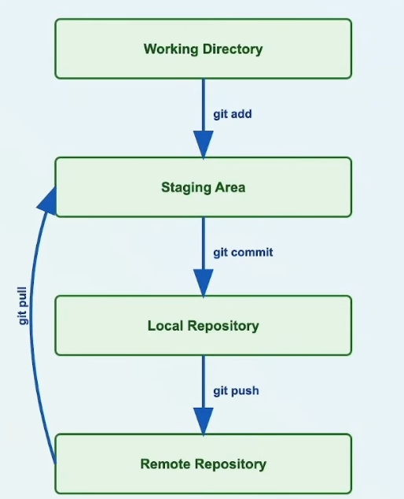

# Git Workflow - Step 01: Understanding Git's Four Stages



## Overview

This diagram illustrates the fundamental workflow of Git version control, showing how code moves through four distinct stages from development to deployment.

## The Four Stages of Git

### 1. Working Directory
- **What it is**: Your local project folder where you actively write and modify code
- **Characteristics**:
  - Contains all your project files (tracked and untracked)
  - Where you make changes to your code
  - Files here are not yet tracked by Git until staged
- **State**: Untracked or modified files

### 2. Staging Area (Index)
- **What it is**: A holding area for changes you want to include in your next commit
- **Purpose**: Allows you to selectively choose which changes to commit
- **Characteristics**:
  - Acts as a preparation area before committing
  - Gives you control over what gets committed
  - You can stage all changes or specific files
- **State**: Staged files ready to be committed

### 3. Local Repository
- **What it is**: Your local Git database stored in the `.git` directory
- **Characteristics**:
  - Contains the complete history of your project
  - Stored on your machine
  - Commits are saved with messages, timestamps, and author information
  - Works offline - no internet connection needed
- **State**: Committed changes saved locally

### 4. Remote Repository
- **What it is**: A version of your repository hosted on a server (e.g., GitHub, GitLab, Bitbucket)
- **Purpose**: 
  - Enables collaboration with other developers
  - Acts as a backup of your code
  - Serves as the central source of truth for the project
- **Characteristics**:
  - Shared among team members
  - Accessible from anywhere with internet
  - Can have multiple branches and contributors
- **State**: Synchronized version of your project

## Git Commands for Each Stage

### `git add` - Working Directory → Staging Area
```bash
# Stage a specific file
git add filename.txt

# Stage all changes in current directory
git add .

# Stage all changes in the repository
git add -A
```
**What it does**: Moves changes from your working directory to the staging area, marking them for inclusion in the next commit.

### `git commit` - Staging Area → Local Repository
```bash
# Commit staged changes with a message
git commit -m "Your commit message"

# Commit and add all tracked files
git commit -am "Your commit message"
```
**What it does**: Takes all staged changes and saves them as a snapshot in your local repository with a unique commit ID.

### `git push` - Local Repository → Remote Repository
```bash
# Push to default remote (origin) and branch
git push

# Push to specific remote and branch
git push origin main

# Push and set upstream branch
git push -u origin main
```
**What it does**: Uploads your local commits to the remote repository, making them available to other team members.

### `git pull` - Remote Repository → Working Directory
```bash
# Pull changes from remote
git pull

# Pull from specific remote and branch
git pull origin main
```
**What it does**: Fetches changes from the remote repository and merges them into your current working directory.

## Typical Workflow Example

1. **Make changes** in your Working Directory
   ```bash
   # Edit files using your code editor
   ```

2. **Stage your changes**
   ```bash
   git add .
   ```

3. **Commit to local repository**
   ```bash
   git commit -m "Add new feature"
   ```

4. **Push to remote repository**
   ```bash
   git push origin main
   ```

## Key Points to Remember

- ✅ Changes must go through staging before being committed
- ✅ You can commit multiple times before pushing to remote
- ✅ The staging area gives you fine-grained control over commits
- ✅ Local repository works offline; remote requires internet connection
- ✅ Always pull before pushing to avoid conflicts
- ✅ Use meaningful commit messages to document your changes

## Common Questions

**Q: Why do we need a staging area?**  
A: The staging area allows you to prepare and review changes before committing. You can stage specific files or parts of files, giving you precise control over what goes into each commit.

**Q: What's the difference between Local and Remote Repository?**  
A: The local repository is stored on your computer and works offline. The remote repository is hosted on a server and enables collaboration with others.

**Q: Can I skip the staging area?**  
A: Yes, using `git commit -a` stages and commits all tracked files in one step, but you lose the fine-grained control that staging provides.

## Related Concepts

- **HEAD**: Points to your current branch and commit
- **Origin**: Default name for the remote repository
- **Branch**: Parallel version of your code
- **Merge**: Combining changes from different branches

---

*This document explains the basic Git workflow. For more advanced topics, see the other step guides.*
