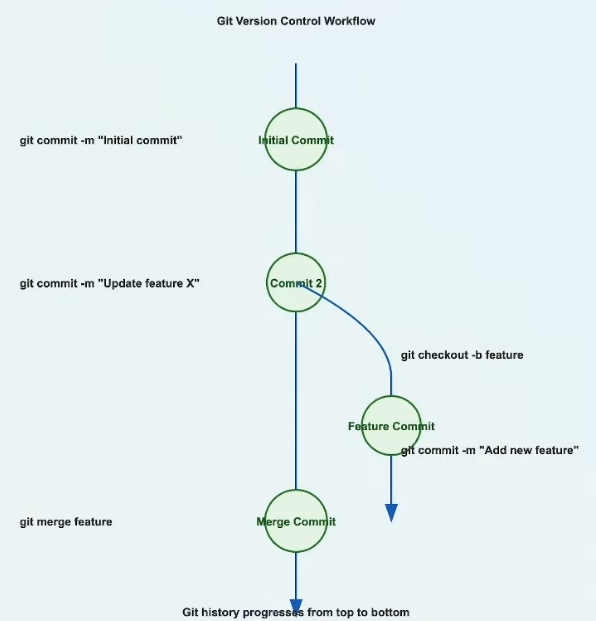

# Git Version Control Workflow - Step 02: Branching and Merging



## Overview

This diagram demonstrates a fundamental Git workflow that showcases **branching** and **merging** - two powerful features that enable parallel development and feature isolation. The workflow shows how to create a feature branch, develop independently, and then merge changes back into the main branch.

## Understanding the Workflow

### The Main Timeline (Vertical Line)

The vertical line represents the **main branch** (or master branch) - the primary line of development in your repository. Commits progress from top to bottom, showing the chronological order of development.

### The Commit History

#### 1. Initial Commit
```bash
git commit -m "Initial commit"
```
- **What it represents**: The first commit in your repository
- **Purpose**: Establishes the foundation of your project
- **Common contents**: README, .gitignore, initial project structure
- **Position**: Top of the timeline

#### 2. Commit 2
```bash
git commit -m "Update feature X"
```
- **What it represents**: A second commit on the main branch
- **Purpose**: Continues development with updates to existing features
- **State**: At this point, development diverges with a new branch
- **Position**: Second node from the top

#### 3. Feature Commit (Branch)
```bash
git checkout -b feature
git commit -m "Add new feature"
```
- **What it represents**: A commit made on a separate feature branch
- **Purpose**: Develops a new feature in isolation from the main branch
- **Key point**: This happens in parallel to main branch development
- **Position**: Right side branch, created from Commit 2

#### 4. Merge Commit
```bash
git merge feature
```
- **What it represents**: The point where the feature branch is merged back into main
- **Purpose**: Integrates the feature branch changes into the main codebase
- **Result**: Combines the history of both branches
- **Position**: Bottom of the timeline, merging both paths

## Key Commands Explained

### Creating and Switching to a Feature Branch

```bash
# Create and switch to a new branch in one command
git checkout -b feature

# Or use the newer Git syntax (Git 2.23+)
git switch -c feature
```

**What happens:**
- Creates a new branch named "feature" based on your current branch
- Switches your working directory to the new branch
- The new branch starts from the current commit (Commit 2 in the diagram)

**Alternative (two steps):**
```bash
# Create a new branch
git branch feature

# Switch to the branch
git checkout feature
```

### Committing on the Feature Branch

```bash
git commit -m "Add new feature"
```

**What happens:**
- Saves changes to the feature branch only
- Main branch remains unchanged
- Creates an independent line of development
- Allows experimentation without affecting the stable main branch

### Merging the Feature Branch

```bash
# Switch back to main branch
git checkout main

# Merge the feature branch into main
git merge feature
```

**What happens:**
- Combines the changes from the feature branch into main
- Creates a merge commit (shown as "Merge Commit" in the diagram)
- Preserves the history of both branches
- The feature branch history becomes part of main's history

## Complete Workflow Example

Here's a step-by-step walkthrough of the entire process:

### Step 1: Start with Initial Commit
```bash
# Initialize repository (if new)
git init

# Add files and make initial commit
git add .
git commit -m "Initial commit"
```

### Step 2: Continue Development on Main
```bash
# Make changes to feature X
git add .
git commit -m "Update feature X"
```

### Step 3: Create Feature Branch
```bash
# Create and switch to feature branch
git checkout -b feature

# Verify you're on the feature branch
git branch
```

### Step 4: Develop the Feature
```bash
# Make changes for the new feature
# Edit files...

# Stage and commit changes
git add .
git commit -m "Add new feature"
```

### Step 5: Merge Back to Main
```bash
# Switch back to main branch
git checkout main

# Merge the feature branch
git merge feature

# Optional: Delete the feature branch after merging
git branch -d feature
```

### Step 6: Push to Remote (if applicable)
```bash
# Push the updated main branch to remote
git push origin main
```

## Benefits of This Workflow

### 1. **Isolation**
- New features are developed separately from the stable main branch
- Experimental changes won't break the main codebase
- Multiple features can be developed simultaneously on different branches

### 2. **Safety**
- Main branch remains stable and deployable
- Easy to abandon a feature branch if the experiment fails
- Can switch between branches to work on urgent fixes

### 3. **Collaboration**
- Team members can work on different features without conflicts
- Clear separation of different work streams
- Easy to review changes before merging (via pull requests)

### 4. **History**
- Preserves the context of when and why features were developed
- Branch history shows parallel development paths
- Makes it easier to understand project evolution

## Understanding the Visual Flow

```
Initial Commit (●)
      |
      ↓
Commit 2 (●) ──────→ Feature Commit (●)
      |                     |
      |                     |
      ↓                     ↓
Merge Commit (●) ←──────────┘
```

**Key observations:**
- **Vertical arrows**: Main branch progression
- **Right-pointing arrow**: Branch creation (`git checkout -b feature`)
- **Diagonal arrow**: Merge operation (`git merge feature`)
- **Circles (●)**: Individual commits in the repository

## Common Scenarios and Variations

### Scenario 1: Fast-Forward Merge
If no commits were made on main after branching, Git performs a "fast-forward" merge:
```bash
git merge feature --ff
```
This simply moves the main branch pointer forward without creating a merge commit.

### Scenario 2: Merge Conflicts
If both branches modified the same lines:
```bash
git merge feature
# CONFLICT: Merge conflict in file.txt
# Manual resolution required

# After resolving conflicts:
git add .
git commit -m "Merge feature branch"
```

### Scenario 3: No-Fast-Forward Merge
Force creation of a merge commit even if fast-forward is possible:
```bash
git merge feature --no-ff
```
This preserves the branch history in the main branch.

## Best Practices

### ✅ Do's
- **Create descriptive branch names**: `feature/user-authentication`, `bugfix/login-error`
- **Commit frequently**: Small, focused commits are easier to understand and revert
- **Write clear commit messages**: Explain what and why, not just what
- **Keep branches short-lived**: Merge features frequently to avoid large, complex merges
- **Pull before merging**: Ensure your main branch is up-to-date

### ❌ Don'ts
- **Don't commit directly to main**: Use feature branches for all development
- **Don't create long-lived branches**: They become difficult to merge
- **Don't merge without testing**: Test your feature branch before merging
- **Don't delete branches with unmerged changes**: Unless you're certain you don't need them

## Related Commands

### Check Current Branch
```bash
git branch
# Shows all branches, highlights current branch
```

### View Branch History
```bash
git log --oneline --graph --all
# Visualizes branch structure in terminal
```

### List All Branches
```bash
git branch -a
# Shows local and remote branches
```

### Delete a Branch
```bash
# Delete merged branch
git branch -d feature

# Force delete unmerged branch
git branch -D feature
```

### Rename a Branch
```bash
git branch -m old-name new-name
```

## Key Takeaways

1. **Branching is cheap in Git** - Create branches freely for new features or experiments
2. **The main branch should always be stable** - Use branches for all development work
3. **Merge commits preserve history** - They show when and how features were integrated
4. **Git history progresses from top to bottom** - Newer commits appear lower in the timeline
5. **Parallel development is enabled by branching** - Multiple features can be developed simultaneously

## Next Steps

After understanding basic branching and merging:
- Learn about **remote branches** and collaboration
- Explore **rebase** as an alternative to merge
- Understand **pull requests** for code review
- Study **conflict resolution** techniques
- Practice **branch strategies** (Git Flow, GitHub Flow)

---

*This document explains Git branching and merging workflow. For basic Git stages, see Step-01.md.*
