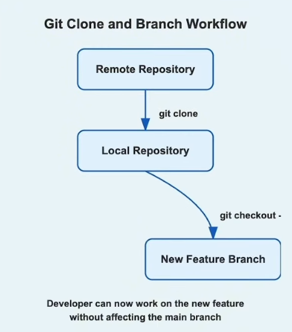

# Git Clone and Branch Workflow - Step 03: Starting Fresh from Remote



## Overview

This diagram illustrates a fundamental workflow in collaborative Git development: **cloning a remote repository and creating a feature branch**. This is typically the first step when joining a new project or starting work on a new feature in an existing project.

## The Three-Stage Workflow

### Stage 1: Remote Repository
**The Source of Truth**

- **What it is**: A Git repository hosted on a remote server (GitHub, GitLab, Bitbucket, etc.)
- **Purpose**: Central location where the project code is stored and shared among team members
- **Characteristics**:
  - Contains the complete project history
  - Accessible to all authorized team members
  - Serves as the backup and collaboration hub
  - Usually contains the main/master branch and other branches

### Stage 2: Local Repository
**Your Complete Copy**

- **What it is**: A full clone of the remote repository on your local machine
- **Created by**: `git clone` command
- **Contains**:
  - Complete project history
  - All branches (that you fetch)
  - Configuration linking to the remote
  - Full Git functionality

### Stage 3: New Feature Branch
**Your Isolated Workspace**

- **What it is**: A separate branch for developing a specific feature
- **Created by**: `git checkout -b` or `git switch -c` command
- **Purpose**: Isolate new development from the stable main branch
- **Benefit**: "Developer can now work on the new feature without affecting the main branch"

## Command Breakdown

### 1. Cloning the Repository

```bash
git clone <repository-url>
```

#### What This Command Does:
1. **Downloads** the entire repository from the remote server
2. **Creates** a new directory with the repository name
3. **Sets up** the remote reference (origin) automatically
4. **Checks out** the default branch (usually main or master)
5. **Initializes** Git tracking in the new directory

#### Practical Examples:

**Clone via HTTPS:**
```bash
git clone https://github.com/username/project-name.git
```

**Clone via SSH:**
```bash
git clone git@github.com:username/project-name.git
```

**Clone into a specific directory:**
```bash
git clone https://github.com/username/project-name.git my-project
```

**Clone a specific branch:**
```bash
git clone -b develop https://github.com/username/project-name.git
```

**Shallow clone (limited history):**
```bash
git clone --depth 1 https://github.com/username/project-name.git
```

### 2. Creating a Feature Branch

```bash
git checkout -b new-feature-branch
```

#### What This Command Does:
1. **Creates** a new branch based on your current branch
2. **Switches** your working directory to the new branch
3. **Isolates** your changes from other branches
4. **Enables** parallel development

#### Alternative Commands:

**Modern Git syntax (Git 2.23+):**
```bash
git switch -c new-feature-branch
```

**Two-step approach:**
```bash
# Create the branch
git branch new-feature-branch

# Switch to it
git checkout new-feature-branch
```

**Create branch from specific commit:**
```bash
git checkout -b new-feature-branch commit-hash
```

**Create branch from remote branch:**
```bash
git checkout -b feature origin/feature
```

## Complete Workflow Example

### Scenario: Joining a New Project

```bash
# Step 1: Clone the repository
git clone https://github.com/company/awesome-project.git

# Step 2: Navigate into the project directory
cd awesome-project

# Step 3: Verify the clone
git status
git branch -a  # See all branches

# Step 4: Create a feature branch
git checkout -b feature/user-authentication

# Step 5: Verify you're on the new branch
git branch
# Output: * feature/user-authentication
#         main

# Step 6: Start working on your feature
# ... make changes to files ...

# Step 7: Stage and commit your changes
git add .
git commit -m "Implement user login functionality"

# Step 8: Push your feature branch to remote
git push -u origin feature/user-authentication
```

## Why This Workflow Matters

### 1. **Clean Starting Point**
- You get the latest, working version of the project
- All dependencies and history are included
- Reduces "works on my machine" problems

### 2. **Safe Development**
- Your work is isolated in a feature branch
- Main branch remains stable and deployable
- You can experiment without risk

### 3. **Easy Collaboration**
- Team members can review your branch before merging
- Multiple developers can work on different features simultaneously
- Clear separation between different work streams

### 4. **Version Control Benefits**
- Full project history is available locally
- Can work offline after cloning
- Easy to sync changes with the team

## Understanding the Flow

```
┌─────────────────────┐
│ Remote Repository   │ ← Hosted on GitHub/GitLab/etc.
│   (Origin)          │
└──────────┬──────────┘
           │ git clone
           │ (Downloads everything)
           ↓
┌─────────────────────┐
│ Local Repository    │ ← Full copy on your machine
│   (main branch)     │
└──────────┬──────────┘
           │ git checkout -b feature
           │ (Creates isolated workspace)
           ↓
┌─────────────────────┐
│ New Feature Branch  │ ← Your development sandbox
│   (feature branch)  │
└─────────────────────┘
```

## Key Concepts

### Remote vs Local Repository

| Aspect | Remote Repository | Local Repository |
|--------|------------------|------------------|
| **Location** | Server (GitHub, GitLab, etc.) | Your computer |
| **Purpose** | Collaboration & backup | Development work |
| **Access** | Requires internet | Works offline |
| **Ownership** | Shared by team | Personal copy |
| **Updates** | Via push/pull | Via clone/commit |

### Main Branch vs Feature Branch

| Aspect | Main Branch | Feature Branch |
|--------|-------------|----------------|
| **Stability** | Always stable | Work in progress |
| **Purpose** | Production-ready code | Develop new features |
| **Changes** | Merged features only | Frequent commits |
| **Lifetime** | Permanent | Temporary (deleted after merge) |
| **Protection** | Often protected | Open for development |

## Common Scenarios

### Scenario 1: Starting a New Feature
```bash
# Clone the repository
git clone https://github.com/team/project.git
cd project

# Create feature branch from main
git checkout -b feature/add-payment-gateway

# Develop and commit
git add .
git commit -m "Add payment gateway integration"

# Push to remote
git push -u origin feature/add-payment-gateway
```

### Scenario 2: Fixing a Bug
```bash
# Clone the repository
git clone https://github.com/team/project.git
cd project

# Create bugfix branch
git checkout -b bugfix/fix-login-error

# Fix the bug and commit
git add .
git commit -m "Fix login validation error"

# Push to remote
git push -u origin bugfix/fix-login-error
```

### Scenario 3: Working on Multiple Features
```bash
# Clone once
git clone https://github.com/team/project.git
cd project

# Create first feature branch
git checkout -b feature/user-profile
# ... work on feature ...
git add .
git commit -m "Add user profile page"

# Switch back to main
git checkout main

# Create second feature branch
git checkout -b feature/notification-system
# ... work on second feature ...
git add .
git commit -m "Add notification system"
```

## Best Practices

### ✅ Do's

1. **Clone before starting work**
   - Always get the latest version from remote
   - Ensures you have the complete project history

2. **Create descriptive branch names**
   ```bash
   # Good examples:
   git checkout -b feature/user-authentication
   git checkout -b bugfix/payment-error
   git checkout -b hotfix/security-patch
   ```

3. **Keep feature branches focused**
   - One branch = one feature or fix
   - Easier to review and merge
   - Reduces merge conflicts

4. **Pull updates regularly**
   ```bash
   git checkout main
   git pull origin main
   ```

5. **Push your branch to remote early**
   ```bash
   git push -u origin feature/my-feature
   ```
   - Creates backup of your work
   - Enables collaboration
   - Facilitates code review

### ❌ Don'ts

1. **Don't work directly on main**
   - Always create a feature branch
   - Keeps main branch stable

2. **Don't clone with unnecessary history**
   - Use shallow clone for large repos if you don't need full history
   ```bash
   git clone --depth 1 <url>
   ```

3. **Don't forget to verify the clone**
   ```bash
   git remote -v
   git branch -a
   ```

4. **Don't use generic branch names**
   - Avoid: `new-feature`, `fix`, `test`
   - Use: `feature/add-login`, `bugfix/navbar-alignment`

5. **Don't clone into existing repositories**
   - Always clone into a new directory
   - Check your current directory first

## Verifying Your Setup

After cloning and creating a branch, verify everything:

```bash
# Check remote configuration
git remote -v
# Output:
# origin  https://github.com/username/project.git (fetch)
# origin  https://github.com/username/project.git (push)

# Check current branch
git branch
# Output:
# main
# * feature/new-feature

# Check branch tracking
git branch -vv

# View repository status
git status
# Output:
# On branch feature/new-feature
# nothing to commit, working tree clean

# View commit history
git log --oneline --graph
```

## Advanced Options

### Cloning Specific Parts

**Clone only a specific branch:**
```bash
git clone -b develop --single-branch https://github.com/user/repo.git
```

**Shallow clone (faster, less history):**
```bash
git clone --depth 1 https://github.com/user/repo.git
```

**Clone without checking out files:**
```bash
git clone --no-checkout https://github.com/user/repo.git
```

### Working with Multiple Remotes

```bash
# Clone the repository
git clone https://github.com/original/repo.git

# Add additional remote
git remote add upstream https://github.com/upstream/repo.git

# Verify remotes
git remote -v
```

## Troubleshooting

### Issue 1: Clone Fails
```bash
# Error: "fatal: could not read from remote repository"
# Solution: Check SSH keys or use HTTPS
git clone https://github.com/user/repo.git
```

### Issue 2: Wrong Directory
```bash
# If you cloned in the wrong place
cd ..
rm -rf wrong-directory
git clone <url> correct-directory
```

### Issue 3: Branch Already Exists
```bash
# Error: "fatal: A branch named 'feature' already exists"
# Solution: Use a different name or delete the old branch
git branch -d feature
git checkout -b feature
```

### Issue 4: Slow Clone
```bash
# For large repositories, use shallow clone
git clone --depth 1 <url>

# Or clone specific branch only
git clone -b main --single-branch <url>
```

## The Developer's Advantage

As noted in the diagram: **"Developer can now work on the new feature without affecting the main branch"**

This means:
- ✅ Experiment freely without breaking production code
- ✅ Commit work-in-progress without affecting others
- ✅ Abandon the branch if the feature doesn't work out
- ✅ Get code reviewed before merging
- ✅ Keep main branch stable and deployable
- ✅ Work on multiple features in parallel

## Next Steps in the Workflow

After creating your feature branch:

1. **Develop your feature**
   - Make changes to files
   - Test your code

2. **Commit regularly**
   ```bash
   git add .
   git commit -m "Descriptive message"
   ```

3. **Push to remote**
   ```bash
   git push origin feature/my-feature
   ```

4. **Create a Pull Request**
   - Request code review
   - Discuss changes with team

5. **Merge after approval**
   ```bash
   git checkout main
   git merge feature/my-feature
   ```

6. **Delete the feature branch**
   ```bash
   git branch -d feature/my-feature
   ```

## Key Takeaways

1. **`git clone` creates a complete local copy** of the remote repository
2. **Feature branches isolate your work** from the main branch
3. **Cloning is a one-time operation** per repository
4. **Branches are lightweight and fast** in Git
5. **This workflow enables safe, parallel development** across teams
6. **Always branch from an updated main branch** for cleanest merges
7. **Remote and local repositories are independent** until you push/pull

---

*This document explains Git clone and branch creation workflow. For basic Git branching, see Step-02.md. For understanding Git stages, see Step-01.md.*
