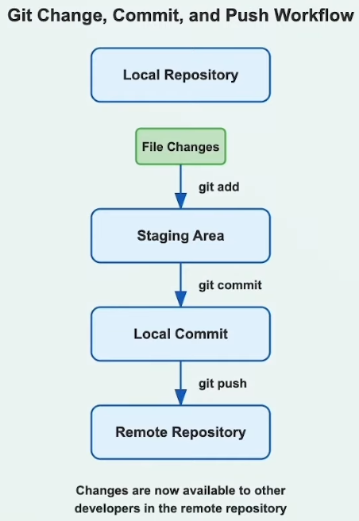

# Git Change, Commit, and Push Workflow - Step 04: Sharing Your Work



## Overview

This diagram illustrates the **complete cycle of making changes and sharing them with your team**. It shows the journey from editing files on your local machine to making those changes available to other developers through the remote repository. This is the most fundamental and frequently used workflow in day-to-day Git operations.

## The Five Stages of Sharing Code

### Stage 1: Local Repository
**Your Starting Point**

- **What it is**: Your local Git repository with the current state of the project
- **Contains**: All committed history and the working directory
- **State**: Ready to accept new changes
- **Location**: On your local machine

### Stage 2: File Changes
**Your Work in Progress**

- **What it is**: Modifications you make to files in your working directory
- **Types of changes**:
  - New files created
  - Existing files modified
  - Files deleted
- **State**: Untracked by Git (not staged yet)
- **Visible to**: Only you, on your local machine

### Stage 3: Staging Area
**The Preparation Zone**

- **What it is**: A holding area for changes you want to commit
- **Purpose**: Select which changes to include in the next commit
- **Command**: `git add` moves changes here
- **State**: Staged and ready to be committed
- **Benefit**: Fine-grained control over what gets committed

### Stage 4: Local Commit
**Your Saved Snapshot**

- **What it is**: A permanent snapshot of your staged changes in local repository
- **Command**: `git commit` creates this snapshot
- **Contains**: 
  - All staged changes
  - Commit message
  - Author information
  - Timestamp
  - Unique commit hash
- **State**: Saved locally, but not yet shared

### Stage 5: Remote Repository
**The Shared Hub**

- **What it is**: The central repository where all team members share code
- **Command**: `git push` uploads your commits here
- **Result**: "Changes are now available to other developers in the remote repository"
- **State**: Visible and accessible to the entire team

## Command Breakdown

### 1. Making Changes

**Just edit your files as normal:**
```bash
# Edit files in your favorite editor/IDE
# Create new files
# Delete unwanted files
```

**Check what changed:**
```bash
# See which files were modified
git status

# See the actual changes in files
git diff

# See changes in a specific file
git diff filename.txt
```

**Example Output:**
```bash
$ git status
On branch feature/user-login
Changes not staged for commit:
  modified:   src/auth.js
  modified:   README.md

Untracked files:
  src/login.js
```

### 2. Staging Changes with `git add`

**Stage specific files:**
```bash
# Stage a single file
git add filename.txt

# Stage multiple files
git add file1.txt file2.txt file3.txt

# Stage files by pattern
git add *.js
git add src/
```

**Stage all changes:**
```bash
# Stage all changes in current directory and subdirectories
git add .

# Stage all changes in entire repository
git add -A

# Stage all changes (alternative)
git add --all
```

**Stage parts of a file (interactive):**
```bash
# Choose which changes to stage interactively
git add -p filename.txt
```

**What happens:**
- Changes move from working directory to staging area
- Git now tracks these changes
- They're ready to be committed

### 3. Committing Changes with `git commit`

**Basic commit:**
```bash
# Commit with a message
git commit -m "Add user authentication feature"
```

**Commit with detailed message:**
```bash
# Opens editor for multi-line message
git commit

# In the editor, write:
# Add user authentication feature
# 
# - Implement login functionality
# - Add password validation
# - Create user session management
```

**Skip staging (for tracked files only):**
```bash
# Stage and commit tracked files in one step
git commit -am "Update user profile page"
```

**Amend the last commit:**
```bash
# Modify the most recent commit
git commit --amend -m "Corrected commit message"
```

**What happens:**
- Staged changes become a permanent snapshot
- Commit is saved to local repository
- Git assigns a unique hash (SHA-1)
- Changes are NOT yet on remote repository

### 4. Pushing to Remote with `git push`

**Basic push:**
```bash
# Push current branch to remote
git push origin branch-name

# Push current branch (if upstream is set)
git push
```

**First-time push (set upstream):**
```bash
# Push and set upstream branch
git push -u origin feature/user-login

# Subsequent pushes can just use:
git push
```

**Push all branches:**
```bash
# Push all branches to remote
git push --all origin
```

**Force push (use with caution):**
```bash
# Overwrite remote history (dangerous!)
git push --force

# Safer force push
git push --force-with-lease
```

**What happens:**
- Local commits are uploaded to remote repository
- Other team members can now see and pull your changes
- Remote branch is updated to match your local branch
- Enables collaboration and backup

## Complete Workflow Example

### Scenario: Adding a New Feature

```bash
# Step 1: Check current status
git status
# On branch feature/user-profile
# nothing to commit, working tree clean

# Step 2: Make changes to files
# (Edit files in your editor: profile.js, profile.css, profile.html)

# Step 3: Check what changed
git status
# Changes not staged for commit:
#   modified:   profile.js
#   modified:   profile.css
#   new file:   profile.html

# View the actual changes
git diff

# Step 4: Stage the changes
git add profile.js profile.css profile.html
# Or stage everything:
git add .

# Step 5: Verify staging
git status
# Changes to be committed:
#   modified:   profile.js
#   modified:   profile.css
#   new file:   profile.html

# Step 6: Commit the changes
git commit -m "Add user profile page with styling"

# Output:
# [feature/user-profile a1b2c3d] Add user profile page with styling
#  3 files changed, 87 insertions(+)
#  create mode 100644 profile.html

# Step 7: Push to remote
git push origin feature/user-profile

# Output:
# Counting objects: 5, done.
# Writing objects: 100% (5/5), 2.43 KiB | 2.43 MiB/s, done.
# To https://github.com/team/project.git
#    e4f5g6h..a1b2c3d  feature/user-profile -> feature/user-profile

# Step 8: Verify on remote
# Check GitHub/GitLab to see your changes
```

## Understanding the Flow

```
┌─────────────────────┐
│ Local Repository    │ ← Starting point
└──────────┬──────────┘
           │
           ↓ (You edit files)
┌─────────────────────┐
│ File Changes        │ ← Modified files in working directory
└──────────┬──────────┘
           │ git add
           ↓
┌─────────────────────┐
│ Staging Area        │ ← Changes ready to commit
└──────────┬──────────┘
           │ git commit
           ↓
┌─────────────────────┐
│ Local Commit        │ ← Snapshot saved locally
└──────────┬──────────┘
           │ git push
           ↓
┌─────────────────────┐
│ Remote Repository   │ ← Changes available to team
└─────────────────────┘
```

## Why Each Stage Matters

### File Changes → Staging Area
**Purpose: Selective Inclusion**
- Choose exactly what to commit
- Group related changes together
- Exclude debug code or temporary files
- Review changes before committing

**Example:**
```bash
# You changed 5 files, but only want to commit 3
git add feature.js feature.css feature.html
# Leave debug.js and test-data.json unstaged
```

### Staging Area → Local Commit
**Purpose: Creating Meaningful History**
- Group logical changes together
- Add descriptive commit messages
- Create checkpoints in development
- Enable easy rollback if needed

**Good commit practices:**
```bash
# ✅ Good: Specific and descriptive
git commit -m "Add email validation to login form"

# ✅ Good: Explains why
git commit -m "Fix navigation bug on mobile devices"

# ❌ Bad: Too vague
git commit -m "Update stuff"

# ❌ Bad: Too broad
git commit -m "Fix everything"
```

### Local Commit → Remote Repository
**Purpose: Collaboration and Backup**
- Share your work with the team
- Backup your code off your machine
- Enable code review via pull requests
- Allow others to build on your work

## Best Practices

### ✅ Do's

1. **Commit often, push regularly**
   ```bash
   # Small, frequent commits are better than large ones
   git add .
   git commit -m "Add header component"
   # ... do more work ...
   git commit -m "Add footer component"
   ```

2. **Write meaningful commit messages**
   ```bash
   # Format: Present tense, imperative mood
   git commit -m "Add user authentication"
   git commit -m "Fix login validation error"
   git commit -m "Update README with installation instructions"
   ```

3. **Review before staging**
   ```bash
   # Always check what you're about to stage
   git status
   git diff
   git diff filename.txt
   ```

4. **Stage related changes together**
   ```bash
   # Commit related changes as a unit
   git add login.js login.css login.html
   git commit -m "Implement login page"
   ```

5. **Pull before push**
   ```bash
   # Avoid conflicts by pulling first
   git pull origin main
   git push origin main
   ```

### ❌ Don'ts

1. **Don't commit sensitive data**
   ```bash
   # ❌ Never commit:
   # - Passwords
   # - API keys
   # - Environment files (.env)
   # - Private keys
   
   # Use .gitignore to prevent this
   ```

2. **Don't use vague commit messages**
   ```bash
   # ❌ Bad messages:
   git commit -m "fix"
   git commit -m "update"
   git commit -m "stuff"
   git commit -m "asdf"
   ```

3. **Don't commit without reviewing**
   ```bash
   # ❌ Don't blindly commit everything:
   git add .
   git commit -m "Updates"
   
   # ✅ Review first:
   git status
   git diff
   git add .
   git commit -m "Add user profile feature"
   ```

4. **Don't push broken code to main branch**
   ```bash
   # Always test before pushing to main
   # Use feature branches for development
   ```

5. **Don't force push to shared branches**
   ```bash
   # ❌ Dangerous on shared branches:
   git push --force
   
   # ✅ Use on your own feature branches only
   ```

## Common Workflows

### Workflow 1: Quick Fix

```bash
# Fix a typo
# Edit file...

git add filename.txt
git commit -m "Fix typo in documentation"
git push
```

### Workflow 2: Feature Development

```bash
# Day 1: Start feature
git add feature-part1.js
git commit -m "Implement basic feature structure"
git push

# Day 2: Continue feature
git add feature-part2.js
git commit -m "Add feature validation logic"
git push

# Day 3: Complete feature
git add feature-part3.js tests.js
git commit -m "Add tests and finalize feature"
git push
```

### Workflow 3: Multiple Related Changes

```bash
# Make changes to multiple files
git status
# modified: auth.js
# modified: user.js
# modified: database.js

# Stage and commit related changes
git add auth.js user.js
git commit -m "Refactor authentication system"

git add database.js
git commit -m "Update database schema"

git push
```

### Workflow 4: Selective Staging

```bash
# You changed 2 files but want separate commits
git add frontend.js
git commit -m "Update UI components"

git add backend.js
git commit -m "Add API endpoint"

git push
```

## Checking Your Progress

### Before Staging
```bash
# What files changed?
git status

# What are the actual changes?
git diff

# Changes in specific file
git diff path/to/file.js
```

### After Staging
```bash
# What's staged?
git status

# See staged changes
git diff --staged

# Unstage if needed
git reset HEAD filename.txt
```

### After Committing
```bash
# View commit history
git log

# View recent commits (one line each)
git log --oneline

# See what changed in last commit
git show

# View specific commit
git show commit-hash
```

### After Pushing
```bash
# Confirm push succeeded
git status
# Output: Your branch is up to date with 'origin/branch-name'

# View remote branches
git branch -r

# Check remote URL
git remote -v
```

## Advanced Techniques

### Partial File Staging
```bash
# Stage only some changes in a file
git add -p filename.js

# Git will show each change and ask:
# Stage this hunk [y,n,q,a,d,s,e,?]?
# y = yes, stage this
# n = no, don't stage this
# s = split into smaller hunks
# q = quit
```

### Amending Commits
```bash
# Forgot to include a file?
git add forgotten-file.js
git commit --amend --no-edit

# Fix commit message
git commit --amend -m "Corrected message"

# ⚠️ Only amend commits that haven't been pushed!
```

### Stashing Changes
```bash
# Save changes without committing
git stash

# Work on something else...
git checkout other-branch

# Come back and restore changes
git checkout original-branch
git stash pop
```

### Committing Only Part of Changes
```bash
# You have many changes but only want to commit some
git add specific-file1.js specific-file2.css
git commit -m "Implement specific feature"

# Other changes remain unstaged for later commit
```

## Troubleshooting

### Issue 1: Forgot to Stage Files
```bash
# Problem: Committed without staging all files
# Solution: Add the file and amend
git add forgotten-file.js
git commit --amend --no-edit
```

### Issue 2: Wrong Commit Message
```bash
# Problem: Typo in commit message
# Solution: Amend if not pushed yet
git commit --amend -m "Correct message"
```

### Issue 3: Push Rejected
```bash
# Error: "Updates were rejected because the remote contains work..."
# Solution: Pull first, then push
git pull origin branch-name
# Resolve any conflicts
git push origin branch-name
```

### Issue 4: Committed to Wrong Branch
```bash
# Problem: Made commit on main instead of feature branch
# Solution: Create branch from current state
git branch feature/my-feature
git reset --hard HEAD~1  # Remove commit from main
git checkout feature/my-feature  # Commit is now here
```

### Issue 5: Want to Undo Add
```bash
# Problem: Staged wrong file
# Solution: Unstage it
git reset HEAD filename.txt

# Or unstage everything
git reset HEAD .
```

### Issue 6: Accidentally Pushed Sensitive Data
```bash
# 🚨 URGENT: Remove immediately
# 1. Remove from repository
git rm --cached sensitive-file.txt
git commit -m "Remove sensitive file"
git push

# 2. Add to .gitignore
echo "sensitive-file.txt" >> .gitignore

# 3. Consider the data compromised - rotate keys/passwords
```

## Understanding "Changes are now available to other developers"

Once you push to the remote repository:

### Team Members Can:
- **Pull your changes**: `git pull origin branch-name`
- **See your commits**: View on GitHub/GitLab
- **Review your code**: Comment on commits
- **Build on your work**: Checkout your branch
- **Merge your changes**: Via pull requests

### What This Enables:
- ✅ **Collaboration**: Multiple people working together
- ✅ **Code review**: Quality assurance before merging
- ✅ **Backup**: Code is safe even if your machine fails
- ✅ **Continuous Integration**: Automated tests run
- ✅ **Deployment**: Code can be deployed from remote
- ✅ **Transparency**: Team visibility into progress

## Complete Daily Workflow

```bash
# Morning: Start work
git checkout main
git pull origin main
git checkout -b feature/new-feature

# Development: Make changes
# ... edit files ...
git status
git diff
git add .
git commit -m "Add feature implementation"

# Mid-day: Push for backup
git push -u origin feature/new-feature

# Afternoon: More changes
# ... edit more files ...
git add .
git commit -m "Add tests for new feature"
git push

# End of day: Final push
# ... final changes ...
git add .
git commit -m "Update documentation"
git push

# Next: Create pull request for review
```

## Key Takeaways

1. **The workflow is: Edit → Add → Commit → Push**
2. **`git add` stages changes** for the next commit
3. **`git commit` saves a snapshot** locally
4. **`git push` shares your work** with the team
5. **Each stage serves a specific purpose** in the development cycle
6. **Commits should be logical, focused units** of work
7. **Commit messages matter** - they document your changes
8. **Push regularly** to backup work and enable collaboration
9. **Review before committing** to avoid mistakes
10. **After pushing, your changes are public** to the team

---

*This document explains the Git change, commit, and push workflow. For understanding Git branching, see Step-02.md and Step-03.md. For Git stages overview, see Step-01.md.*
