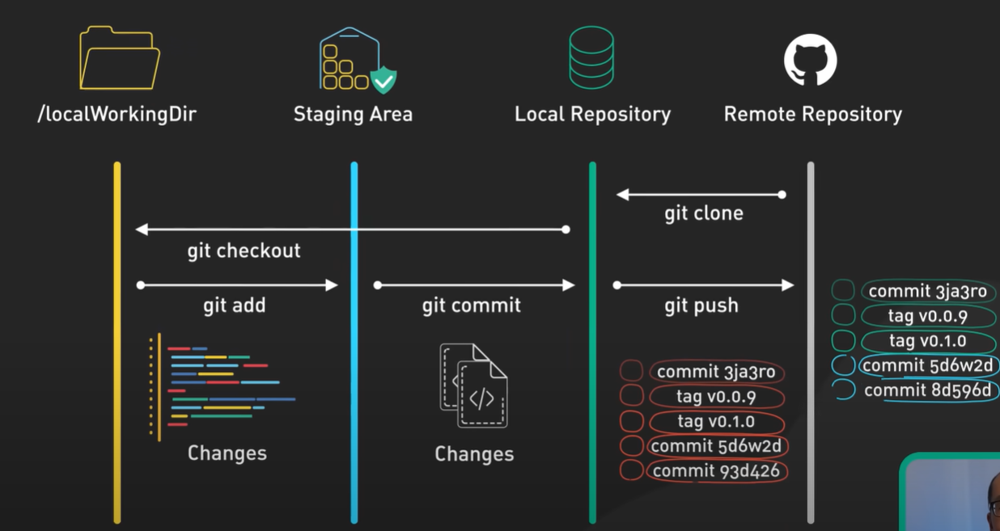

# Git Complete Workflow - Step 05: The Full Picture



## Overview

This diagram presents a **comprehensive visual representation of the entire Git workflow**, showing all four key areas and how code moves between them. This is the complete picture that ties together all the concepts from previous steps, illustrating how changes flow from your local working directory all the way to the remote repository and back.

## The Four Pillars of Git

### 1. /localWorkingDir (Working Directory)
**Your Development Workspace**

- **Icon**: Folder icon (yellow/gold)
- **What it is**: The actual files and folders on your computer where you write code
- **Contains**: 
  - Your project files (tracked and untracked)
  - Code changes you're currently working on
  - Modifications not yet staged
- **Visualization**: Shows colorful code lines representing your changes
- **State**: Files in various states (modified, new, deleted)

### 2. Staging Area (Index)
**The Preparation Zone**

- **Icon**: Package/box with checkmark icon (cyan/blue)
- **What it is**: A buffer zone between your working directory and the repository
- **Purpose**: Select and prepare specific changes for commit
- **Contains**: Snapshot of files marked for the next commit
- **Visualization**: Shows files/documents icon representing staged changes
- **Command to get here**: `git add`

### 3. Local Repository
**Your Personal Git Database**

- **Icon**: Database cylinder icon (green)
- **What it is**: The `.git` directory containing your project's complete history
- **Contains**: 
  - All commits with their full history
  - Tags marking specific versions (v0.0.9, v0.1.0)
  - Branches and their commits
  - Complete project snapshots
- **Visualization**: Shows commit history with hashes (3ja3ro, 5d6w2d, 93d426, etc.)
- **Command to get here**: `git commit`

### 4. Remote Repository
**The Collaboration Hub**

- **Icon**: GitHub logo (white Octocat)
- **What it is**: Server-hosted repository (GitHub, GitLab, Bitbucket)
- **Contains**: 
  - Shared commit history
  - Tags synchronized from local
  - All branches pushed from team members
  - Latest highlighted commit (8d596d)
- **Visualization**: Shows commit timeline with current HEAD
- **Command to get here**: `git push`

## The Complete Workflow Commands

### Forward Flow: Local → Remote

#### 1. `git add` - Working Directory → Staging Area
```bash
# Stage specific files
git add filename.js

# Stage all changes
git add .

# Stage by pattern
git add *.css
```

**What happens:**
- Changes move from working directory to staging area
- Files are marked for inclusion in next commit
- You gain control over what gets committed
- Changes are still local and can be unstaged

**Visual in diagram:** Arrow from left (yellow timeline) to staging area (cyan timeline)

#### 2. `git commit` - Staging Area → Local Repository
```bash
# Commit staged changes
git commit -m "Add new feature"

# Commit with detailed message
git commit -m "Add user authentication" -m "Includes login, logout, and session management"

# Stage and commit tracked files in one step
git commit -am "Update documentation"
```

**What happens:**
- Staged changes become a permanent snapshot
- Git creates a unique commit hash (like 5d6w2d)
- Commit is saved to `.git` directory
- Changes are still only on your machine

**Visual in diagram:** Arrow from staging area (cyan timeline) to local repository (green timeline)

#### 3. `git push` - Local Repository → Remote Repository
```bash
# Push to remote
git push origin main

# Push with upstream tracking
git push -u origin feature-branch

# Push all branches
git push --all
```

**What happens:**
- Local commits are uploaded to remote server
- Remote repository is updated with your commits
- Tags are synchronized
- Changes become available to team members

**Visual in diagram:** Arrow from local repository (green timeline) to remote repository (gray timeline)

### Backward Flow: Remote → Local

#### 4. `git clone` - Remote Repository → Local Repository
```bash
# Clone a repository
git clone https://github.com/user/repo.git

# Clone to specific directory
git clone https://github.com/user/repo.git my-project

# Shallow clone (faster, less history)
git clone --depth 1 https://github.com/user/repo.git
```

**What happens:**
- Complete repository is downloaded from remote
- All history, commits, and branches are copied
- Local repository is created
- Working directory is populated with latest code

**Visual in diagram:** Arrow from remote repository back to local repository

#### 5. `git checkout` - Local Repository → Working Directory
```bash
# Switch to a branch
git checkout main
git checkout feature-branch

# Create and switch to new branch
git checkout -b new-feature

# Checkout specific commit
git checkout 5d6w2d

# Checkout specific file from commit
git checkout HEAD -- filename.js
```

**What happens:**
- Working directory files are updated to match the checked-out state
- HEAD pointer moves to specified branch or commit
- Files in working directory reflect the selected version
- You can now work on this version

**Visual in diagram:** Arrow from local repository back to working directory

## Understanding Commits and Tags

### Commit Hashes Shown in Diagram

The diagram shows realistic commit hashes to illustrate version history:

**Local Repository:**
- `commit 3ja3ro` (oldest)
- `tag v0.0.9`
- `tag v0.1.0`
- `commit 5d6w2d`
- `commit 93d426` (newest)

**Remote Repository:**
- `commit 3ja3ro`
- `tag v0.0.9`
- `tag v0.1.0`
- `commit 5d6w2d`
- `commit 8d596d` (current HEAD - highlighted in cyan)

**Key observation:** The remote is slightly ahead with commit `8d596d`, which means someone else pushed changes that you need to pull!

### Tags in the Workflow

**What are tags?**
- Markers for specific commits (usually releases)
- Examples: `v0.0.9`, `v0.1.0`, `v1.0.0`
- Permanent references to important commits
- Used for version releases and milestones

**Creating and pushing tags:**
```bash
# Create a tag
git tag v1.0.0

# Create annotated tag (recommended)
git tag -a v1.0.0 -m "Release version 1.0.0"

# Push tags to remote
git push origin v1.0.0

# Push all tags
git push --tags
```

## Complete Workflow Scenarios

### Scenario 1: Starting Fresh with a New Project

```bash
# 1. Clone the remote repository
git clone https://github.com/team/project.git
cd project

# 2. Checkout to working directory (already done by clone)
# Files are now in your working directory

# 3. Create a feature branch
git checkout -b feature/new-feature

# 4. Make changes to files
# (Edit files in your IDE)

# 5. Check status
git status

# 6. Stage changes
git add .

# 7. Commit changes
git commit -m "Implement new feature"

# 8. Push to remote
git push -u origin feature/new-feature
```

### Scenario 2: Daily Development Cycle

```bash
# Morning: Get latest changes
git checkout main
git pull origin main

# Create feature branch
git checkout -b feature/user-dashboard

# Work on feature
# ... edit files ...

# Stage and commit incrementally
git add dashboard.js dashboard.css
git commit -m "Add dashboard layout"

# ... more edits ...
git add dashboard-api.js
git commit -m "Integrate dashboard API"

# Push to backup and enable collaboration
git push -u origin feature/user-dashboard

# Continue working
# ... more edits ...
git add dashboard-tests.js
git commit -m "Add dashboard tests"
git push

# End of day: All work is backed up on remote
```

### Scenario 3: Syncing with Team Changes

```bash
# You have local commits
git log --oneline
# 93d426 Add feature X
# 5d6w2d Update documentation

# Remote has new commits (8d596d from teammate)
# You need to sync before pushing

# Pull remote changes
git pull origin main

# If conflicts, resolve them
# ... fix conflicts ...
git add .
git commit -m "Merge remote changes"

# Now push your changes
git push origin main
```

### Scenario 4: Creating a Release

```bash
# Ensure you're on main with latest code
git checkout main
git pull origin main

# Create a release tag
git tag -a v1.0.0 -m "Release version 1.0.0"

# View tags
git tag

# Push tag to remote
git push origin v1.0.0

# Or push all tags
git push --tags
```

## Visual Flow Analysis

### Left to Right: The Publishing Flow

```
Working Dir → Staging → Local Repo → Remote Repo
    (edit)  git add   git commit    git push
```

This represents **publishing your work**:
1. You make changes
2. You stage what you want to commit
3. You commit to create a snapshot
4. You push to share with the team

### Right to Left: The Retrieval Flow

```
Remote Repo → Local Repo → Working Dir
           git clone     git checkout
           git pull      git switch
```

This represents **getting code**:
1. Clone to get the repository initially
2. Checkout to update your working directory
3. Pull to get the latest changes

## Understanding the Timelines

### Working Directory Timeline (Yellow)
- Represents continuous file editing
- No fixed points until you stage
- Most volatile area (can lose changes)
- Shows active code being written

### Staging Area Timeline (Cyan)
- Represents prepared changes
- Intermediate state before committing
- Can be modified before committing
- Gives you control over what gets committed

### Local Repository Timeline (Green)
- Shows permanent commit history
- Each commit is a snapshot
- Includes tags for releases
- Complete offline record

### Remote Repository Timeline (Gray)
- Shared team history
- Current HEAD marked (8d596d highlighted)
- Source of truth for the team
- Accessible to all collaborators

## Key Commands Summary

### Moving Forward (Local → Remote)
| Command | From | To | Purpose |
|---------|------|-------|---------|
| `git add` | Working Dir | Staging Area | Stage changes |
| `git commit` | Staging Area | Local Repo | Save snapshot |
| `git push` | Local Repo | Remote Repo | Share with team |

### Moving Backward (Remote → Local)
| Command | From | To | Purpose |
|---------|------|-------|---------|
| `git clone` | Remote Repo | Local Repo | Get repository |
| `git pull` | Remote Repo | Local Repo + Working Dir | Update code |
| `git checkout` | Local Repo | Working Dir | Switch versions |
| `git fetch` | Remote Repo | Local Repo | Download changes only |

## Advanced Workflow Concepts

### The Difference Between Fetch and Pull

**Git Fetch:**
```bash
git fetch origin

# Downloads commits from remote
# Does NOT modify your working directory
# Safe - just updates your local repo's knowledge of remote
```

**Git Pull:**
```bash
git pull origin main

# Equivalent to: git fetch + git merge
# Downloads AND merges into current branch
# Updates your working directory
```

### Stashing: Temporary Storage

```bash
# Save work-in-progress without committing
git stash

# Work on something else
git checkout other-branch

# Come back and restore
git checkout original-branch
git stash pop
```

**Where does stash fit?**
- Temporary storage between Working Directory and Staging Area
- Useful when you need to switch contexts quickly

### Reset: Moving Between States

```bash
# Unstage files (keep changes in working directory)
git reset HEAD file.txt

# Undo last commit (keep changes staged)
git reset --soft HEAD~1

# Undo last commit (keep changes in working directory)
git reset --mixed HEAD~1

# Undo last commit (discard all changes) ⚠️ DANGEROUS
git reset --hard HEAD~1
```

## Best Practices for the Complete Workflow

### ✅ Do's

1. **Follow the flow: Edit → Add → Commit → Push**
   ```bash
   # Natural progression
   # Edit files...
   git add .
   git commit -m "Clear message"
   git push
   ```

2. **Pull before push to avoid conflicts**
   ```bash
   git pull origin main
   # Resolve any conflicts
   git push origin main
   ```

3. **Commit often, push regularly**
   ```bash
   # Small commits are easier to manage
   git commit -m "Add header"
   git commit -m "Add footer"
   git push
   ```

4. **Use meaningful commit messages**
   ```bash
   git commit -m "Fix login validation bug"
   # Not: git commit -m "fix"
   ```

5. **Create tags for releases**
   ```bash
   git tag -a v1.0.0 -m "First stable release"
   git push --tags
   ```

6. **Review staged changes before committing**
   ```bash
   git diff --staged
   git status
   ```

### ❌ Don'ts

1. **Don't skip the staging area unnecessarily**
   ```bash
   # ❌ This stages all changes blindly
   git commit -am "Update"
   
   # ✅ Review what you're committing
   git status
   git add specific-files.js
   git commit -m "Update specific feature"
   ```

2. **Don't force push to shared branches**
   ```bash
   # ❌ Dangerous on main/shared branches
   git push --force
   
   # ✅ Only force push your own feature branches if needed
   git push --force-with-lease origin my-feature
   ```

3. **Don't commit without testing**
   ```bash
   # ❌ Don't do this:
   # ... make changes ...
   git add .
   git commit -m "New feature"
   git push
   
   # ✅ Do this:
   # ... make changes ...
   # ... test changes ...
   git add .
   git commit -m "New feature (tested)"
   git push
   ```

4. **Don't commit sensitive information**
   ```bash
   # Never commit:
   # - passwords
   # - API keys
   # - .env files
   # - private keys
   
   # Use .gitignore!
   ```

5. **Don't work directly on main branch**
   ```bash
   # ❌ Don't:
   git checkout main
   # ... edit files ...
   
   # ✅ Do:
   git checkout -b feature/my-feature
   # ... edit files ...
   ```

## Checking State at Each Stage

### Check Working Directory
```bash
# See modified files
git status

# See actual changes
git diff

# See untracked files
git status -u
```

### Check Staging Area
```bash
# See staged files
git status

# See staged changes
git diff --staged

# See both staged and unstaged
git status -v
```

### Check Local Repository
```bash
# See commit history
git log

# See commits with changes
git log -p

# See commits graphically
git log --oneline --graph --all

# See specific commit
git show 5d6w2d
```

### Check Remote Repository
```bash
# See remote branches
git branch -r

# See all branches (local and remote)
git branch -a

# See remote status
git remote show origin

# Compare local with remote
git log origin/main..main  # Commits you haven't pushed
git log main..origin/main  # Commits you haven't pulled
```

## Synchronization Patterns

### Pattern 1: Simple Push (Local Ahead)
```
Local:  3ja3ro → 5d6w2d → 93d426 (you)
Remote: 3ja3ro → 5d6w2d

Action: git push
Result: Remote now has 93d426
```

### Pattern 2: Simple Pull (Remote Ahead)
```
Local:  3ja3ro → 5d6w2d
Remote: 3ja3ro → 5d6w2d → 8d596d (teammate)

Action: git pull
Result: Local now has 8d596d
```

### Pattern 3: Diverged (Both Have New Commits)
```
Local:  3ja3ro → 5d6w2d → 93d426 (you)
Remote: 3ja3ro → 5d6w2d → 8d596d (teammate)

Action: git pull (fetch + merge)
Result: Creates merge commit combining both
```

## Real-World Example: Feature Development

```bash
# Day 1: Start new feature
git clone https://github.com/team/project.git
cd project
git checkout -b feature/payment-integration

# Make changes
# ... edit payment.js ...
git add payment.js
git commit -m "Add payment gateway structure"
git push -u origin feature/payment-integration

# Day 2: Continue development
git pull origin feature/payment-integration  # Get any changes
# ... edit payment.js, api.js ...
git add payment.js api.js
git commit -m "Implement payment API calls"
git push

# Day 3: Finalize and test
# ... add tests, fix bugs ...
git add .
git commit -m "Add payment integration tests"
git push

# Day 4: Ready for review
# Create pull request on GitHub
# After approval, merge to main
git checkout main
git pull origin main
git merge feature/payment-integration
git push origin main

# Tag the release
git tag -a v1.1.0 -m "Add payment integration"
git push origin v1.1.0

# Clean up
git branch -d feature/payment-integration
git push origin --delete feature/payment-integration
```

## Understanding Repository States

### Clean State
```bash
$ git status
On branch main
Your branch is up to date with 'origin/main'.

nothing to commit, working tree clean
```
- No changes in working directory
- Nothing staged
- Synced with remote

### Modified Files (Working Directory)
```bash
$ git status
On branch main
Changes not staged for commit:
  modified:   index.html
  modified:   style.css
```
- Files changed but not staged
- Changes only in working directory

### Staged Files (Staging Area)
```bash
$ git status
On branch main
Changes to be committed:
  modified:   index.html
  modified:   style.css
```
- Files staged for commit
- Ready to be committed

### Ahead of Remote (Local Repository)
```bash
$ git status
On branch main
Your branch is ahead of 'origin/main' by 2 commits.
  (use "git push" to publish your local commits)
```
- Local has commits not on remote
- Need to push

### Behind Remote
```bash
$ git status
On branch main
Your branch is behind 'origin/main' by 1 commit.
  (use "git pull" to update your local branch)
```
- Remote has commits not in local
- Need to pull

## Key Takeaways

1. **Four distinct areas**: Working Directory, Staging Area, Local Repository, Remote Repository
2. **Forward flow**: `add` → `commit` → `push` (publishing your work)
3. **Backward flow**: `clone/pull` → `checkout` (getting code)
4. **Staging area provides control**: Choose exactly what to commit
5. **Local repository enables offline work**: Commit without internet
6. **Remote repository enables collaboration**: Share and backup code
7. **Commits are snapshots**: Each commit represents a complete state
8. **Tags mark important versions**: Use for releases and milestones
9. **The workflow is cyclical**: Continuous loop of edit, commit, push, pull
10. **Understanding the flow prevents mistakes**: Know where your changes are

## The Big Picture

This diagram shows that Git is not just a simple save system - it's a sophisticated workflow with multiple checkpoints:

- **Working Directory**: Where creativity happens
- **Staging Area**: Where you curate your changes
- **Local Repository**: Where you preserve history
- **Remote Repository**: Where you collaborate and backup

Each stage serves a purpose, and understanding the complete picture helps you use Git effectively and confidently.

---

*This document explains the complete Git workflow with all four key areas. This integrates concepts from Step-01 (Git stages), Step-02 (branching), Step-03 (cloning), and Step-04 (committing).*
