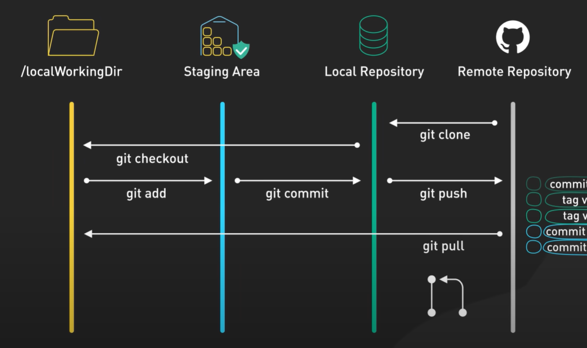

# Git Pull Workflow - Step 06: Synchronizing with Remote Changes



## Overview

This diagram illustrates the **complete bidirectional Git workflow**, with special emphasis on the `git pull` command. While previous diagrams focused on pushing changes to remote, this one highlights how to **retrieve and synchronize changes from the remote repository back to your local environment**. Understanding this flow is crucial for collaborative development where multiple team members are working on the same codebase.

## The Four Key Areas Revisited

### 1. /localWorkingDir (Working Directory)
**Your Active Workspace**

- **Icon**: Yellow/gold folder
- **Purpose**: Where you actively edit and work on files
- **State**: Contains your current work, both tracked and untracked changes
- **Affected by**: `git checkout`, `git pull`

### 2. Staging Area
**The Selection Zone**

- **Icon**: Cyan box with checkmark
- **Purpose**: Prepare specific changes for commit
- **State**: Holds changes marked for the next commit
- **Affected by**: `git add`, `git reset`

### 3. Local Repository
**Your Local Database**

- **Icon**: Green database cylinder
- **Purpose**: Stores complete project history locally
- **Contains**: Commits, branches, tags
- **Affected by**: `git commit`, `git pull`, `git fetch`

### 4. Remote Repository
**The Central Hub**

- **Icon**: White GitHub Octocat
- **Purpose**: Central collaboration point for the team
- **Contains**: Shared commits, branches, tags
- **Affected by**: `git push`, team member pushes

## The Bidirectional Workflow

### Forward Flow: Sending Changes to Remote

```
Working Directory → Staging Area → Local Repository → Remote Repository
      (edit)         git add        git commit          git push
```

### Backward Flow: Receiving Changes from Remote (Featured!)

```
Remote Repository → Local Repository → Working Directory
                   git pull (fetch + merge)
                   
Or broken into steps:
Remote Repository → Local Repository → Working Directory
     git fetch         git merge      (automatic)
```

## Understanding `git pull`

### What is Git Pull?

**Git pull is a compound command** that performs two operations:
1. **`git fetch`**: Downloads commits from remote to local repository
2. **`git merge`**: Merges the fetched changes into your current branch

### The Pull Process Visualized

```
Before Pull:
Local:  A → B → C (your local commits)
Remote: A → B → C → D → E (teammate's commits)

During Pull:
1. Fetch: Download D and E to local repo
2. Merge: Integrate D and E into your branch

After Pull:
Local:  A → B → C → D → E (now synchronized)
Remote: A → B → C → D → E (unchanged)
```

### The Pull Arrow in the Diagram

The diagram shows a distinctive **long horizontal arrow** labeled `git pull` that:
- **Starts** from the Remote Repository (right side)
- **Passes through** the Local Repository (updating it)
- **Ends** at the Working Directory (updating your files)

Below the arrow, you'll see a **merge visualization** showing two commit paths converging - this represents how `git pull` merges remote changes with your local work.

## Git Pull Commands

### Basic Pull
```bash
# Pull from the tracked remote branch
git pull

# Equivalent to:
git fetch origin
git merge origin/current-branch
```

### Pull from Specific Remote and Branch
```bash
# Pull from specific branch
git pull origin main

# Pull from different remote
git pull upstream develop
```

### Pull with Rebase (Alternative to Merge)
```bash
# Pull and rebase instead of merge
git pull --rebase

# Or specifically:
git pull --rebase origin main
```

### Pull with Options
```bash
# Pull only if fast-forward is possible
git pull --ff-only

# Pull and show verbose output
git pull -v

# Pull all branches
git pull --all
```

## When to Use Git Pull

### Scenario 1: Start of the Day
```bash
# Get latest changes before starting work
git checkout main
git pull origin main

# Now create your feature branch
git checkout -b feature/new-feature
```

### Scenario 2: Before Pushing
```bash
# Always pull before pushing to avoid conflicts
git pull origin main

# If successful, then push
git push origin main
```

### Scenario 3: Syncing During Development
```bash
# Periodically sync with team changes
git stash              # Save your work temporarily
git pull origin main   # Get latest changes
git stash pop          # Restore your work
```

### Scenario 4: After Team Member Pushes
```bash
# Teammate notifies you of a push
git pull origin feature/shared-feature

# Review and test the new changes
git log --oneline -5
```

## Git Pull vs Git Fetch vs Git Merge

### Git Fetch (Safe, Information Gathering)
```bash
git fetch origin

# What it does:
# ✓ Downloads commits from remote
# ✓ Updates remote tracking branches
# ✗ Does NOT modify your working directory
# ✗ Does NOT merge changes into your branch
```

**Use when**: You want to see what's changed without affecting your work

### Git Merge (Integration)
```bash
git merge origin/main

# What it does:
# ✓ Merges fetched changes into current branch
# ✓ Updates working directory
# ✓ May create a merge commit
# ✗ Requires prior fetch
```

**Use when**: You've fetched and want to integrate changes

### Git Pull (Convenience, Combined Action)
```bash
git pull origin main

# What it does:
# ✓ Fetches from remote
# ✓ Merges into current branch
# ✓ Updates working directory
# ⚠️ Can cause merge conflicts
```

**Use when**: You want to sync quickly and are ready to handle conflicts

### Comparison Table

| Command | Downloads Changes | Merges Changes | Updates Working Dir | Risk Level |
|---------|------------------|----------------|---------------------|------------|
| `git fetch` | ✅ Yes | ❌ No | ❌ No | 🟢 Low (Safe) |
| `git merge` | ❌ No* | ✅ Yes | ✅ Yes | 🟡 Medium |
| `git pull` | ✅ Yes | ✅ Yes | ✅ Yes | 🟡 Medium |

*Assumes you've already fetched

## Complete Workflow Example

### Scenario: Collaborative Feature Development

```bash
# Monday Morning: Start work
git clone https://github.com/team/project.git
cd project

# Create feature branch
git checkout -b feature/user-profile

# Work on feature
# ... edit files ...
git add .
git commit -m "Add user profile structure"
git push -u origin feature/user-profile

# Tuesday: Teammate also works on same feature
# They push their changes while you're working

# Tuesday Afternoon: Get teammate's changes
git pull origin feature/user-profile

# Output shows:
# remote: Counting objects: 5, done.
# Unpacking objects: 100% (5/5), done.
# From https://github.com/team/project
#  * branch            feature/user-profile -> FETCH_HEAD
# Updating a1b2c3d..e4f5g6h
# Fast-forward
#  profile.js | 15 +++++++++++++++
#  1 file changed, 15 insertions(+)

# Continue working with teammate's changes
# ... edit more files ...
git add .
git commit -m "Add profile validation"
git push

# Wednesday: Time to merge to main
git checkout main
git pull origin main  # Get latest main
git merge feature/user-profile
git push origin main
```

## Handling Pull Conflicts

### What Causes Conflicts?

Conflicts occur when:
- You and a teammate modified the same lines in the same file
- One person deleted a file while another modified it
- Multiple conflicting changes in the merge

### Conflict Resolution Workflow

```bash
# Attempt to pull
git pull origin main

# Conflict occurs:
# Auto-merging index.js
# CONFLICT (content): Merge conflict in index.js
# Automatic merge failed; fix conflicts and then commit the result.

# Step 1: Check conflicted files
git status
# Unmerged paths:
#   both modified:   index.js

# Step 2: Open the file and see conflict markers
# <<<<<<< HEAD
# Your local changes
# =======
# Remote changes
# >>>>>>> origin/main

# Step 3: Edit the file to resolve conflicts
# Remove conflict markers and combine changes appropriately

# Step 4: Stage the resolved file
git add index.js

# Step 5: Complete the merge
git commit -m "Merge remote changes and resolve conflicts"

# Step 6: Push the resolved merge
git push origin main
```

### Example Conflict Resolution

**Before (with conflict markers):**
```javascript
function calculateTotal(price, tax) {
<<<<<<< HEAD
  // Your changes
  return price + (price * tax);
=======
  // Remote changes
  return price * (1 + tax);
>>>>>>> origin/main
}
```

**After (resolved):**
```javascript
function calculateTotal(price, tax) {
  // Combined approach with validation
  if (price < 0 || tax < 0) return 0;
  return price * (1 + tax);
}
```

**Then finalize:**
```bash
git add calculator.js
git commit -m "Merge: combine price calculation approaches with validation"
git push
```

## Pull Strategies

### Strategy 1: Merge (Default)
```bash
git pull origin main

# Creates a merge commit if histories diverged
# Preserves complete history
# Results in: A → B → C → M (merge commit)
```

**Pros:**
- ✅ Preserves exact history
- ✅ Shows when integration happened
- ✅ Safe and reversible

**Cons:**
- ❌ Creates extra merge commits
- ❌ History can become cluttered

### Strategy 2: Rebase
```bash
git pull --rebase origin main

# Replays your commits on top of remote commits
# Creates linear history
# Results in: A → B → C → D (your commits replayed)
```

**Pros:**
- ✅ Clean, linear history
- ✅ No merge commits
- ✅ Easier to follow

**Cons:**
- ❌ Rewrites commit history
- ❌ More complex conflict resolution
- ❌ Never use on public branches!

### Strategy 3: Fast-Forward Only
```bash
git pull --ff-only origin main

# Only pulls if fast-forward is possible
# Fails if histories have diverged
```

**Pros:**
- ✅ Safest option
- ✅ Prevents unexpected merges
- ✅ Forces you to handle divergence explicitly

**Cons:**
- ❌ Fails if you have local commits
- ❌ Requires manual intervention more often

### Configuring Default Pull Strategy
```bash
# Set global pull strategy to rebase
git config --global pull.rebase true

# Set to fast-forward only
git config --global pull.ff only

# Set to merge (default)
git config --global pull.rebase false
```

## The Complete Bidirectional Flow

### Understanding Both Directions

```
          git add      git commit      git push
Working --------> Staging --------> Local --------> Remote
  Dir                Area              Repo          Repo
  ↑                                      ↑             |
  |                                      |             |
  └──────────────────────────────────────┴─────────────┘
              git pull (fetch + merge)
          or: git checkout (after fetch)
```

### Daily Developer Workflow

```bash
# Morning: Sync with team
git checkout main
git pull origin main
git checkout -b feature/today-work

# Mid-morning: Work and commit
# ... edit files ...
git add .
git commit -m "Implement feature part 1"

# Lunch: Push for backup
git push -u origin feature/today-work

# Afternoon: Check for team updates
git checkout main
git pull origin main
git checkout feature/today-work
git merge main  # Bring main updates into your feature

# Late afternoon: More work
# ... edit files ...
git add .
git commit -m "Complete feature"
git push

# End of day: Everything backed up
git status  # Should be clean and pushed
```

## Best Practices for Pulling

### ✅ Do's

1. **Pull before starting work**
   ```bash
   git checkout main
   git pull origin main
   # Now you have the latest code
   ```

2. **Pull before pushing**
   ```bash
   git pull origin main
   # Resolve any conflicts locally
   git push origin main
   ```

3. **Pull regularly during long development sessions**
   ```bash
   # Every few hours
   git stash
   git pull origin main
   git stash pop
   ```

4. **Review what you're pulling**
   ```bash
   git fetch origin
   git log HEAD..origin/main  # See what's new
   git pull origin main
   ```

5. **Commit your work before pulling**
   ```bash
   # Save work first
   git add .
   git commit -m "WIP: save progress"
   git pull
   ```

### ❌ Don'ts

1. **Don't pull with uncommitted changes (unless using stash)**
   ```bash
   # ❌ Bad: might cause conflicts
   # ... have modified files ...
   git pull
   
   # ✅ Good: commit or stash first
   git stash
   git pull
   git stash pop
   ```

2. **Don't ignore pull conflicts**
   ```bash
   # ❌ Bad: leaving conflicts unresolved
   git pull  # Conflicts occur
   # ... ignore and continue working ...
   
   # ✅ Good: resolve immediately
   git pull  # Conflicts occur
   git status  # Check conflicts
   # ... resolve conflicts ...
   git add .
   git commit
   ```

3. **Don't pull without understanding the changes**
   ```bash
   # ❌ Bad: blindly pulling
   git pull
   
   # ✅ Good: review first
   git fetch
   git log HEAD..origin/main
   git diff HEAD..origin/main
   git pull
   ```

4. **Don't use pull with rebase on shared branches**
   ```bash
   # ❌ Bad: rewriting shared history
   git pull --rebase origin main  # On main branch
   
   # ✅ Good: use merge on shared branches
   git pull origin main  # Default merge
   ```

5. **Don't forget to test after pulling**
   ```bash
   # ❌ Bad: pull and push immediately
   git pull
   git push
   
   # ✅ Good: test after pulling
   git pull
   # ... run tests ...
   # ... verify functionality ...
   git push
   ```

## Checking Status at Each Stage

### Before Pull
```bash
# Check if remote has changes
git fetch origin
git status

# Output might show:
# Your branch is behind 'origin/main' by 3 commits.
#   (use "git pull" to update your local branch)
```

### During Pull (Conflicts)
```bash
git pull origin main

# If conflicts:
git status
# Unmerged paths:
#   both modified:   file.js

# Check which files have conflicts
git diff --name-only --diff-filter=U
```

### After Pull
```bash
git status

# Clean state:
# On branch main
# Your branch is up to date with 'origin/main'.
# nothing to commit, working tree clean

# View what was pulled
git log --oneline -5
```

## Advanced Pull Scenarios

### Scenario 1: Pull with Uncommitted Work
```bash
# You have uncommitted changes
git status
# Modified: index.js, style.css

# Option 1: Stash, pull, unstash
git stash
git pull origin main
git stash pop

# Option 2: Commit first
git add .
git commit -m "WIP: save progress"
git pull origin main
```

### Scenario 2: Pull Specific Files
```bash
# Fetch first
git fetch origin

# Checkout specific file from remote
git checkout origin/main -- specific-file.js

# Note: This doesn't technically "pull" but updates specific files
```

### Scenario 3: Pull and Squash Remote Changes
```bash
# Fetch changes
git fetch origin

# Merge with squash
git merge --squash origin/main

# All remote commits become one commit
git commit -m "Integrate remote changes"
```

### Scenario 4: Pull from Multiple Remotes
```bash
# Add multiple remotes
git remote add upstream https://github.com/original/repo.git

# Fetch from both
git fetch origin
git fetch upstream

# Pull from specific remote
git pull upstream main

# Merge both
git merge origin/main upstream/main
```

## Visualizing the Pull Operation

### Before Pull: Diverged History

```
Local Branch:
A---B---C---D (your commits)

Remote Branch:
A---B---E---F---G (teammate commits)

Common ancestor: B
```

### After Pull (Merge Strategy):

```
A---B---C---D---M (merge commit)
     \         /
      E---F---G (from remote)
```

### After Pull (Rebase Strategy):

```
A---B---E---F---G---C'---D' (your commits replayed)
```

## The Merge Visualization in the Diagram

The diagram shows a small branching diagram below the `git pull` arrow:
```
  ●
  ↓
  ● ← ●
  ↓
  ●
```

This represents:
- **Top commit**: Common ancestor
- **Branch split**: Diverged history (local and remote)
- **Merge point**: Where pull combines them
- **Bottom commit**: Result after pull

## Troubleshooting Pull Issues

### Issue 1: "Cannot pull with rebase: You have unstaged changes"
```bash
# Error during pull
git pull --rebase
# error: cannot pull with rebase: You have unstaged changes.

# Solution: Stash or commit first
git stash
git pull --rebase
git stash pop
```

### Issue 2: "Your local changes would be overwritten"
```bash
# Error
git pull
# error: Your local changes to the following files would be overwritten by merge

# Solution: Commit or stash
git add .
git commit -m "Save local changes"
git pull
```

### Issue 3: "Already up to date"
```bash
git pull
# Already up to date.

# Verify you're on the right branch
git branch
git remote -v

# Force fetch and check
git fetch --all
git log HEAD..origin/main
```

### Issue 4: Detached HEAD After Pull
```bash
# Somehow in detached HEAD state
git status
# HEAD detached at a1b2c3d

# Solution: Checkout a branch
git checkout main
git pull
```

### Issue 5: Pull Taking Too Long
```bash
# For large repositories
git pull --depth 1  # Shallow pull (not recommended for regular use)

# Or check network
git pull -v  # Verbose output to see progress
```

## Git Pull in Team Workflows

### Workflow 1: Feature Branch Workflow
```bash
# Regularly sync feature branch with main
git checkout feature/my-feature
git pull origin main  # Bring main changes into feature
# Resolve conflicts
git push origin feature/my-feature
```

### Workflow 2: Fork Workflow
```bash
# Sync fork with upstream
git remote add upstream https://github.com/original/repo.git
git fetch upstream
git checkout main
git merge upstream/main
git push origin main
```

### Workflow 3: Git Flow
```bash
# Update develop branch
git checkout develop
git pull origin develop

# Update feature from develop
git checkout feature/new-feature
git pull origin develop
```

## Key Takeaways

1. **`git pull` is a combination** of `git fetch` + `git merge`
2. **Pull updates three areas**: Remote tracking branches, local repository, and working directory
3. **Always pull before pushing** to avoid conflicts
4. **Pull regularly** to stay synchronized with team
5. **Commit or stash before pulling** to avoid conflicts with local changes
6. **Use `git fetch` first** if you want to review changes before integrating
7. **Choose your pull strategy**: merge, rebase, or fast-forward only
8. **Resolve conflicts promptly** when they occur during pull
9. **Test after pulling** to ensure changes work together
10. **The diagram shows bidirectional flow**: code goes both to and from remote

## The Complete Picture

This diagram emphasizes that Git is not just about pushing your code—it's equally about **pulling and integrating changes from your team**. The bidirectional workflow ensures:

- 🔄 **Continuous synchronization** with team members
- 🤝 **Collaborative development** without stepping on each other's toes
- 🔒 **Conflict resolution** before problems get too large
- 💾 **Up-to-date local copy** matching the team's progress
- 🎯 **Shared understanding** of the current codebase state

Understanding `git pull` and when to use it is essential for successful team collaboration in Git!

---

*This document explains the Git pull workflow and bidirectional synchronization. For the complete workflow, see Step-05.md. For pushing changes, see Step-04.md.*
