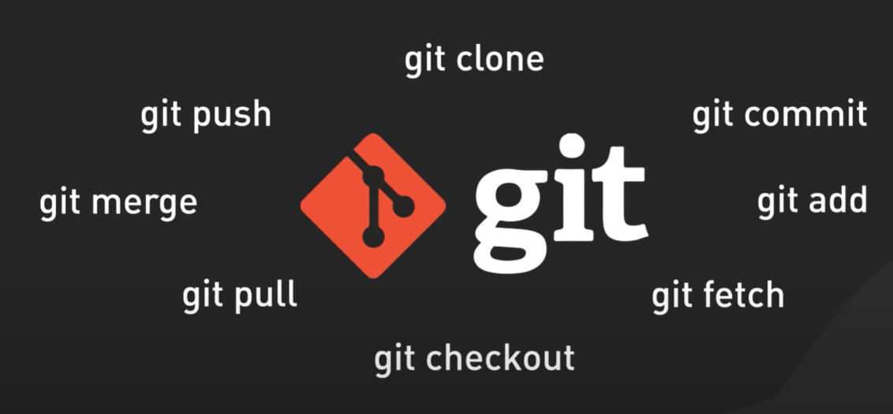

# Git Essential Commands - Step 07: Core Commands Overview



## Overview

This diagram presents a **visual summary of the most essential Git commands** that every developer needs to know. Arranged around the iconic Git logo, these eight commands form the foundation of Git version control and represent the core operations you'll use daily in your development workflow.

## The Git Logo: Symbol of Version Control

### Central Icon
**The Git Diamond Logo**

- **Design**: Red-orange diamond with a branching structure
- **Symbolism**: Represents Git's branching and merging capabilities
- **The branches**: Show how Git tracks divergent paths of development
- **Color**: Red-orange symbolizes energy and collaboration
- **Accompanied by**: Large "git" wordmark in white

The logo serves as the centerpiece, with the essential commands radiating outward, emphasizing that all these operations revolve around Git's core functionality.

## The Eight Essential Git Commands

### Top Commands: Remote Operations

#### 1. `git clone`
**Position**: Top center
**Purpose**: Download a repository from remote to local

```bash
# Clone a repository
git clone <repository-url>

# Clone to specific directory
git clone <repository-url> <directory-name>

# Clone specific branch
git clone -b <branch-name> <repository-url>
```

**When to use:**
- Starting work on an existing project
- Getting a copy of a remote repository
- Setting up a new development environment
- Contributing to open-source projects

**What it does:**
- ✅ Downloads complete repository history
- ✅ Creates a local copy on your machine
- ✅ Sets up remote tracking (origin)
- ✅ Checks out the default branch

**Example:**
```bash
git clone https://github.com/facebook/react.git
cd react
# You now have the entire React repository locally
```

---

### Left Side Commands: Collaboration and Integration

#### 2. `git push`
**Position**: Upper left
**Purpose**: Upload local commits to remote repository

```bash
# Push to remote
git push origin <branch-name>

# Push with upstream tracking
git push -u origin <branch-name>

# Push all branches
git push --all
```

**When to use:**
- Sharing your work with the team
- Backing up your commits
- After committing changes locally
- Publishing a new branch

**What it does:**
- ✅ Uploads local commits to remote
- ✅ Updates remote branch
- ✅ Makes your work visible to others
- ✅ Enables collaboration

**Example:**
```bash
git add .
git commit -m "Add login feature"
git push origin feature/login
# Your commits are now on GitHub
```

#### 3. `git merge`
**Position**: Middle left
**Purpose**: Combine branches together

```bash
# Merge a branch into current branch
git merge <branch-name>

# Merge with no-fast-forward (creates merge commit)
git merge --no-ff <branch-name>

# Abort a merge in progress
git merge --abort
```

**When to use:**
- Integrating feature branches into main
- Combining work from multiple developers
- Pulling together divergent code paths
- Completing a feature development cycle

**What it does:**
- ✅ Combines histories of two branches
- ✅ Integrates changes from another branch
- ✅ May create a merge commit
- ✅ Resolves parallel development

**Example:**
```bash
git checkout main
git merge feature/user-profile
# Feature branch is now integrated into main
```

#### 4. `git pull`
**Position**: Lower left
**Purpose**: Download and integrate remote changes

```bash
# Pull from remote
git pull origin <branch-name>

# Pull with rebase
git pull --rebase

# Pull from tracked branch
git pull
```

**When to use:**
- Getting latest changes from team
- Syncing before starting work
- Before pushing your changes
- Updating your local repository

**What it does:**
- ✅ Fetches commits from remote
- ✅ Merges them into current branch
- ✅ Updates working directory
- ✅ Keeps you synchronized with team

**Example:**
```bash
git checkout main
git pull origin main
# Your local main is now up-to-date
```

---

### Right Side Commands: Local Operations

#### 5. `git commit`
**Position**: Upper right
**Purpose**: Save changes to local repository

```bash
# Commit staged changes
git commit -m "Your message"

# Commit with detailed message
git commit -m "Title" -m "Description"

# Stage and commit tracked files
git commit -am "Message"
```

**When to use:**
- After staging changes with git add
- Creating a checkpoint in development
- Saving a logical unit of work
- Building project history

**What it does:**
- ✅ Creates a snapshot of staged changes
- ✅ Saves to local repository
- ✅ Generates unique commit hash
- ✅ Records author and timestamp

**Example:**
```bash
git add src/login.js
git commit -m "Implement login validation"
# Changes are now permanently saved locally
```

#### 6. `git add`
**Position**: Middle right
**Purpose**: Stage changes for commit

```bash
# Stage specific file
git add <filename>

# Stage all changes
git add .

# Stage interactively
git add -p
```

**When to use:**
- After modifying files
- Before committing changes
- Selecting specific changes to commit
- Preparing a logical commit

**What it does:**
- ✅ Moves changes to staging area
- ✅ Marks files for next commit
- ✅ Allows selective commits
- ✅ Prepares snapshot

**Example:**
```bash
# Edit multiple files
git add login.js profile.js
# Only these two files are staged
git commit -m "Update login and profile"
```

#### 7. `git fetch`
**Position**: Lower right
**Purpose**: Download changes without merging

```bash
# Fetch from remote
git fetch origin

# Fetch all remotes
git fetch --all

# Fetch specific branch
git fetch origin <branch-name>
```

**When to use:**
- Checking what's new on remote
- Reviewing changes before merging
- Updating remote tracking branches
- Safe synchronization

**What it does:**
- ✅ Downloads commits from remote
- ✅ Updates remote tracking branches
- ❌ Does NOT modify working directory
- ❌ Does NOT merge changes

**Example:**
```bash
git fetch origin
git log HEAD..origin/main  # See what's new
git merge origin/main      # Merge when ready
```

---

### Bottom Command: Navigation

#### 8. `git checkout`
**Position**: Bottom center
**Purpose**: Switch branches or restore files

```bash
# Switch to branch
git checkout <branch-name>

# Create and switch to new branch
git checkout -b <new-branch>

# Restore file from last commit
git checkout -- <filename>
```

**When to use:**
- Switching between branches
- Creating new branches
- Discarding local changes
- Viewing historical versions

**What it does:**
- ✅ Changes your current branch
- ✅ Updates working directory
- ✅ Can create branches
- ✅ Can restore files

**Example:**
```bash
git checkout main
git checkout -b feature/new-feature
# Now on new feature branch
```

**Note**: In newer Git versions (2.23+), this is split into:
- `git switch` - for switching branches
- `git restore` - for restoring files

## Command Relationships and Workflow

### The Complete Git Workflow Using These Commands

```bash
# 1. CLONE: Get the repository
git clone https://github.com/team/project.git
cd project

# 2. CHECKOUT: Create feature branch
git checkout -b feature/awesome-feature

# 3. EDIT: Make changes to files
# ... edit files in your IDE ...

# 4. ADD: Stage the changes
git add .

# 5. COMMIT: Save locally
git commit -m "Add awesome feature"

# 6. FETCH: Check remote status (optional)
git fetch origin

# 7. PULL: Get latest changes
git pull origin main

# 8. MERGE: Integrate main into your feature (if needed)
git merge main

# 9. PUSH: Share your work
git push -u origin feature/awesome-feature

# 10. MERGE: Via pull request or directly
git checkout main
git merge feature/awesome-feature
git push origin main
```

## Command Categories

### Remote Collaboration Commands
```
git clone  ─┐
git push   ─┤── Work with remote repositories
git pull   ─┤── Enable team collaboration
git fetch  ─┘
```

These commands connect your local repository with remote servers, enabling collaboration and backup.

### Local Development Commands
```
git add      ─┐
git commit   ─┤── Work locally
git checkout ─┤── Manage your code
git merge    ─┘
```

These commands operate on your local repository, allowing offline work and local version control.

## Understanding Command Pairs

### Pair 1: `git fetch` vs `git pull`
```bash
# fetch = download only
git fetch origin
# Your working directory unchanged

# pull = download + merge
git pull origin main
# Your working directory updated
```

**Rule of thumb:** 
- Use `fetch` when you want to review first
- Use `pull` when you're ready to integrate

### Pair 2: `git add` vs `git commit`
```bash
# add = stage changes
git add file.js
# Changes marked but not saved

# commit = save staged changes
git commit -m "Message"
# Changes permanently saved
```

**Rule of thumb:**
- `add` selects WHAT to save
- `commit` saves WHEN you're ready

### Pair 3: `git merge` vs `git checkout`
```bash
# checkout = switch context
git checkout feature-branch
# You're now on feature branch

# merge = bring changes in
git merge feature-branch
# Feature changes merged into current branch
```

**Rule of thumb:**
- `checkout` changes WHERE you are
- `merge` brings changes TO where you are

## Command Frequency Guide

### Daily Use ⭐⭐⭐⭐⭐
```bash
git add      # Multiple times per day
git commit   # Several times per day
git push     # Once or twice per day
git pull     # Start and end of day
git checkout # Frequently switching contexts
```

### Regular Use ⭐⭐⭐⭐
```bash
git fetch    # Before pulling (cautious developers)
git merge    # When integrating branches
```

### Occasional Use ⭐⭐⭐
```bash
git clone    # Once per project/repository
```

## Common Workflows

### Workflow 1: Starting Your Day
```bash
# Get latest changes
git checkout main
git pull origin main

# Create feature branch
git checkout -b feature/today-work

# Start coding...
```

### Workflow 2: Saving Progress
```bash
# Check what changed
git status

# Stage changes
git add .

# Commit
git commit -m "Implement feature X"

# Backup to remote
git push origin feature/today-work
```

### Workflow 3: Integrating Changes
```bash
# Update main branch
git checkout main
git pull origin main

# Merge into your feature
git checkout feature/my-feature
git merge main

# Or merge feature into main
git checkout main
git merge feature/my-feature
git push origin main
```

### Workflow 4: Checking Team Updates
```bash
# Safe check - doesn't change files
git fetch origin

# Review changes
git log HEAD..origin/main

# Decide to merge
git pull origin main
```

## Command Cheat Sheet

| Command | Purpose | Affects | Risk Level |
|---------|---------|---------|------------|
| `git clone` | Download repo | Creates new dir | 🟢 Safe |
| `git add` | Stage changes | Staging area | 🟢 Safe |
| `git commit` | Save snapshot | Local repo | 🟢 Safe |
| `git push` | Upload commits | Remote repo | 🟡 Medium |
| `git pull` | Download + merge | Working dir | 🟡 Medium |
| `git fetch` | Download only | Remote tracking | 🟢 Safe |
| `git merge` | Combine branches | Current branch | 🟡 Medium |
| `git checkout` | Switch branch | Working dir | 🟡 Medium |

## Visual Command Flow

### Publishing Changes (Local → Remote)
```
Edit Files
    ↓
git add (stage)
    ↓
git commit (save locally)
    ↓
git push (upload to remote)
    ↓
Remote Repository Updated
```

### Getting Changes (Remote → Local)
```
Remote Repository
    ↓
git fetch (download info) OR git pull (download + merge)
    ↓
Local Repository Updated
    ↓
git checkout (switch if needed)
    ↓
Working Directory Updated
```

### Branch Integration
```
Main Branch          Feature Branch
    A                    A
    |                    |
    B ←─── git merge ── C
    |                    
    D
```

## Best Practices for Each Command

### `git clone`
✅ **Do:**
- Clone once per project
- Use SSH for frequent access
- Clone into organized directory structure

❌ **Don't:**
- Clone into existing repo
- Clone unnecessarily large repos without --depth

### `git add`
✅ **Do:**
- Review changes before adding
- Stage related changes together
- Use `git add -p` for selective staging

❌ **Don't:**
- Use `git add .` blindly
- Stage temporary or debug files
- Add sensitive information

### `git commit`
✅ **Do:**
- Write clear, descriptive messages
- Commit logical units of work
- Commit frequently

❌ **Don't:**
- Write vague messages ("fix", "update")
- Commit broken code to main
- Make huge commits with many changes

### `git push`
✅ **Do:**
- Push regularly for backup
- Pull before pushing
- Verify branch before pushing

❌ **Don't:**
- Force push to shared branches
- Push without testing
- Push sensitive data

### `git pull`
✅ **Do:**
- Pull before starting work
- Commit or stash before pulling
- Review conflicts carefully

❌ **Don't:**
- Pull with uncommitted changes
- Ignore merge conflicts
- Pull without understanding changes

### `git fetch`
✅ **Do:**
- Use when you want to review first
- Fetch regularly to stay informed
- Fetch before important merges

❌ **Don't:**
- Forget to merge after fetching
- Assume fetch updates working directory

### `git merge`
✅ **Do:**
- Merge tested code
- Review changes before merging
- Use meaningful merge messages

❌ **Don't:**
- Merge without testing
- Force merge with conflicts
- Merge into wrong branch

### `git checkout`
✅ **Do:**
- Commit changes before switching
- Verify current branch
- Use descriptive branch names

❌ **Don't:**
- Checkout with uncommitted changes
- Lose track of current branch
- Checkout detached HEAD state accidentally

## Extending Your Git Knowledge

### Beyond the Essential Eight

Once you master these eight commands, explore:

```bash
# Branch management
git branch          # List branches
git branch -d       # Delete branch

# History viewing
git log            # View history
git log --graph    # Visual history

# Undoing changes
git reset          # Undo commits
git revert         # Safe undo

# Temporary storage
git stash          # Save work temporarily
git stash pop      # Restore work

# Remote management
git remote         # Manage remotes
git remote -v      # View remotes

# Tagging
git tag            # Create tags
git tag -a v1.0.0  # Annotated tag

# Difference viewing
git diff           # See changes
git diff --staged  # See staged changes

# Status checking
git status         # Check state
git log --oneline  # Compact history
```

## Real-World Scenario: Complete Feature Development

```bash
# Day 1: Start
git clone https://github.com/company/product.git
cd product
git checkout -b feature/user-notifications

# Day 1-2: Development
# ... edit files ...
git add notifications.js
git commit -m "Add notification structure"
git push -u origin feature/user-notifications

# ... more edits ...
git add tests/notifications.test.js
git commit -m "Add notification tests"
git push

# Day 3: Sync with team
git fetch origin
git log HEAD..origin/main  # Review team changes
git pull origin main       # Get latest main
git merge main             # Merge into feature

# Day 4: Finalize
git add .
git commit -m "Finalize notifications feature"
git push

# Day 5: Integration
git checkout main
git pull origin main
git merge feature/user-notifications
git push origin main

# Cleanup
git branch -d feature/user-notifications
```

## The Git Mental Model

### Think of Git as a Tree
- **Branches**: Different paths of development
- **Commits**: Nodes on those paths
- **Merge**: Bringing paths together
- **Checkout**: Moving between paths

### Commands Map to Actions
- **clone**: Get a copy of the tree
- **add**: Mark changes to save
- **commit**: Create a new node
- **push**: Share your branch with others
- **pull**: Get others' branches
- **fetch**: See what's new without taking it
- **merge**: Combine branches
- **checkout**: Move to different branch

## Key Takeaways

1. **These 8 commands cover 90% of daily Git use**
2. **Clone once, commit often, push regularly**
3. **Fetch is safe, pull changes your files**
4. **Add selects, commit saves, push shares**
5. **Checkout moves you, merge brings to you**
6. **Master these before learning advanced commands**
7. **Every command serves a specific purpose**
8. **Understanding relationships prevents mistakes**
9. **Local commands are safe, remote commands need care**
10. **The Git logo represents branching power - use it!**

## Quick Reference Card

```
GETTING CODE:
  git clone <url>          Get repository
  git pull                 Update with remote

SAVING CHANGES:
  git add <file>           Stage changes
  git commit -m "msg"      Save changes

SHARING CODE:
  git push                 Upload commits
  git fetch                Download info

NAVIGATION:
  git checkout <branch>    Switch branch
  
INTEGRATION:
  git merge <branch>       Combine branches
```

---

*This document provides an overview of essential Git commands. For detailed workflows, see Step-01 through Step-06.*
