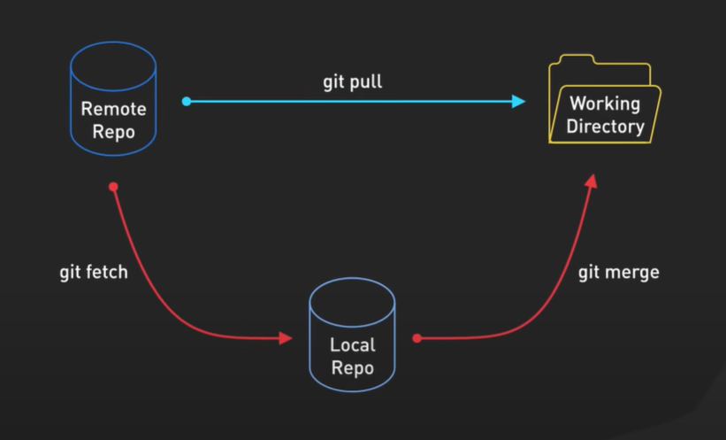

# Git Pull vs Fetch - Step 08: Understanding the Difference



## Overview

This diagram illustrates one of the **most important distinctions in Git**: the difference between `git pull` and the combination of `git fetch` + `git merge`. Understanding this difference is crucial for safe and controlled synchronization with remote repositories. The diagram shows how both approaches achieve the same end result but through different paths, giving you varying levels of control.

## The Three Components

### 1. Remote Repo (Remote Repository)
**Position**: Upper left
**Icon**: Blue database cylinder

- **What it is**: The remote repository hosted on a server (GitHub, GitLab, Bitbucket, etc.)
- **Contains**: The authoritative version of the project with all team changes
- **Role**: Source of truth for collaboration
- **State**: Contains commits from all team members

### 2. Local Repo (Local Repository)
**Position**: Bottom center
**Icon**: Blue database cylinder

- **What it is**: Your local Git repository (the `.git` directory)
- **Contains**: Your local commit history and remote tracking branches
- **Role**: Staging ground for remote changes before they reach your working directory
- **State**: Can be synchronized with remote independently of working directory

### 3. Working Directory
**Position**: Upper right
**Icon**: Yellow/gold folder

- **What it is**: Your actual project files where you edit code
- **Contains**: Current state of your files
- **Role**: Where you actively work and see changes
- **State**: Reflects the checked-out version of your code

## The Two Paths to Synchronization

### Path 1: The Direct Route - `git pull` (Cyan Arrow)

```
Remote Repo ──────git pull─────→ Working Directory
     └──────────(via Local Repo)─────────┘
```

**The cyan arrow shows**: `git pull` is a **direct path** from Remote Repo to Working Directory

**What `git pull` does:**
```bash
git pull origin main
```

1. **Fetches** commits from remote repository
2. **Updates** local repository with those commits
3. **Merges** automatically into your current branch
4. **Updates** your working directory immediately

**Characteristics:**
- ⚡ **Fast**: One command does everything
- 🔄 **Automatic**: Merges without asking
- ⚠️ **Less control**: Changes happen immediately
- 🎯 **Convenient**: Most common for simple updates

**Equivalent to:**
```bash
git fetch origin
git merge origin/main
```

### Path 2: The Controlled Route - `git fetch` + `git merge` (Red Arrows)

```
Remote Repo ──git fetch──→ Local Repo ──git merge──→ Working Directory
```

**The red arrows show**: A **two-step process** with an intermediate stop

#### Step 1: `git fetch` (Left Red Arrow)

```bash
git fetch origin
```

**What it does:**
1. **Downloads** commits from remote repository
2. **Updates** remote tracking branches in local repo
3. **Does NOT** modify your working directory
4. **Does NOT** merge anything

**Result**: Your local repo knows about remote changes, but your files are unchanged

#### Step 2: `git merge` (Right Red Arrow)

```bash
git merge origin/main
```

**What it does:**
1. **Merges** the fetched changes into your current branch
2. **Updates** your working directory with the changes
3. **Allows** you to review before integrating
4. **Gives control** over when changes are applied

**Result**: Changes are now in your working directory

**Characteristics:**
- 🔍 **Visibility**: See changes before they affect your files
- 🛡️ **Safety**: Review before merging
- 🎛️ **Control**: Decide when to integrate
- 📊 **Analysis**: Inspect differences first

## Visual Flow Analysis

### The `git pull` Flow (Cyan)
```
┌─────────────┐
│ Remote Repo │ (Team's latest code)
└──────┬──────┘
       │ git pull (fetch + merge in one step)
       │ Downloads AND merges automatically
       ↓
┌─────────────┐
│  Local Repo │ (Updated silently)
└──────┬──────┘
       │ (Automatic)
       ↓
┌─────────────┐
│  Working    │ (Your files updated immediately)
│  Directory  │
└─────────────┘
```

### The `git fetch` + `git merge` Flow (Red)
```
┌─────────────┐
│ Remote Repo │ (Team's latest code)
└──────┬──────┘
       │ git fetch (download only)
       │ Downloads but doesn't change files
       ↓
┌─────────────┐
│  Local Repo │ (Updated with remote info)
└──────┬──────┘
       │ (YOU REVIEW HERE) ← Key difference!
       │ git merge (when you're ready)
       ↓
┌─────────────┐
│  Working    │ (Your files updated when you decide)
│  Directory  │
└─────────────┘
```

## Key Differences: Pull vs Fetch + Merge

### Comparison Table

| Aspect | `git pull` | `git fetch` + `git merge` |
|--------|------------|--------------------------|
| **Steps** | One command | Two separate commands |
| **Speed** | Faster (immediate) | Slower (manual) |
| **Control** | Automatic merge | Manual merge |
| **Safety** | Lower (surprise changes) | Higher (review first) |
| **Review opportunity** | No | Yes |
| **Working dir impact** | Immediate | Delayed until merge |
| **Recommended for** | Simple updates | Complex changes |
| **Risk level** | 🟡 Medium | 🟢 Low |

### What Happens to Your Working Directory

**With `git pull`:**
```bash
# Before pull
$ ls
file.js  # Your version

$ git pull origin main
# ... merging happens automatically ...

$ ls
file.js  # Changed! (updated version from remote)
```
Your files change **immediately**.

**With `git fetch` + `git merge`:**
```bash
# Before fetch
$ ls
file.js  # Your version

$ git fetch origin
# Downloads info but files unchanged

$ ls
file.js  # Still your version! Not changed yet.

# Review changes
$ git diff HEAD..origin/main
# ... see what would change ...

# Decide to merge
$ git merge origin/main
# ... merging happens now ...

$ ls
file.js  # Now changed (updated version from remote)
```
Your files change **only when you merge**.

## When to Use Each Approach

### Use `git pull` When:

✅ **Simple synchronization**
```bash
# Just getting latest changes
git checkout main
git pull origin main
```

✅ **You trust the remote changes**
```bash
# Small team, good communication
git pull
```

✅ **Starting your workday**
```bash
# Get latest before starting work
git pull origin main
git checkout -b feature/today-work
```

✅ **Quick updates on feature branches**
```bash
# Your personal feature branch
git checkout feature/my-feature
git pull origin feature/my-feature
```

### Use `git fetch` + `git merge` When:

✅ **You want to review changes first**
```bash
git fetch origin
git log HEAD..origin/main  # See what's new
git diff HEAD..origin/main # See actual changes
git merge origin/main      # Merge when satisfied
```

✅ **Working on critical/production code**
```bash
git fetch origin
# Review thoroughly
git merge origin/main
```

✅ **Expecting significant changes**
```bash
git fetch origin
git log --oneline HEAD..origin/main
# "Wow, 25 new commits! Better review these..."
git merge origin/main
```

✅ **Multiple people working on same branch**
```bash
git fetch origin
git diff HEAD..origin/feature/shared
# Check for conflicts before merging
git merge origin/feature/shared
```

✅ **Learning/understanding Git better**
```bash
# See each step of the process
git fetch origin
# Now I can examine what was fetched
git merge origin/main
# Now I see the merge happening
```

## Detailed Command Breakdown

### Git Pull in Detail

```bash
# Basic pull
git pull

# Pull from specific remote and branch
git pull origin main

# Pull with rebase instead of merge
git pull --rebase origin main

# Pull only if fast-forward possible
git pull --ff-only

# Verbose output
git pull -v
```

**What happens internally:**
```bash
# git pull is equivalent to:
git fetch origin
git merge origin/current-branch

# Or with rebase:
git fetch origin
git rebase origin/current-branch
```

### Git Fetch in Detail

```bash
# Fetch from default remote (origin)
git fetch

# Fetch from specific remote
git fetch origin

# Fetch specific branch
git fetch origin main

# Fetch all remotes
git fetch --all

# Fetch and prune deleted branches
git fetch --prune

# Verbose output
git fetch -v
```

**What you can do after fetching:**
```bash
# View fetched commits
git log HEAD..origin/main

# See differences
git diff HEAD..origin/main

# See stat summary
git diff --stat HEAD..origin/main

# View remote branches
git branch -r

# Inspect specific commit
git show origin/main
```

### Git Merge in Detail

```bash
# Merge fetched changes
git merge origin/main

# Merge with no-fast-forward (always create merge commit)
git merge --no-ff origin/main

# Merge and add message
git merge -m "Merge latest changes from main" origin/main

# Abort merge if conflicts occur
git merge --abort
```

## Practical Scenarios

### Scenario 1: Safe Update of Main Branch

**Using git pull (quick way):**
```bash
git checkout main
git pull origin main
# Hope nothing breaks!
```

**Using fetch + merge (careful way):**
```bash
git checkout main
git fetch origin

# Review what's coming
git log --oneline HEAD..origin/main
# Output:
# a1b2c3d Add new API endpoint
# e4f5g6h Update dependencies
# h7i8j9k Fix security vulnerability

# See the actual changes
git diff HEAD..origin/main

# Check if any of your files would be affected
git diff --name-only HEAD..origin/main

# Satisfied? Now merge
git merge origin/main

# Test everything
npm test

# If good, continue working
```

### Scenario 2: Checking Team Updates Before Lunch

**Using fetch (non-intrusive):**
```bash
# Just check what's new
git fetch origin

# See if there are updates
git log --oneline HEAD..origin/main

# Output might show:
# No new commits - you're up to date!
# OR
# 3 new commits from teammates

# Continue working without disruption
# Merge later when ready
```

**If you used pull:**
```bash
# Forces immediate merge
git pull origin main
# Your files change immediately
# Might break your current work
```

### Scenario 3: Multiple Remotes

**Fetch allows selective updates:**
```bash
# You have both origin and upstream
git remote -v
# origin    https://github.com/you/project.git
# upstream  https://github.com/original/project.git

# Fetch from both
git fetch origin
git fetch upstream

# Review both
git log --oneline HEAD..origin/main
git log --oneline HEAD..upstream/main

# Merge from upstream (the original project)
git merge upstream/main

# Now push to your fork
git push origin main
```

### Scenario 4: Feature Branch with Conflicts

**Fetch first approach:**
```bash
git checkout feature/my-feature
git fetch origin

# Check if main has updates
git log --oneline HEAD..origin/main

# Preview merge conflicts
git merge --no-commit --no-ff origin/main
# See conflicts but don't complete merge

# Abort to try different approach
git merge --abort

# Decide to rebase instead
git rebase origin/main
# Handle conflicts one commit at a time
```

### Scenario 5: Reviewing Teammate's Work

**Fetch enables inspection:**
```bash
# Teammate says they pushed big changes
git fetch origin

# Create temporary branch to review
git checkout -b review-changes origin/feature/teammate-work

# Review the code
git log --oneline
git diff main..HEAD

# Test their changes
npm install
npm test

# If good, merge into your branch
git checkout feature/my-feature
git merge review-changes

# Clean up
git branch -d review-changes
```

## Understanding Remote Tracking Branches

### What Fetch Updates

When you run `git fetch`, it updates **remote tracking branches**:

```bash
# Before fetch
git branch -a
# * main
#   feature/my-work
#   remotes/origin/main (at commit abc123)

# Teammate pushes to origin/main (commit xyz789)

# After fetch
git fetch origin
git branch -a
# * main (still at abc123)
#   feature/my-work
#   remotes/origin/main (now at xyz789) ← Updated!

# Your working directory: Still at abc123
# Remote tracking branch: Updated to xyz789
# Ready to merge when you decide
```

### Viewing Remote Tracking Branches

```bash
# List remote branches
git branch -r

# List all branches (local and remote)
git branch -a

# See tracking relationships
git branch -vv

# See what's ahead/behind
git status
# Output: Your branch is behind 'origin/main' by 3 commits
```

## The Review Window: Between Fetch and Merge

The **key advantage** of fetch + merge is the review window:

```bash
git fetch origin

# ╔════════════════════════════════════════╗
# ║     REVIEW WINDOW (You are here!)      ║
# ║  Changes downloaded but not applied     ║
# ║  Your files are safe and unchanged      ║
# ╚════════════════════════════════════════╝

# What you can do in this window:

# 1. See commit list
git log HEAD..origin/main

# 2. See file changes
git diff HEAD..origin/main

# 3. See which files changed
git diff --name-only HEAD..origin/main

# 4. See statistics
git diff --stat HEAD..origin/main

# 5. Review specific file
git diff HEAD..origin/main -- path/to/file.js

# 6. See commit details
git show origin/main

# 7. Compare branches
git log --left-right --oneline HEAD...origin/main

# After review, decide:
git merge origin/main  # Accept changes
# OR
# Don't merge yet, continue working
```

## Best Practices

### ✅ Do's

1. **Use fetch + merge for important updates**
   ```bash
   # On main or production branches
   git fetch origin
   git log HEAD..origin/main
   git merge origin/main
   ```

2. **Use pull for quick personal branch updates**
   ```bash
   # On your feature branch
   git pull origin feature/my-branch
   ```

3. **Always fetch before making decisions**
   ```bash
   git fetch origin
   # Now you have current information
   ```

4. **Review changes in the fetch window**
   ```bash
   git fetch origin
   git diff --stat HEAD..origin/main
   git log --oneline HEAD..origin/main
   git merge origin/main
   ```

5. **Fetch regularly to stay informed**
   ```bash
   # Every few hours
   git fetch origin
   git status  # Shows if you're behind
   ```

6. **Set up aliases for common patterns**
   ```bash
   git config --global alias.sync '!git fetch origin && git merge origin/main'
   git sync  # Now does fetch + merge
   ```

### ❌ Don'ts

1. **Don't pull without committing/stashing first**
   ```bash
   # ❌ Bad
   # ... working on files ...
   git pull  # Might cause conflicts
   
   # ✅ Good
   git stash
   git pull
   git stash pop
   ```

2. **Don't ignore what fetch tells you**
   ```bash
   # ❌ Bad
   git fetch origin
   # ... ignore the output ...
   
   # ✅ Good
   git fetch origin
   git status  # Check what's new
   ```

3. **Don't pull on dirty working directory**
   ```bash
   # ❌ Bad
   git status  # Shows modified files
   git pull    # Risky!
   
   # ✅ Good
   git status
   git add .
   git commit -m "Save work"
   git pull
   ```

4. **Don't forget that fetch doesn't change files**
   ```bash
   # ❌ Misconception
   git fetch origin
   # "Why didn't my files update?" ← Need to merge!
   
   # ✅ Understanding
   git fetch origin  # Downloads info
   git merge origin/main  # Updates files
   ```

5. **Don't pull on the wrong branch**
   ```bash
   # ❌ Bad
   git pull  # Which branch am I on?
   
   # ✅ Good
   git branch  # Check current branch
   git pull origin main  # Explicit
   ```

## Advanced: Pull with Rebase

### Pull with Merge (Default)
```bash
git pull origin main

# Creates history like:
#     A---B---C (main)
#          \
#           D---E (your commits)
#                \
#                 M (merge commit)
```

### Pull with Rebase
```bash
git pull --rebase origin main

# Creates history like:
#     A---B---C---D'---E' (linear)
```

**Comparison:**

| Aspect | Pull (merge) | Pull --rebase |
|--------|-------------|---------------|
| History | Branched | Linear |
| Merge commit | Yes | No |
| Conflicts | Once at end | Per commit |
| Reversibility | Easy | Harder |
| Use on | Any branch | Feature branches only |

## Configuration Options

### Set Default Pull Behavior

```bash
# Always use merge (default)
git config --global pull.rebase false

# Always use rebase
git config --global pull.rebase true

# Only pull if fast-forward possible
git config --global pull.ff only
```

### Set Default Push Behavior
```bash
# Push current branch to same name on remote
git config --global push.default current
```

## Troubleshooting

### Issue 1: Fetch Shows Nothing New
```bash
git fetch origin
# No output?

# Check remote URL
git remote -v

# Verify you're on correct branch
git branch

# Fetch with verbose
git fetch -v

# Check if remote has changes
git ls-remote origin main
```

### Issue 2: After Fetch, Can't See Changes
```bash
git fetch origin
git log  # Don't see new commits?

# You need to check remote tracking branch
git log origin/main  # See remote commits

# Or compare
git log HEAD..origin/main
```

### Issue 3: Pull Fails with Conflicts
```bash
git pull origin main
# CONFLICT in file.js

# Option 1: Resolve and complete
# ... fix conflicts ...
git add file.js
git commit

# Option 2: Abort and try fetch + merge
git merge --abort
git fetch origin
git diff HEAD..origin/main  # Preview conflicts
git merge origin/main
```

### Issue 4: Accidentally Pulled Wrong Branch
```bash
git pull origin develop  # Oops! Wanted main

# Undo the merge
git reset --hard HEAD~1

# Pull correct branch
git pull origin main
```

## Mental Model

### Think of It This Way:

**`git pull` is like Amazon Prime:**
- Order and it arrives at your door automatically
- Fast and convenient
- Less control over delivery

**`git fetch` + `git merge` is like picking up a package:**
- Package arrives at post office (fetch)
- You inspect it before bringing home (review)
- You bring it home when ready (merge)
- More control over the process

### Or Think of It as Food Delivery:

**`git pull`:**
- Food ordered and immediately eaten
- Hope you like it!

**`git fetch` + `git merge`:**
- Food delivered to door (fetch)
- You check it, smell it, maybe taste a bit (review)
- Eat when satisfied it's what you want (merge)

## Key Takeaways

1. **`git pull` = `git fetch` + `git merge` combined**
2. **Fetch is safe** - downloads info but doesn't change your files
3. **Pull is convenient** - one command, automatic merge
4. **Fetch + merge gives control** - review before integrating
5. **Use pull for simple updates** - personal branches, quick syncs
6. **Use fetch + merge for important updates** - main branch, complex changes
7. **The diagram shows two paths to same destination** - direct (pull) vs controlled (fetch + merge)
8. **Fetch updates local repo** - not working directory
9. **Merge updates working directory** - after you've reviewed
10. **Understanding both makes you a better Git user**

## Summary

This diagram beautifully illustrates that while both approaches end up with your working directory synchronized with the remote repository, they offer different levels of control:

- **Cyan arrow (git pull)**: The express route - fast, automatic, convenient
- **Red arrows (git fetch + git merge)**: The scenic route - safe, controllable, reviewable

Choose based on your needs: convenience vs. control!

---

*This document explains the critical difference between `git pull` and `git fetch` + `git merge`. For more on these commands individually, see Step-06.md and Step-07.md.*
