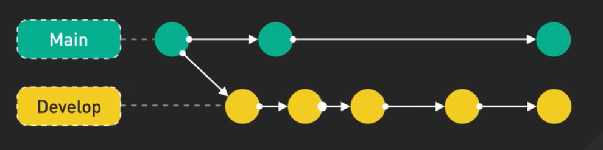

# Git Branching Strategy - Step 09: Main and Develop Branches



## Overview

This diagram illustrates a **fundamental branching strategy** used in professional software development, showing the relationship between two long-lived branches: **Main** (production) and **Develop** (development). This is a core concept of workflows like **Git Flow** and represents how teams separate stable, production-ready code from active development work.

## Understanding the Diagram

### Visual Elements

**Two Parallel Timelines:**
- **Top Timeline (Teal/Green)**: Main branch - the production line
- **Bottom Timeline (Yellow)**: Develop branch - the development line

**Commit Nodes:**
- **Circles (●)**: Individual commits on each branch
- **Connected by arrows**: Show the progression of work over time
- **Different colors**: Distinguish the two branches clearly

**Connecting Arrows:**
- **Dashed lines**: Branch creation points (showing where branches originate)
- **Solid white arrows**: Merges from Develop into Main
- **Direction**: Flow of code integration

## The Two-Branch Model

### Main Branch (Top - Teal/Green)

**Branch Label**: "Main" in a dashed border box

**Characteristics:**
- 🏆 **Production branch**: Contains only stable, release-ready code
- 🔒 **Protected**: Direct commits usually not allowed
- 📦 **Release history**: Each commit typically represents a production release
- ✅ **Always deployable**: Code here should always work
- 🎯 **Customer-facing**: This is what users see

**Commit Pattern:**
- Fewer commits (3 visible in diagram)
- Represents major releases or milestones
- Each commit is carefully vetted
- Typically tagged with version numbers

**Common names:**
- `main` (modern standard)
- `master` (older convention)
- `production`
- `prod`

### Develop Branch (Bottom - Yellow)

**Branch Label**: "Develop" in a dashed border box

**Characteristics:**
- 🔨 **Integration branch**: Where features come together
- 🚀 **Active development**: Constant activity and updates
- 🧪 **Testing ground**: Pre-production testing happens here
- 👥 **Team collaboration**: All developers integrate work here
- 🔄 **Latest code**: Always has the newest completed features

**Commit Pattern:**
- More commits (5 visible in diagram)
- Frequent updates from feature branches
- Continuous integration of new work
- More activity than Main

**Common names:**
- `develop` (Git Flow standard)
- `dev`
- `development`
- `integration`

## The Flow: How Code Moves

### 1. Branch Creation (Dashed Lines)

```
Main -------- ● (initial commit)
              |
              └─→ ● Develop branch created
```

**What the dashed line shows:**
- Develop branch originates from Main
- Both branches start from a common point
- Develop inherits Main's initial state

**In commands:**
```bash
# Create develop from main
git checkout main
git checkout -b develop
git push -u origin develop
```

### 2. Parallel Development

```
Main    ● ─────────────→ ● ─────────────→ ●

Develop ● ─→ ● ─→ ● ─→ ● ─→ ●
```

**What this shows:**
- Both branches progress independently
- Develop has more frequent commits
- Main remains stable while Develop evolves
- Multiple features integrated into Develop

**Typical activity:**
```bash
# On develop branch - continuous activity
git checkout develop
git merge feature/login
git merge feature/profile
git merge feature/settings
# Develop keeps growing
```

### 3. Merging to Main (White Arrows)

```
Main    ● ←──────── ● ───────→ ●
        ↑           ↑
Develop ● ─→ ● ─→ ● ─→ ● ─→ ●
```

**What the white arrows show:**
- Periodic merges from Develop to Main
- Develop code promoted to production
- Release points where features go live
- Quality gates passed

**In commands:**
```bash
# Release: merge develop to main
git checkout main
git merge develop
git tag -a v1.0.0 -m "Release version 1.0.0"
git push origin main --tags
```

## The Complete Workflow

### Phase 1: Initial Setup

```bash
# Create repository with main branch
git init
git add .
git commit -m "Initial commit"
git branch -M main

# Create develop branch
git checkout -b develop
git push -u origin main
git push -u origin develop
```

### Phase 2: Feature Development

```bash
# Developer creates feature branch from develop
git checkout develop
git pull origin develop
git checkout -b feature/user-authentication

# Work on feature
# ... edit files ...
git add .
git commit -m "Add login functionality"

# More work
git commit -m "Add password validation"
git commit -m "Add session management"

# Push feature branch
git push -u origin feature/user-authentication
```

### Phase 3: Integrating Features into Develop

```bash
# Merge feature into develop
git checkout develop
git pull origin develop
git merge feature/user-authentication

# Test on develop
# Run integration tests
npm test

# If good, push
git push origin develop

# Delete feature branch
git branch -d feature/user-authentication
git push origin --delete feature/user-authentication
```

### Phase 4: Releasing to Main

```bash
# When ready to release
git checkout develop
git pull origin develop

# Ensure all tests pass
npm test
npm run build

# Merge to main
git checkout main
git pull origin main
git merge develop

# Tag the release
git tag -a v1.0.0 -m "Release version 1.0.0"

# Push to production
git push origin main
git push origin --tags

# Deploy from main branch
# (Deployment pipeline triggers)
```

## Why Two Branches?

### Benefits of This Model

#### 1. **Separation of Concerns**
```
Main:    Production code only
         ↓
         Safe, stable, deployable

Develop: Active development
         ↓
         Experimental, evolving, testing
```

#### 2. **Stability Guarantee**
- Main always works
- Can deploy Main at any time
- Emergency fixes can be applied to Main
- No "broken" code in production

#### 3. **Parallel Development**
- Multiple features developed simultaneously
- All integrate into Develop first
- Test compatibility before production
- Reduces risk of conflicts in Main

#### 4. **Clear Release Process**
- Develop → Main merge = release
- Easy to see what's in production
- Version tags on Main show history
- Predictable deployment cycle

#### 5. **Rollback Safety**
```bash
# If release has issues
git checkout main
git reset --hard v0.9.0  # Previous version
git push --force

# Or create hotfix
git checkout -b hotfix/critical-bug main
# ... fix bug ...
git checkout main
git merge hotfix/critical-bug
```

## Branch Protection Rules

### Typical Main Branch Rules

```yaml
Main branch protection:
  - No direct pushes ❌
  - Require pull requests ✅
  - Require reviews (2+) ✅
  - Require status checks ✅
  - Require up-to-date branch ✅
  - No force pushes ❌
  - Require linear history ✅
```

**Setting up on GitHub:**
```bash
# Settings → Branches → Add rule
# Branch name pattern: main
# Enable:
#   - Require pull request reviews before merging
#   - Require status checks to pass
#   - Require branches to be up to date
#   - Include administrators
```

### Typical Develop Branch Rules

```yaml
Develop branch protection:
  - Allow direct pushes (limited) ⚠️
  - Require pull requests (recommended) ✅
  - Require reviews (1+) ✅
  - Require status checks ✅
  - Allow force pushes (careful) ⚠️
```

## Real-World Development Cycle

### Week 1: Feature Development

```bash
# Monday: Team starts new features
Developer 1: git checkout -b feature/payment develop
Developer 2: git checkout -b feature/notifications develop
Developer 3: git checkout -b feature/reports develop

# Tuesday-Thursday: Active development
# Each developer commits to their feature branch
git commit -m "Progress on feature"

# Friday: Features complete, merge to develop
git checkout develop
git merge feature/payment
git merge feature/notifications
git merge feature/reports

# Develop now has all three features
```

**Diagram state:**
```
Main    ● ─────────────────────→ ●

Develop ● ─→ ● ─→ ● ─→ ● (payment, notifications, reports merged)
```

### Week 2: Testing and Stabilization

```bash
# Monday-Wednesday: Test on develop
# Run full test suite
npm test
npm run e2e-tests

# Fix bugs found during testing
git checkout -b bugfix/payment-error develop
# ... fix bug ...
git checkout develop
git merge bugfix/payment-error

# Thursday: Final verification
# All tests pass, ready for release
```

**Diagram state:**
```
Main    ● ─────────────────────→ ●

Develop ● ─→ ● ─→ ● ─→ ● ─→ ● (features + bug fixes)
```

### Week 3: Release

```bash
# Friday: Release to production
git checkout main
git merge develop
git tag -a v2.0.0 -m "Release v2.0.0: Payments, Notifications, Reports"
git push origin main --tags

# Deployment happens automatically
# Monitor production for issues
```

**Diagram state:**
```
Main    ● ──────────→ ● ←───── ● (v2.0.0 released!)
                      ↑
Develop ● ─→ ● ─→ ● ─→ ● ─→ ●
```

## Handling Different Scenarios

### Scenario 1: Hotfix in Production

```bash
# Critical bug found in production (main)
git checkout main
git checkout -b hotfix/critical-security-issue

# Fix the bug
git commit -m "Fix security vulnerability"

# Merge to main immediately
git checkout main
git merge hotfix/critical-security-issue
git tag -a v2.0.1 -m "Hotfix: Security patch"
git push origin main --tags

# Also merge to develop (keep in sync!)
git checkout develop
git merge hotfix/critical-security-issue
git push origin develop

# Clean up
git branch -d hotfix/critical-security-issue
```

**Diagram after hotfix:**
```
Main    ● ──→ ● ──→ ● ──→ ● (v2.0.1 hotfix)
                ↑         ↓
Develop ● ─→ ● ─→ ● ─→ ● ─→ ● (hotfix merged back)
```

### Scenario 2: Long-Running Feature

```bash
# Feature takes 3 weeks to develop
git checkout -b feature/redesign develop

# Week 1-3: Work on feature
git commit -m "Week 1 progress"
# ... many commits ...

# Meanwhile, develop gets other updates
# Periodically sync feature with develop
git checkout feature/redesign
git merge develop  # Bring in other team's work

# Week 3: Feature complete
git checkout develop
git merge feature/redesign
```

### Scenario 3: Release Candidate Testing

```bash
# Create release branch for final testing
git checkout -b release/v3.0.0 develop

# Test thoroughly
# Fix minor issues in release branch
git commit -m "Fix typo in UI"
git commit -m "Adjust button spacing"

# When ready, merge to main
git checkout main
git merge release/v3.0.0
git tag -a v3.0.0 -m "Major release v3.0.0"

# Also merge fixes back to develop
git checkout develop
git merge release/v3.0.0

# Clean up
git branch -d release/v3.0.0
```

## Commit Frequency Comparison

### Main Branch (Low Frequency)
```
Day 1:  ●
Day 7:  
Day 14: 
Day 21: ●
Day 28: 
Day 35:
Day 42: ●

= 3 commits in 6 weeks (releases only)
```

### Develop Branch (High Frequency)
```
Day 1:  ●
Day 2:  ●
Day 3:  ●●
Day 4:  ●
Day 5:  ●●
Day 6:  ●
Day 7:  ●●●

= 10+ commits per week (continuous integration)
```

## Best Practices

### ✅ Do's

1. **Always branch from develop for features**
   ```bash
   git checkout develop
   git pull origin develop
   git checkout -b feature/new-feature
   ```

2. **Keep develop up to date**
   ```bash
   # Daily or multiple times per day
   git checkout develop
   git pull origin develop
   ```

3. **Test thoroughly on develop before merging to main**
   ```bash
   git checkout develop
   npm test
   npm run integration-tests
   npm run e2e-tests
   # Only merge to main if all pass
   ```

4. **Tag all releases on main**
   ```bash
   git tag -a v1.2.3 -m "Release description"
   git push origin main --tags
   ```

5. **Protect both branches**
   ```bash
   # Set up branch protection on GitHub/GitLab
   # Require pull requests and reviews
   ```

6. **Keep main always deployable**
   ```bash
   # Every commit on main should be production-ready
   # CI/CD should be green before merging
   ```

7. **Merge develop to main only for releases**
   ```bash
   # Scheduled releases (e.g., every 2 weeks)
   # Or when significant features are ready
   ```

8. **Sync hotfixes to both branches**
   ```bash
   # Hotfix applied to main must go to develop too
   git checkout develop
   git merge main
   ```

### ❌ Don'ts

1. **Don't commit directly to main**
   ```bash
   # ❌ Bad
   git checkout main
   git commit -m "Quick fix"
   
   # ✅ Good
   git checkout -b hotfix/issue
   git commit -m "Fix issue"
   # Create pull request
   ```

2. **Don't merge main into develop (except hotfixes)**
   ```bash
   # ❌ Bad (normal workflow)
   git checkout develop
   git merge main
   
   # ✅ Good (only for hotfixes)
   git checkout develop
   git merge main  # After hotfix applied to main
   ```

3. **Don't skip testing on develop**
   ```bash
   # ❌ Bad
   git checkout develop
   git merge feature/new-feature
   git checkout main
   git merge develop  # Without testing!
   
   # ✅ Good
   git checkout develop
   git merge feature/new-feature
   npm test  # Test first!
   # Wait for CI to pass
   git checkout main
   git merge develop
   ```

4. **Don't keep feature branches too long**
   ```bash
   # ❌ Bad: 6-month-old feature branch
   # Merge conflicts nightmare
   
   # ✅ Good: Merge within 1-2 weeks
   # Keep features small and focused
   ```

5. **Don't forget to pull before merging**
   ```bash
   # ❌ Bad
   git checkout develop
   git merge feature/my-feature  # Without pulling first
   
   # ✅ Good
   git checkout develop
   git pull origin develop
   git merge feature/my-feature
   ```

6. **Don't use develop for production deployments**
   ```bash
   # ❌ Bad
   # Deploy from develop branch
   
   # ✅ Good
   # Always deploy from main branch
   ```

## Variations of This Model

### Git Flow (Extended)

The diagram shows the foundation. Full Git Flow adds:
- **Feature branches**: Branch from develop, merge back to develop
- **Release branches**: Branch from develop, merge to both main and develop
- **Hotfix branches**: Branch from main, merge to both main and develop

```
Main     ● ──────────→ ● ←─ hotfix ←─ ● ←── release ←── ●
                       ↓                 ↑
Develop  ● ←── feature ← ● ──────────→ ● ───────────→ ●
```

### GitHub Flow (Simplified)

Simpler model with just `main`:
```
Main     ● ←── feature1 ←── ●
         ↓
         ● ←── feature2 ←── ●
         ↓
         ● ←── feature3 ←── ●
```
- No develop branch
- Features merge directly to main
- Requires excellent CI/CD and testing

### Trunk-Based Development

Even simpler:
```
Main     ● ─→ ● ─→ ● ─→ ● ─→ ●
         (short-lived branches, frequent merges)
```
- Everyone commits to main (via short-lived branches)
- Very fast integration
- Requires very mature practices

## Integration with CI/CD

### Develop Branch Pipeline

```yaml
# .github/workflows/develop.yml
name: Develop CI

on:
  push:
    branches: [ develop ]
  pull_request:
    branches: [ develop ]

jobs:
  test:
    runs-on: ubuntu-latest
    steps:
      - uses: actions/checkout@v2
      - name: Run tests
        run: |
          npm install
          npm test
          npm run integration-tests
      
  deploy-staging:
    needs: test
    runs-on: ubuntu-latest
    steps:
      - name: Deploy to staging environment
        run: |
          # Deploy develop branch to staging server
          deploy-to-staging.sh
```

### Main Branch Pipeline

```yaml
# .github/workflows/main.yml
name: Production CI/CD

on:
  push:
    branches: [ main ]

jobs:
  test:
    runs-on: ubuntu-latest
    steps:
      - uses: actions/checkout@v2
      - name: Run full test suite
        run: |
          npm install
          npm test
          npm run e2e-tests
          npm run security-scan
  
  deploy-production:
    needs: test
    runs-on: ubuntu-latest
    steps:
      - name: Deploy to production
        run: |
          # Deploy main branch to production
          deploy-to-production.sh
      
      - name: Create release
        uses: actions/create-release@v1
        with:
          tag_name: ${{ github.ref }}
          release_name: Release ${{ github.ref }}
```

## Team Workflow Example

### Small Team (3 developers)

**Week Sprint Cycle:**

```bash
# Monday: Sprint planning
# Everyone creates feature branches from develop

Developer A:
git checkout develop
git pull origin develop
git checkout -b feature/user-dashboard

Developer B:
git checkout develop
git pull origin develop
git checkout -b feature/api-endpoints

Developer C:
git checkout develop
git pull origin develop
git checkout -b feature/database-optimization

# Monday-Thursday: Development
# Each developer works independently on their branch
# Regular commits to feature branches

# Friday: Integration day
# Merge all features into develop

git checkout develop
git pull origin develop
git merge feature/user-dashboard
git merge feature/api-endpoints
git merge feature/database-optimization
git push origin develop

# Test on develop over weekend
# If stable, release to main Monday
git checkout main
git merge develop
git tag -a v1.5.0 -m "Sprint 15 release"
git push origin main --tags
```

## Visualizing the Complete Picture

### Timeline View

```
Week 1:
Main    ● (v1.0.0)
        |
Develop ● ─→ ● ─→ ● (features A, B)

Week 2:
Main    ● ─────────────→ ● (still v1.0.0)
        
Develop ● ─→ ● ─→ ● ─→ ● ─→ ● (features C, D, E)

Week 3: (Release)
Main    ● ─────────────→ ● ←──── ● (v1.1.0)
                         ↑
Develop ● ─→ ● ─→ ● ─→ ● ─→ ●
```

### Branch Relationship

```
                  ┌──── Feature branches (temporary)
                  │
                  ↓
Develop ─────────────→ Integration & Testing
                  ↓
                  └──→ Main ─────→ Production
```

## Key Takeaways

1. **Two long-lived branches**: Main (production) and Develop (integration)
2. **Main is sacred**: Always stable, always deployable
3. **Develop is active**: Where features come together
4. **Flow is one-way**: Develop → Main (except hotfixes)
5. **Releases are merges**: Develop to Main = release
6. **Parallel development**: Both branches evolve independently
7. **Different commit frequencies**: Develop fast, Main slow
8. **Protection is critical**: Both branches should be protected
9. **Testing happens on develop**: Before reaching Main
10. **This model scales**: Works for teams of all sizes

## When to Use This Model

### ✅ Use This Model When:

- Team has 3+ developers
- Need stable production branch
- Have regular release cycle
- Want clear separation of concerns
- Multiple features in development
- Need QA/testing phase
- Have staging environment
- Enterprise or production-critical software

### ❌ Consider Simpler Model When:

- Solo developer or very small team
- Continuous deployment (hourly/daily)
- Experimental project
- All changes are small and quick
- Excellent test coverage and CI/CD
- Using trunk-based development

## Summary

This diagram represents a **professional, industry-standard branching strategy** that provides:

- 🎯 **Clear separation**: Production (Main) vs Development (Develop)
- 🔒 **Stability**: Main always works
- 🚀 **Velocity**: Develop moves fast
- 🤝 **Collaboration**: Team integrates in Develop
- 📦 **Releases**: Controlled merges to Main
- 🛡️ **Safety**: Testing before production

The visual clearly shows two parallel universes of your code: the safe, stable world of production (Main) and the dynamic, evolving world of development (Develop), with periodic bridges between them when new features are ready for the world!

---

*This document explains the Main and Develop branching strategy. For more on branching concepts, see Step-02.md. For advanced workflows, research Git Flow and GitHub Flow.*
