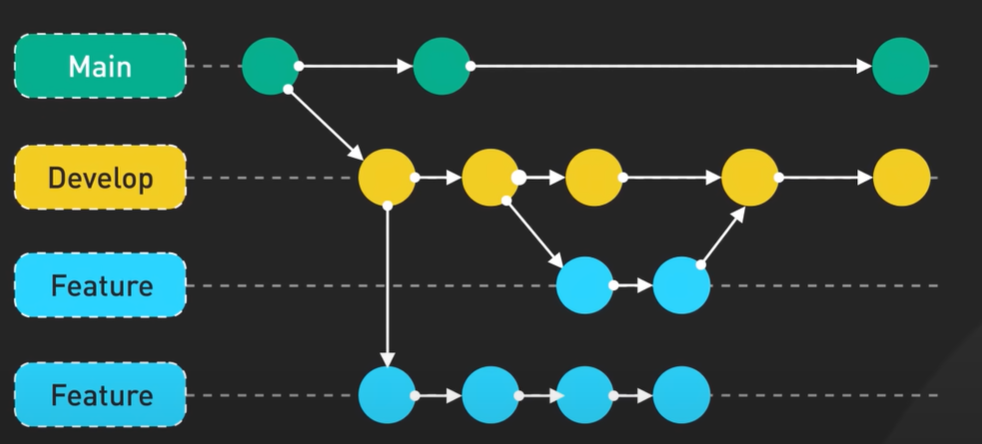

# Git Flow with Feature Branches - Step 10: Complete Branching Model



## Overview

This diagram illustrates the **complete Git Flow branching model**, expanding on the Main-Develop strategy by adding **Feature branches**. This is the full professional workflow used by development teams worldwide, showing how multiple features can be developed in parallel, integrated into Develop, and eventually released to Main. This model is the foundation of the popular **Git Flow** methodology created by Vincent Driessen.

## The Four-Level Hierarchy

### 1. Main Branch (Top - Teal/Green)
**The Production Line**

- **Purpose**: Production-ready code only
- **Commits**: 3 visible (representing releases)
- **Stability**: 100% stable
- **Access**: Highly protected
- **Deployment**: Auto-deploys to production
- **Tags**: Each commit tagged with version (v1.0.0, v2.0.0, etc.)

### 2. Develop Branch (Second - Yellow)
**The Integration Hub**

- **Purpose**: Integration of completed features
- **Commits**: 5 visible (more active than Main)
- **Stability**: Should be stable, but allows for bugs
- **Access**: Protected, but more permissive than Main
- **Deployment**: Usually deploys to staging environment
- **Role**: Bridge between Features and Main

### 3. Feature Branch (Third - Light Blue)
**Short-Lived Development Branch**

- **Purpose**: Develop a specific feature
- **Commits**: 2 visible
- **Stability**: Work in progress, can be unstable
- **Access**: Usually not protected
- **Lifecycle**: Created from Develop, merged back to Develop
- **Naming**: `feature/feature-name`

### 4. Feature Branch (Bottom - Light Blue)
**Another Parallel Feature**

- **Purpose**: Different feature, developed in parallel
- **Commits**: 4 visible
- **Independence**: Can progress without affecting other features
- **Lifecycle**: Same as third branch - from Develop, back to Develop
- **Naming**: `feature/other-feature-name`

## Understanding the Flow

### Branch Creation Points (Dashed Lines)

```
Main     ●
         ↓ (dashed - branch created)
Develop  ●
         ↓ (dashed - branch created)
Feature  ●
```

**What dashed lines show:**
- Origin points where branches are created
- Main creates Develop
- Develop creates Feature branches
- Shows inheritance relationship

**Commands:**
```bash
# Create Develop from Main
git checkout main
git checkout -b develop

# Create Feature from Develop
git checkout develop
git checkout -b feature/user-authentication

# Create another Feature from Develop
git checkout develop
git checkout -b feature/payment-system
```

### Parallel Development (Independent Features)

```
Develop  ● ────→ ● ────→ ● ────→ ● ────→ ●
         │                 │
         ↓                 ↓
Feature1 ● ─→ ●           (merged)
         
Feature2 ● ─→ ● ─→ ● ─→ ●
```

**Key observations:**
- Two feature branches work simultaneously
- Feature 1 (top): Shorter lifecycle, 2 commits, finishes first
- Feature 2 (bottom): Longer lifecycle, 4 commits, takes more time
- Both branch from same Develop but work independently
- No interference between features

### Merging Pattern (White Arrows)

The diagram shows **three merge points**:

#### Merge 1: Feature → Develop (Top feature)
```
Develop  ● ───→ ● ←─── Feature
              ↑
         (merge back)
```

**What happens:**
- Feature is complete and tested
- Merged back into Develop
- Feature branch can be deleted
- Develop now contains this feature

#### Merge 2: Feature → Develop (Bottom feature)
```
Develop  ● ───→ ● ───→ ● ←─── Feature
                       ↑
                  (merge back)
```

**What happens:**
- Second feature completes later
- Also merged into Develop
- Develop now has both features
- Feature branch deleted

#### Merge 3: Develop → Main (Release)
```
Main     ● ───────────────→ ● ←─── Develop
                            ↑
                       (release)
```

**What happens:**
- Develop is stable with all features
- Ready for production release
- Merged to Main
- Tagged as new version
- Deployed to production

## The Complete Workflow Explained

### Step 1: Project Initialization

```bash
# Create repository with main branch
git init
git add README.md
git commit -m "Initial commit"
git branch -M main
git push -u origin main

# Create develop branch
git checkout -b develop
git push -u origin develop
```

**Diagram state:**
```
Main     ● (initial commit)
         │
Develop  ● (branched from main)
```

### Step 2: Feature 1 Development

```bash
# Developer A starts Feature 1
git checkout develop
git pull origin develop
git checkout -b feature/user-authentication

# Work on the feature
# Day 1
git add authentication.js
git commit -m "Add login form"

# Day 2
git add validation.js
git commit -m "Add password validation"

# Push to remote for backup
git push -u origin feature/user-authentication
```

**Diagram state:**
```
Main     ● ──────────────→ ●

Develop  ● ──────────────→ ●
         │
Feature1 ● ─→ ● (2 commits)
```

### Step 3: Feature 2 Development (Parallel)

```bash
# Developer B starts Feature 2 (while Feature 1 is in progress)
git checkout develop
git pull origin develop
git checkout -b feature/payment-system

# Work on payment system
# Week 1
git commit -m "Add payment gateway integration"
git commit -m "Add payment form UI"

# Week 2
git commit -m "Add payment validation"
git commit -m "Add payment confirmation"

# Push regularly
git push -u origin feature/payment-system
```

**Diagram state:**
```
Main     ● ──────────────→ ●

Develop  ● ──────────────→ ●
         │                 │
Feature1 ● ─→ ●            │
         │                 │
Feature2 ● ─→ ● ─→ ● ─→ ● (4 commits, still in progress)
```

### Step 4: Feature 1 Completion and Merge

```bash
# Feature 1 is complete
git checkout develop
git pull origin develop
git merge feature/user-authentication

# Test the integration
npm test
npm run integration-tests

# If successful, push
git push origin develop

# Delete feature branch
git branch -d feature/user-authentication
git push origin --delete feature/user-authentication
```

**Diagram state:**
```
Main     ● ──────────────→ ●

Develop  ● ──────→ ● ←─── ● (Feature 1 merged)
                   ↑
Feature1          [merged, deleted]

Feature2 ● ─→ ● ─→ ● ─→ ● (still in progress)
```

### Step 5: Feature 2 Completion and Merge

```bash
# Feature 2 is complete
git checkout develop
git pull origin develop
git merge feature/payment-system

# Test thoroughly (includes Feature 1 + Feature 2)
npm test

# Push to develop
git push origin develop

# Delete feature branch
git branch -d feature/payment-system
git push origin --delete feature/payment-system
```

**Diagram state:**
```
Main     ● ──────────────→ ●

Develop  ● ──→ ● ──→ ● ──→ ● ←─── ● (Feature 2 merged)
              ↑            ↑
      (Feature 1)    (Feature 2)

Feature1 [deleted]
Feature2 [deleted]
```

### Step 6: Release to Main

```bash
# All features tested and stable on develop
# Ready for production release

git checkout main
git pull origin main
git merge develop

# Tag the release
git tag -a v1.1.0 -m "Release v1.1.0: Authentication and Payment features"

# Push to production
git push origin main
git push origin --tags

# Production deployment happens automatically
```

**Final diagram state:**
```
Main     ● ──────────────→ ● ←──────────── ● (v1.1.0 released!)
                           ↑
Develop  ● ──→ ● ──→ ● ──→ ● ──→ ●
```

## Real-World Scenario: Sprint Development

### Sprint Planning (Week 1, Monday)

**Product Owner assigns features:**
- Feature A: User Profile (Developer Alice)
- Feature B: Notification System (Developer Bob)
- Feature C: Dashboard Analytics (Developer Carol)

```bash
# Alice
git checkout develop
git pull origin develop
git checkout -b feature/user-profile

# Bob
git checkout develop
git pull origin develop
git checkout -b feature/notifications

# Carol
git checkout develop
git pull origin develop
git checkout -b feature/dashboard
```

**Visual:**
```
Main     ● ──────────────→ ●

Develop  ● ──────────────→ ●
         │
         ├─→ Feature A (Alice)
         ├─→ Feature B (Bob)
         └─→ Feature C (Carol)
```

### Development Phase (Week 1, Tue-Fri)

**Everyone works independently:**

```bash
# Alice's progress
git commit -m "Add profile structure"
git commit -m "Add profile form"
git commit -m "Add profile validation"

# Bob's progress
git commit -m "Add notification model"
git commit -m "Add notification UI"

# Carol's progress
git commit -m "Add dashboard layout"
git commit -m "Add charts integration"
git commit -m "Add data fetching"
git commit -m "Add filtering"
```

**Visual:**
```
Main     ● ───────────────────────→ ●

Develop  ● ───────────────────────→ ●
         │
         ├─→ Feature A: ● ─→ ● ─→ ● (Alice - 3 commits)
         │
         ├─→ Feature B: ● ─→ ● (Bob - 2 commits)
         │
         └─→ Feature C: ● ─→ ● ─→ ● ─→ ● (Carol - 4 commits)
```

### Integration Day (Week 2, Monday)

**Features merge in order of completion:**

```bash
# Alice finishes first
git checkout develop
git pull origin develop
git merge feature/user-profile
npm test
git push origin develop

# Bob finishes next
git checkout develop
git pull origin develop  # Now has Alice's feature
git merge feature/notifications
npm test
git push origin develop

# Carol finishes last
git checkout develop
git pull origin develop  # Now has Alice's and Bob's features
git merge feature/dashboard
npm test
git push origin develop
```

**Visual:**
```
Main     ● ───────────────────────────────→ ●

Develop  ● ──→ ● ──→ ● ──→ ● (all features integrated)
              ↑     ↑     ↑
          (Alice)(Bob)(Carol)
```

### Testing and Stabilization (Week 2, Tue-Thu)

```bash
# QA team tests develop branch
# Bugs found and fixed

git checkout develop
git pull origin develop
git checkout -b bugfix/profile-validation
# ... fix bug ...
git checkout develop
git merge bugfix/profile-validation

# More testing
# All green ✅
```

### Release (Week 2, Friday)

```bash
# Release to production
git checkout main
git pull origin main
git merge develop
git tag -a v2.0.0 -m "Sprint 15: Profile, Notifications, Dashboard"
git push origin main --tags

# 🎉 Production deployment!
```

**Final visual:**
```
Main     ● ───────────────────→ ● ←─────────── ● (v2.0.0)
                                 ↑
Develop  ● ──→ ● ──→ ● ──→ ● ───→ ●
```

## Multiple Features: Benefits and Challenges

### Benefits ✅

#### 1. **Parallel Development**
```
Instead of:
Feature A → Feature B → Feature C (3 weeks sequential)

We have:
Feature A ─┐
Feature B ─┤→ All done in 1 week!
Feature C ─┘
```

#### 2. **Isolation**
- Bug in Feature A doesn't affect Feature B
- Can abandon Feature C without affecting others
- Each feature has its own history

#### 3. **Code Review**
```bash
# Easy to review each feature separately
# Create pull request for each feature
git push origin feature/user-profile
# PR: Compare feature/user-profile with develop
```

#### 4. **Rollback Capability**
```bash
# If Feature B causes issues after merge
git revert <merge-commit-hash>
# Only Feature B is removed, A and C remain
```

#### 5. **Team Scaling**
- 10 developers = 10 parallel features
- No stepping on each other's toes
- Clear ownership and responsibility

### Challenges ⚠️

#### 1. **Merge Conflicts**
```bash
# Two features modify same file
Feature A: login.js (adds validation)
Feature B: login.js (adds styling)

# When merging second feature:
git merge feature-b
# CONFLICT in login.js
# Must resolve manually
```

**Solution:**
```bash
# Regularly sync feature with develop
git checkout feature/user-profile
git merge develop  # Bring in other changes
# Resolve small conflicts frequently
# Better than one big conflict at end
```

#### 2. **Integration Testing**
- Features work alone but break together
- Must test all combinations
- Requires good CI/CD

**Solution:**
```bash
# Automated integration tests on develop
# Run full test suite after each merge
npm run test:integration
```

#### 3. **Coordination**
- Features may depend on each other
- Need good communication
- Sprint planning crucial

**Solution:**
- Daily standups
- Feature dependency planning
- Merge critical features first

## Branch Naming Conventions

### Feature Branches

```bash
# Good naming:
feature/user-authentication
feature/payment-gateway
feature/social-media-integration
feature/dark-mode
feature/export-to-pdf

# Pattern: feature/<description-with-hyphens>

# Also common:
feature/JIRA-123-user-auth
feature/issue-456-payment
feat/user-profile

# Bad naming:
feature/stuff
feature/fix
feature/update
myfeature
```

### Other Branch Types (Extended Git Flow)

```bash
# Hotfix branches (from Main)
hotfix/critical-security-patch
hotfix/production-bug-fix

# Release branches (from Develop)
release/v1.0.0
release/v2.1.0

# Bugfix branches (from Develop)
bugfix/login-error
bugfix/broken-navigation
```

## The Complete Git Flow Model

The diagram shows the core, but full Git Flow includes:

### 5 Branch Types

1. **Main**: Production code
2. **Develop**: Integration branch
3. **Feature**: New features (`feature/*`)
4. **Release**: Release preparation (`release/*`)
5. **Hotfix**: Emergency production fixes (`hotfix/*`)

### Extended Visual

```
Main      ● ──────→ ● ←──hotfix──← ● ←──release──← ●
          │          ↓                              ↑
          │          └──────────────────────────────┤
          ↓                                         │
Develop   ● ←feature← ● ←feature← ● ─────────────→ ●
          │           │           │
          ↓           ↓           ↓
Feature1  ● ─→ ●     
Feature2            ● ─→ ● ─→ ●
Feature3                      ● ─→ ●
```

## Practical Commands Reference

### Creating Features

```bash
# Start new feature from develop
git checkout develop
git pull origin develop
git checkout -b feature/my-awesome-feature

# Work on feature
git add .
git commit -m "Add awesome functionality"

# Push regularly for backup
git push -u origin feature/my-awesome-feature
```

### Updating Feature with Develop Changes

```bash
# Keep feature branch up-to-date
git checkout feature/my-awesome-feature
git merge develop

# Or with rebase (cleaner history)
git rebase develop
```

### Completing Features

```bash
# Finish feature
git checkout develop
git pull origin develop
git merge --no-ff feature/my-awesome-feature
git push origin develop

# Delete feature branch
git branch -d feature/my-awesome-feature
git push origin --delete feature/my-awesome-feature
```

### Checking Branch Status

```bash
# See all branches
git branch -a

# See branch relationships
git log --graph --oneline --all

# See what's in feature but not in develop
git log develop..feature/my-feature

# See diff between branches
git diff develop..feature/my-feature
```

## Pull Request Workflow

### Modern Practice with Pull Requests

```bash
# Instead of direct merge:
# 1. Push feature branch
git push origin feature/user-authentication

# 2. Create Pull Request on GitHub/GitLab
#    - Base: develop
#    - Compare: feature/user-authentication

# 3. Team reviews code
#    - Comments on specific lines
#    - Requests changes
#    - Approves when ready

# 4. Address feedback
git commit -m "Address review comments"
git push origin feature/user-authentication

# 5. Merge via PR interface (after approval)
#    - Creates merge commit
#    - Auto-deletes branch (optional)

# 6. Pull updated develop
git checkout develop
git pull origin develop
```

### Pull Request Checklist

```markdown
## PR Description Template

### What does this PR do?
- Adds user authentication system
- Implements login/logout functionality
- Includes password validation

### How to test?
1. Run `npm install`
2. Start server: `npm start`
3. Navigate to /login
4. Test login with test credentials

### Screenshots
[Include if UI changes]

### Checklist
- [x] Tests added/updated
- [x] Documentation updated
- [x] No breaking changes
- [x] Tested locally
- [x] Tested on staging
```

## Best Practices

### ✅ Do's

1. **Keep features small and focused**
   ```bash
   # ✅ Good: Small, focused features
   feature/add-login-button
   feature/validate-email
   
   # ❌ Bad: Too broad
   feature/entire-authentication-system
   ```

2. **Branch from updated develop**
   ```bash
   git checkout develop
   git pull origin develop  # ← Important!
   git checkout -b feature/new-feature
   ```

3. **Commit frequently on feature branches**
   ```bash
   # Small commits are good
   git commit -m "Add form structure"
   git commit -m "Add validation"
   git commit -m "Add error handling"
   ```

4. **Sync feature with develop regularly**
   ```bash
   # Every few days or before major work
   git checkout feature/my-feature
   git merge develop
   ```

5. **Delete feature branches after merge**
   ```bash
   git branch -d feature/completed-feature
   git push origin --delete feature/completed-feature
   ```

6. **Use pull requests for code review**
   ```bash
   git push origin feature/my-feature
   # Then create PR on GitHub/GitLab
   ```

7. **Test before merging to develop**
   ```bash
   git checkout feature/my-feature
   npm test
   npm run lint
   # All green? Now merge
   ```

8. **Write descriptive commit messages**
   ```bash
   # ✅ Good
   git commit -m "Add email validation to registration form"
   
   # ❌ Bad
   git commit -m "update"
   ```

### ❌ Don'ts

1. **Don't create features from main**
   ```bash
   # ❌ Wrong
   git checkout main
   git checkout -b feature/my-feature
   
   # ✅ Right
   git checkout develop
   git checkout -b feature/my-feature
   ```

2. **Don't let feature branches live too long**
   ```bash
   # ❌ Bad: 2-month-old feature branch
   # Merge conflicts nightmare
   
   # ✅ Good: Merge within 1-2 weeks
   ```

3. **Don't merge broken code to develop**
   ```bash
   # ❌ Bad
   git merge feature/broken-feature  # Tests failing
   
   # ✅ Good
   npm test  # All pass
   git merge feature/working-feature
   ```

4. **Don't commit directly to develop**
   ```bash
   # ❌ Bad
   git checkout develop
   git commit -m "Quick fix"
   
   # ✅ Good
   git checkout -b feature/quick-fix
   git commit -m "Quick fix"
   # Create PR
   ```

5. **Don't forget to pull before creating features**
   ```bash
   # ❌ Bad
   git checkout -b feature/new  # Without pulling
   
   # ✅ Good
   git pull origin develop
   git checkout -b feature/new
   ```

6. **Don't mix multiple features in one branch**
   ```bash
   # ❌ Bad: feature/login-and-profile-and-settings
   
   # ✅ Good: Three separate branches
   feature/login
   feature/profile
   feature/settings
   ```

## Handling Common Scenarios

### Scenario 1: Feature Depends on Another Feature

```bash
# Feature B depends on Feature A
# Option 1: Wait for Feature A to merge
git checkout develop
# Wait for Feature A to merge
git pull origin develop
git checkout -b feature/feature-b

# Option 2: Branch from Feature A
git checkout feature/feature-a
git checkout -b feature/feature-b
# Work on Feature B
# When Feature A merges, rebase Feature B onto develop
```

### Scenario 2: Urgent Hotfix While Features in Progress

```bash
# Features in progress on develop
# Critical bug found in production

# Create hotfix from main
git checkout main
git checkout -b hotfix/critical-bug
git commit -m "Fix critical bug"

# Merge to main
git checkout main
git merge hotfix/critical-bug
git tag -a v1.0.1 -m "Hotfix: Critical bug"
git push origin main --tags

# IMPORTANT: Merge to develop too
git checkout develop
git merge hotfix/critical-bug
git push origin develop

# Now both branches have the fix
```

### Scenario 3: Feature Needs to Be Cancelled

```bash
# Feature is no longer needed
git checkout develop
# Don't merge the feature

# Delete feature branch
git branch -D feature/cancelled-feature
git push origin --delete feature/cancelled-feature

# Work is discarded, develop unaffected
```

### Scenario 4: Merge Conflict Between Features

```bash
# Feature A merged to develop
git checkout develop
git merge feature/feature-a
git push origin develop

# Feature B has conflicts with Feature A
git checkout feature/feature-b
git merge develop
# CONFLICT in shared-file.js

# Resolve conflict
# ... edit shared-file.js ...
git add shared-file.js
git commit -m "Resolve merge conflict with Feature A"

# Continue work
git push origin feature/feature-b
```

## Visualizing Your Branches

### Use Git Log with Graph

```bash
# Beautiful branch visualization
git log --graph --oneline --all --decorate

# Example output:
* a1b2c3d (HEAD -> feature/payment) Add payment validation
* e4f5g6h Add payment form
| * h7i8j9k (feature/profile) Add profile settings
| * k1l2m3n Add profile view
|/
* n4o5p6q (develop) Merge feature/authentication
* r7s8t9u Add authentication
* v1w2x3y (main, tag: v1.0.0) Initial release
```

### Use Git GUI Tools

Popular tools:
- **GitKraken**: Visual branch management
- **SourceTree**: Free Git GUI
- **GitHub Desktop**: Simple GitHub integration
- **VS Code Git Graph**: Extension for VS Code
- **Git Extensions**: Windows Git GUI

## Team Size and Branch Strategy

### Small Team (2-5 developers)

```
Main     ● ──────────→ ●
         │
Develop  ● ──→ ● ──→ ●
         │     │
         ↓     ↓
     1-2 features at a time
```

### Medium Team (5-15 developers)

```
Main     ● ──────────→ ●
         │
Develop  ● ──→ ● ──→ ● ──→ ●
         │     │     │     │
         ↓     ↓     ↓     ↓
     3-5 features in parallel
```

### Large Team (15+ developers)

```
Main     ● ──────────→ ●
         │
Develop  ● ──→ ● ──→ ● ──→ ● ──→ ●
         │     │     │     │     │
         ↓     ↓     ↓     ↓     ↓
     5-10+ features + release branches
```

## Integration with Project Management

### Linking Branches to Tickets

```bash
# Include ticket number in branch name
git checkout -b feature/JIRA-123-user-authentication
git checkout -b feature/TICKET-456-payment-gateway

# Include in commit messages
git commit -m "[JIRA-123] Add login form"
git commit -m "[TICKET-456] Integrate Stripe API"

# Auto-links to project management tool
```

### Branch Naming with Issue Numbers

```bash
# GitHub Issues
feature/gh-42-add-dark-mode
bugfix/gh-98-fix-navigation

# Jira
feature/PROJ-123-user-profile
feature/PROJ-456-notifications

# GitLab
feature/123-user-authentication
```

## Key Takeaways

1. **Four levels**: Main → Develop → Feature branches
2. **Multiple features in parallel**: Independent development
3. **Features branch from develop**: Not from main
4. **Features merge back to develop**: Integration point
5. **Develop merges to main**: Release point
6. **Isolation**: Features don't affect each other
7. **Flexibility**: Can have many features simultaneously
8. **This is Git Flow**: Industry-standard branching model
9. **Pull requests recommended**: Code review before merge
10. **Delete after merge**: Keep repository clean

## Summary

This diagram represents the **complete Git Flow branching strategy**:

- 🎯 **Main**: The sacred production branch
- 🔄 **Develop**: The integration hub
- 🚀 **Features**: Parallel development lanes

The beauty of this model is **parallel development without chaos**:
- Multiple developers work simultaneously
- Each feature isolated in its own branch
- Features integrate one by one into Develop
- Only stable, tested code reaches Main

This is how professional teams ship quality software at scale! 🎉

---

*This document explains the complete Git Flow branching model with feature branches. For the basic Main-Develop model, see Step-09.md. For branching concepts, see Step-02.md.*
