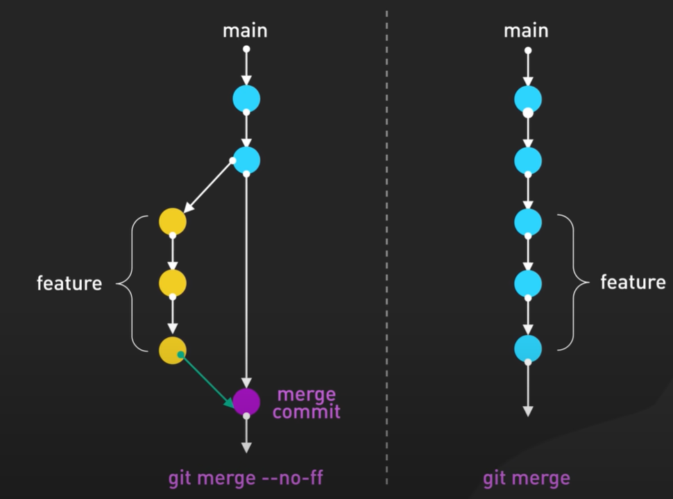

# Git Merge Strategies - Step 11: Merge vs No-Fast-Forward



## Overview

This diagram illustrates one of the most important decisions in Git merging: **`git merge --no-ff`** (no fast-forward) versus **`git merge`** (default, allows fast-forward). Understanding the difference between these two approaches is crucial for maintaining a clear and useful Git history. The visual comparison shows how the same feature integration can result in very different commit histories.

## The Two Approaches Side-by-Side

### Left Side: `git merge --no-ff` (No Fast-Forward)
**Preserves Branch History**

### Right Side: `git merge` (Default)
**Linear History**

Both achieve the same end result (feature code integrated into main), but the **history structure** is fundamentally different.

## Understanding the Left Side: `git merge --no-ff`

### Visual Structure

```
main     ● ──→ ● ──────────────→ ● (merge commit)
              ↘                 ↗
feature        ● ──→ ● ──→ ●
              (yellow commits)
```

### Key Elements

**1. Main Branch (Cyan/Blue commits):**
- Top commit: Starting point
- Middle commit: Parallel work on main
- Bottom commit: **Purple merge commit**

**2. Feature Branch (Yellow commits):**
- Branches off from main
- Three independent commits
- Labeled with curly brace: "feature"

**3. Merge Commit (Purple):**
- Special commit with **two parents**
- Combines both histories
- Labeled: "merge commit"
- Created even though fast-forward was possible

**4. White Arrows:**
- Diagonal arrow: Branch creation point
- Teal arrow: Merge back to main
- Shows clear branch and merge points

### The Command

```bash
git merge --no-ff feature-branch
```

**What `--no-ff` means:**
- `--no-ff` = "no fast-forward"
- Forces creation of a merge commit
- Preserves branch structure in history
- Shows that a feature branch existed

### Resulting History

```bash
git log --oneline --graph

# Output:
*   a1b2c3d (HEAD -> main) Merge branch 'feature'
|\  
| * e4f5g6h Feature commit 3
| * h7i8j9k Feature commit 2  
| * k1l2m3n Feature commit 1
* | n4o5p6q Main commit during feature development
|/  
* r7s8t9u Initial commit
```

**Key observation:** You can see the branch structure in history!

## Understanding the Right Side: `git merge` (Fast-Forward)

### Visual Structure

```
main     ● ──→ ● ──→ ● ──→ ● ──→ ● ──→ ●
         (all commits appear on single line)
```

### Key Elements

**1. Main Branch (Cyan/Blue commits):**
- Appears as a single linear line
- Six commits total
- No visible branch structure
- All commits "absorbed" into main

**2. Feature Branch:**
- Labeled with curly brace on the right
- But visually integrated into main line
- No separate visual representation
- History looks like commits were made directly on main

**3. No Merge Commit:**
- No purple commit
- No special merge point
- Just continuous progression
- Fast-forwarded the branch pointer

### The Command

```bash
git merge feature-branch
```

**What happens (fast-forward):**
- Git sees main hasn't diverged from feature
- Simply moves main pointer forward
- No merge commit created
- Linear history maintained

### Resulting History

```bash
git log --oneline --graph

# Output:
* e4f5g6h (HEAD -> main) Feature commit 3
* h7i8j9k Feature commit 2
* k1l2m3n Feature commit 1
* n4o5p6q Previous main commit
* r7s8t9u Initial commit

# No branch structure visible!
# Looks like all commits were on main
```

**Key observation:** Can't tell a branch ever existed!

## When Fast-Forward is Possible

### Fast-Forward Condition

Fast-forward only happens when:
```
main     ● ──→ ● (no new commits)
              ↘
feature        ● ──→ ● ──→ ●
```

**Requirements:**
- Main branch has **not** advanced since feature was created
- Feature branch is **ahead** of main
- Main can simply "catch up" by moving its pointer forward

### When Fast-Forward is NOT Possible

```
main     ● ──→ ● ──→ ● (new commits exist)
              ↘
feature        ● ──→ ● ──→ ●
```

**Why not:**
- Main has new commits that feature doesn't have
- Branches have **diverged**
- Merge commit is **required**
- Both approaches create merge commit in this case

## Detailed Comparison

### `git merge --no-ff` (No Fast-Forward)

#### Command
```bash
git checkout main
git merge --no-ff feature/user-authentication
```

#### Visual Result
```
*   Merge branch 'feature/user-authentication'
|\  
| * Add login validation
| * Add login form
| * Add authentication structure
* | Update dependencies
|/  
* Initial commit
```

#### Characteristics
- ✅ **Always creates merge commit**
- ✅ **Preserves branch history**
- ✅ **Shows feature boundaries**
- ✅ **Clear feature isolation**
- ✅ **Easy to revert entire feature**
- ❌ **More verbose history**
- ❌ **Extra commit for every merge**

#### When to Use
- Professional/team projects
- Feature branches
- When you want clear history
- Git Flow workflow
- When features need to be identifiable
- Code reviews via pull requests

### `git merge` (Default/Fast-Forward)

#### Command
```bash
git checkout main
git merge feature/user-authentication
```

#### Visual Result (if fast-forward possible)
```
* Add login validation
* Add login form
* Add authentication structure
* Update dependencies
* Initial commit
```

#### Characteristics
- ✅ **Linear history**
- ✅ **Cleaner log output**
- ✅ **Fewer commits**
- ✅ **Simple progression**
- ❌ **Loses branch context**
- ❌ **Can't see feature boundaries**
- ❌ **Harder to revert features**

#### When to Use
- Personal projects
- Solo development
- Simple linear workflow
- Small, trivial changes
- Trunk-based development
- When you prefer clean history

## The Merge Commit Explained

### What is a Merge Commit?

A merge commit is **special** because it has **two parents**:

```bash
commit a1b2c3d (purple merge commit)
Author: Developer <dev@example.com>
Date:   Fri Oct 7 2024

    Merge branch 'feature' into main
    
    # Special characteristics:
    Parent 1: n4o5p6q (main branch)
    Parent 2: e4f5g6h (feature branch)
```

**Normal commit:**
```
Parent: One commit
Children: Can have many
```

**Merge commit:**
```
Parents: Two (or more) commits
Children: Can have many
```

### Creating a Merge Commit

```bash
git checkout main
git merge --no-ff feature/my-feature

# Git opens editor for merge message:
# Default message:
Merge branch 'feature/my-feature'

# You can customize:
Merge branch 'feature/my-feature'

Add user authentication system
- Login functionality
- Password validation
- Session management
```

## Practical Examples

### Example 1: Feature Development with --no-ff

```bash
# Start feature
git checkout main
git pull origin main
git checkout -b feature/payment-gateway

# Work on feature (3 commits)
git commit -m "Add payment gateway structure"
git commit -m "Integrate Stripe API"
git commit -m "Add payment validation"

# Merge with no-ff
git checkout main
git merge --no-ff feature/payment-gateway

# History shows:
*   Merge branch 'feature/payment-gateway'
|\  
| * Add payment validation
| * Integrate Stripe API
| * Add payment gateway structure
|/  
* Previous main commit
```

**Benefits:**
- Clear boundary: "These 3 commits are the payment gateway"
- Easy to find: "When did we add payment?"
- Easy to revert: "Let's remove the payment gateway"

### Example 2: Same Feature with Default Merge

```bash
# Same feature development
git checkout main
git checkout -b feature/payment-gateway
# ... same 3 commits ...

# Merge with default (fast-forward)
git checkout main
git merge feature/payment-gateway

# History shows:
* Add payment validation
* Integrate Stripe API
* Add payment gateway structure
* Previous main commit
```

**Result:**
- Looks like commits were made directly on main
- No indication these were part of a feature
- Harder to identify what was part of payment gateway
- More difficult to revert as a unit

### Example 3: Reverting a Feature

**With --no-ff (Easy):**
```bash
# Find the merge commit
git log --oneline --grep="payment-gateway"
# a1b2c3d Merge branch 'feature/payment-gateway'

# Revert the entire feature in one command
git revert -m 1 a1b2c3d

# All 3 commits are reverted together
# Clean and atomic
```

**With fast-forward (Harder):**
```bash
# Must identify all commits manually
git log --oneline
# e4f5g6h Add payment validation
# h7i8j9k Integrate Stripe API
# k1l2m3n Add payment gateway structure

# Revert each individually (in reverse order)
git revert e4f5g6h
git revert h7i8j9k
git revert k1l2m3n

# Three separate revert commits
# More error-prone
```

## Configuring Default Merge Behavior

### Always Use --no-ff

```bash
# Set globally
git config --global merge.ff false

# Now all merges will use --no-ff by default
git merge feature-branch
# Creates merge commit automatically
```

### Always Use Fast-Forward Only

```bash
# Set globally
git config --global merge.ff only

# Now merges will fail if fast-forward not possible
git merge feature-branch
# Error if main has diverged
# Forces you to rebase or be explicit
```

### Default Behavior (Context-Dependent)

```bash
# Git's default (no config set)
# Allows fast-forward when possible
# Creates merge commit when necessary
```

## Team Workflows

### Recommended for Teams: --no-ff

```bash
# Team workflow with pull requests
# 1. Developer creates feature
git checkout -b feature/user-profile

# 2. Makes commits
git commit -m "Add profile structure"
git commit -m "Add profile form"

# 3. Pushes for review
git push origin feature/user-profile

# 4. Team reviews on GitHub/GitLab
# Creates Pull Request
# Reviews and approves

# 5. Merge via PR with --no-ff
# (Most platforms default to --no-ff for PRs)
git checkout main
git merge --no-ff feature/user-profile

# 6. History clearly shows:
*   Merge pull request #42 from user/feature/user-profile
|\  
| * Add profile form
| * Add profile structure
|/  
```

**Why teams prefer --no-ff:**
- ✅ Clear feature boundaries
- ✅ Easy code review tracking
- ✅ Traceability to pull requests
- ✅ Easy rollback of features
- ✅ Better understanding of project evolution

## Visual History Examples

### Project with --no-ff

```bash
git log --oneline --graph --all

*   Merge branch 'feature/notifications'
|\  
| * Add email notifications
| * Add push notifications
| * Add notification service
|/  
*   Merge branch 'feature/payments'
|\  
| * Add payment processing
| * Add payment forms
|/  
*   Merge branch 'feature/authentication'
|\  
| * Add login
| * Add registration
|/  
* Initial commit
```

**What you see:**
- Clear feature grouping
- Each merge represents a feature
- Easy to understand project structure
- Visual "swim lanes" for features

### Same Project with Fast-Forward

```bash
git log --oneline --graph --all

* Add email notifications
* Add push notifications
* Add notification service
* Add payment processing
* Add payment forms
* Add login
* Add registration
* Initial commit
```

**What you see:**
- Linear list of commits
- No feature grouping
- Unclear boundaries
- Harder to understand structure
- All commits look equal in importance

## Advanced Scenarios

### Scenario 1: Long-Running Feature Branch

```bash
# Feature branch exists for 2 weeks
# Main has advanced significantly

main     ● ──→ ● ──→ ● ──→ ● ──→ ●
              ↘
feature        ● ──→ ● ──→ ● ──→ ● ──→ ●

# Fast-forward NOT possible (branches diverged)
# Both merge types create merge commit

# With --no-ff:
git merge --no-ff feature-branch
# Explicit merge commit with clear message

# With default merge:
git merge feature-branch
# Also creates merge commit (required)
# But now you chose explicitly vs forced to
```

### Scenario 2: Multiple Feature Merges

```bash
# Multiple developers merging features

# Developer A uses --no-ff
git merge --no-ff feature/feature-a

# Developer B uses fast-forward
git merge feature/feature-b  # Fast-forwards

# Result: Inconsistent history
# Some features show as branches, others don't
# Confusing project timeline

# Solution: Team convention
# All use --no-ff for consistency
```

### Scenario 3: Hotfix on Production

```bash
# Urgent production fix
git checkout main
git checkout -b hotfix/critical-bug

# Fix and commit
git commit -m "Fix critical security bug"

# For hotfix, fast-forward might be OK
git checkout main
git merge hotfix/critical-bug  # Fast-forward

# Reason: Single commit, not a feature
# Less important to show as branch
# But --no-ff also acceptable for tracking
```

## Best Practices

### ✅ Do's

1. **Use --no-ff for feature branches**
   ```bash
   git merge --no-ff feature/user-dashboard
   ```

2. **Set team convention**
   ```bash
   # Document in CONTRIBUTING.md
   # All feature merges use --no-ff
   ```

3. **Use --no-ff with pull requests**
   ```bash
   # GitHub/GitLab can enforce this
   # Settings → Merge button → 
   #   ✓ Create a merge commit
   ```

4. **Write descriptive merge messages**
   ```bash
   git merge --no-ff feature/notifications
   # In editor:
   Merge branch 'feature/notifications'
   
   Add notification system
   - Email notifications
   - Push notifications
   - In-app notifications
   ```

5. **Use fast-forward for trivial updates**
   ```bash
   # Updating README, fixing typo, etc.
   git merge feature/update-readme  # Fast-forward OK
   ```

6. **Configure per-repository**
   ```bash
   # In .git/config or project settings
   [merge]
       ff = false  # Team uses --no-ff
   ```

### ❌ Don'ts

1. **Don't mix strategies randomly**
   ```bash
   # ❌ Inconsistent
   git merge --no-ff feature-a
   git merge feature-b  # Sometimes ff, sometimes not
   
   # ✅ Consistent
   # Always use --no-ff for features
   ```

2. **Don't use --no-ff for single commits**
   ```bash
   # ❌ Overkill
   git merge --no-ff fix-typo  # One commit
   
   # ✅ Better
   git merge fix-typo  # Fast-forward fine
   ```

3. **Don't forget to delete feature branches**
   ```bash
   # After merging
   git branch -d feature/old-feature
   # Especially if using fast-forward
   # Otherwise branch names pile up
   ```

4. **Don't rebase before no-ff merge**
   ```bash
   # ❌ Don't do this:
   git rebase main  # On feature branch
   git checkout main
   git merge --no-ff feature-branch
   # Rebasing removes the point of --no-ff
   
   # ✅ Just merge:
   git checkout main
   git merge --no-ff feature-branch
   ```

## GitHub/GitLab Settings

### GitHub Pull Request Settings

```yaml
Repository Settings → General → Pull Requests:

Merge button options:
  ☑ Allow merge commits
      ☑ Default to merge commit
  ☐ Allow squash merging
  ☐ Allow rebase merging

Result: All PR merges use --no-ff automatically
```

### GitLab Merge Request Settings

```yaml
Repository Settings → General → Merge requests:

Merge method:
  ● Merge commit (creates merge commit)
  ○ Merge commit with semi-linear history
  ○ Fast-forward merge

Result: Merge requests create merge commits (--no-ff behavior)
```

## Impact on Git Bisect

### With --no-ff (Better for Bisect)

```bash
# Finding when a bug was introduced
git bisect start
git bisect bad HEAD
git bisect good v1.0.0

# Git bisect shows merge commits
# Can skip entire feature branches
git bisect skip  # Skip merge commit to test feature as unit
```

### With Fast-Forward (Harder)

```bash
# All commits are equal
# Must test each commit individually
# Can't skip features as units
# More time-consuming
```

## The Command Summary

### Creating No-FF Merge

```bash
# Method 1: Explicit flag
git merge --no-ff feature-branch

# Method 2: Configure default
git config merge.ff false
git merge feature-branch

# Method 3: Per merge with message
git merge --no-ff -m "Merge feature: User authentication" feature-branch
```

### Creating Fast-Forward Merge

```bash
# Method 1: Default (if possible)
git merge feature-branch

# Method 2: Explicit fast-forward only
git merge --ff-only feature-branch
# Fails if FF not possible

# Method 3: Force fast-forward
# Not possible if branches diverged
# Must rebase first
git rebase main  # On feature branch
git checkout main
git merge feature-branch  # Now fast-forward works
```

## Real-World Team Example

### Scenario: E-commerce Platform Development

**Team convention: Use --no-ff for all features**

```bash
# Week 1: Three features developed in parallel

# Feature 1: Shopping cart (Developer Alice)
git merge --no-ff feature/shopping-cart
# 5 commits merged

# Feature 2: Payment integration (Developer Bob)
git merge --no-ff feature/payment-integration
# 7 commits merged

# Feature 3: User reviews (Developer Carol)
git merge --no-ff feature/user-reviews
# 4 commits merged

# Git history:
*   Merge feature/user-reviews
|\  
| * Add review moderation
| * Add review display
| * Add review form
| * Add review database
|/  
*   Merge feature/payment-integration
|\  
| * Add payment confirmation
| * Add payment processing
| * Add Stripe integration
| * ... (7 commits total)
|/  
*   Merge feature/shopping-cart
|\  
| * Add cart persistence
| * Add quantity controls
| * Add remove from cart
| * Add add to cart
| * Add cart UI
|/  
* Initial sprint commit
```

**Benefits achieved:**
- Clear what each feature included
- Easy to understand when features were added
- Simple to revert if feature causes issues
- Good for documentation and onboarding
- Matches sprint planning structure

## Checking Current Configuration

```bash
# Check merge configuration
git config merge.ff
# Output:
#   (nothing) = default behavior
#   false = always --no-ff
#   only = only allow fast-forward

# Check all merge-related configs
git config --get-regexp merge
```

## Key Takeaways

1. **--no-ff preserves branch structure** in history
2. **Default merge uses fast-forward** when possible
3. **Fast-forward = linear history**, no merge commit
4. **--no-ff = branched history**, always merge commit
5. **--no-ff better for features** and team collaboration
6. **Fast-forward fine for trivial** changes
7. **Team consistency is crucial** - pick one strategy
8. **GitHub/GitLab default to --no-ff** for pull requests
9. **Merge commit has two parents** - shows integration point
10. **History structure affects** understanding and reverting

## Decision Matrix

### Use `git merge --no-ff` When:
- ✅ Working in a team
- ✅ Merging feature branches
- ✅ Want clear project history
- ✅ Need to revert features easily
- ✅ Using Git Flow
- ✅ Code reviews via PRs
- ✅ Professional projects

### Use `git merge` (Fast-Forward) When:
- ✅ Solo developer
- ✅ Personal projects
- ✅ Simple linear workflow
- ✅ Trivial changes (typos, docs)
- ✅ Want minimal commits
- ✅ Trunk-based development
- ✅ Continuous deployment

## Summary

The diagram beautifully illustrates the fundamental choice in Git merging:

**Left (--no-ff)**: 
- "I want to remember this was a feature branch"
- Preserves context and history
- Better for collaboration and understanding

**Right (Fast-Forward)**:
- "I want a clean linear history"
- Simpler log output
- Better for small solo projects

**Most professional teams choose --no-ff** because the ability to see feature boundaries, revert features atomically, and understand project evolution is worth the extra merge commits.

The purple merge commit on the left is not just an extra commit—it's **documentation of your development process** embedded in your Git history! 📚

---

*This document explains Git merge strategies. For branching models, see Step-09.md and Step-10.md. For basic merging, see Step-02.md.*
