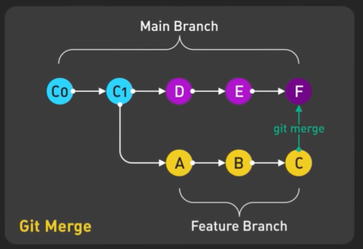

# Git Merge Visualization - Step 12: Understanding Merge Mechanics



## Overview

This diagram provides a **detailed visualization of how Git merge works**, showing the exact commit structure when a feature branch is merged back into the main branch. It illustrates the **relationship between commits**, the **branching point**, and the **merge point**, making the abstract concept of Git merging concrete and understandable. This is essential knowledge for understanding what happens "under the hood" when you execute a merge command.

## The Commit Structure

### Main Branch Timeline (Top - Cyan/Magenta)

**Labeled: "Main Branch"**

The main branch shows a progression of commits:

```
C0 → C1 → D → E → F
```

**Commit Breakdown:**

#### C0 (Cyan - Initial Commit)
- **Position**: Starting point of the repository
- **Color**: Light cyan/blue
- **Significance**: The common ancestor of both branches
- **Contains**: Initial project files, base code
- **State**: Before branching occurs

#### C1 (Cyan - Second Commit)
- **Position**: After C0, before branching
- **Color**: Light cyan/blue
- **Significance**: Last commit before feature branch was created
- **Contains**: Updates to main before branching
- **State**: Branching point - feature branch diverges here

#### D (Magenta - Main Progress)
- **Position**: First commit on main after branching
- **Color**: Magenta/purple
- **Significance**: Main branch continued development
- **Contains**: Changes made to main while feature was in progress
- **State**: Parallel development with feature branch

#### E (Magenta - More Main Progress)
- **Position**: Second commit on main after branching
- **Color**: Magenta/purple
- **Significance**: More main branch development
- **Contains**: Additional changes on main
- **State**: Main continues to evolve

#### F (Magenta - Merge Commit)
- **Position**: Final commit, merge point
- **Color**: Magenta/purple
- **Significance**: **Merge commit** - combines both branches
- **Contains**: Integration of feature branch into main
- **State**: Both branches unified
- **Special**: Has **two parent commits** (E and C)

### Feature Branch Timeline (Bottom - Yellow)

**Labeled: "Feature Branch"**

The feature branch shows its own progression:

```
A → B → C
```

**Commit Breakdown:**

#### A (Yellow - First Feature Commit)
- **Position**: First commit after branching from C1
- **Color**: Yellow/gold
- **Significance**: Beginning of feature development
- **Contains**: Initial feature structure
- **State**: Isolated from main branch changes

#### B (Yellow - Second Feature Commit)
- **Position**: Second commit on feature branch
- **Color**: Yellow/gold
- **Significance**: Feature development continues
- **Contains**: Additional feature implementation
- **State**: More progress on feature

#### C (Yellow - Final Feature Commit)
- **Position**: Last commit before merge
- **Color**: Yellow/gold
- **Significance**: Feature completion
- **Contains**: Final feature code, tests, documentation
- **State**: Ready to merge back to main

## The Critical Connections

### Branching Point (White Line from C1)

```
Main:    C0 → C1
              ↓ (branch created)
Feature:      A
```

**What the vertical white line shows:**
- Feature branch was created from commit C1
- C1 is the **parent** of commit A
- Feature branch inherits state of main at C1
- This is the **common ancestor** point

**Command that created this:**
```bash
git checkout C1  # On main branch
git checkout -b feature-branch
# First commit on feature becomes A
```

### Merge Point (Green Line to F)

```
Main:    ... → E → F
                   ↑ (merge happens)
Feature:      ... → C
```

**What the green line shows:**
- Feature branch merges into main at commit F
- Commit F has **two parents**: E (main) and C (feature)
- All feature changes now integrated into main
- Feature branch commits become part of main's history

**Command that created this:**
```bash
git checkout main  # Currently at E
git merge feature-branch
# Creates merge commit F
```

**Labeled: "git merge" in green**

## Understanding the Merge Commit (F)

### What Makes F Special?

Commit F is a **merge commit** with unique properties:

```bash
commit F (merge commit)
Parents: 
  - Parent 1: E (from main branch)
  - Parent 2: C (from feature branch)
  
Message: "Merge branch 'feature-branch' into main"

Changes: Combination of:
  - Everything from D and E (main progress)
  - Everything from A, B, and C (feature progress)
```

### The Two-Parent Relationship

```
         E (parent 1)
          ↓
         F (merge commit)
          ↑
         C (parent 2)
```

**Why two parents?**
- Preserves both lines of development
- Git can trace history back through both branches
- Enables understanding of how code evolved
- Allows reverting either branch's changes

## The Complete Flow Explained

### Timeline Sequence

```
Time →

1. C0: Repository created
2. C1: Initial development
3. Branch created from C1
4. A: Feature work begins
5. D: Main continues (parallel)
6. B: Feature continues
7. E: Main continues
8. C: Feature completes
9. F: Merge! Both streams unite
```

### What Happens at Each Stage

#### Stage 1-2: Initial Development (C0 → C1)
```bash
git init
git add .
git commit -m "C0: Initial commit"
git commit -m "C1: Add base features"
```

**State:**
```
Main: C0 → C1
```

#### Stage 3: Branch Created
```bash
git checkout -b feature-branch
# Currently at C1
```

**State:**
```
Main:    C0 → C1 (HEAD was here)
              ↓
Feature:      (branch created, no commits yet)
```

#### Stage 4: Feature Work Begins (Commit A)
```bash
# On feature branch
git commit -m "A: Add feature structure"
```

**State:**
```
Main:    C0 → C1
              ↓
Feature:      A
```

#### Stage 5: Parallel Development (Commit D)
```bash
git checkout main
git commit -m "D: Update main functionality"
```

**State:**
```
Main:    C0 → C1 → D
              ↓
Feature:      A
```

#### Stage 6: More Feature Work (Commit B)
```bash
git checkout feature-branch
git commit -m "B: Implement feature logic"
```

**State:**
```
Main:    C0 → C1 → D
              ↓
Feature:      A → B
```

#### Stage 7: Main Continues (Commit E)
```bash
git checkout main
git commit -m "E: More main updates"
```

**State:**
```
Main:    C0 → C1 → D → E
              ↓
Feature:      A → B
```

#### Stage 8: Feature Complete (Commit C)
```bash
git checkout feature-branch
git commit -m "C: Finalize feature"
```

**State:**
```
Main:    C0 → C1 → D → E
              ↓
Feature:      A → B → C
```

#### Stage 9: Merge! (Commit F)
```bash
git checkout main
git merge feature-branch
# Creates merge commit F
```

**Final State:**
```
Main:    C0 → C1 → D → E → F
              ↓           ↗
Feature:      A → B → C
```

## The Curly Braces: Showing Scope

### Main Branch Brace (Top)
```
┌─────────────────┐
│   Main Branch   │
└─────────────────┘
C0 → C1 → D → E → F
```

**What it indicates:**
- All commits C0, C1, D, E, F are on main branch
- Shows the complete main branch timeline
- Includes commits from before and after branching

### Feature Branch Brace (Bottom)
```
      A → B → C
┌──────────────┐
│Feature Branch│
└──────────────┘
```

**What it indicates:**
- Commits A, B, C are on feature branch
- Shows the feature branch timeline
- Separate development stream

## Detailed Command Walkthrough

### Step 1: Setup Main Branch

```bash
# Initialize repository
git init
cd my-project

# Create first commit (C0)
echo "Initial code" > app.js
git add app.js
git commit -m "C0: Initial commit"

# Create second commit (C1)
echo "More base code" >> app.js
git add app.js
git commit -m "C1: Add base features"
```

**State: C0 → C1**

### Step 2: Create Feature Branch

```bash
# Create and switch to feature branch
git checkout -b feature/new-feature

# Verify branch
git branch
# * feature/new-feature
#   main
```

**State: Branch exists at C1**

### Step 3: Work on Feature (A, B, C)

```bash
# Commit A
echo "Feature part 1" > feature.js
git add feature.js
git commit -m "A: Add feature structure"

# Commit B
echo "Feature part 2" >> feature.js
git add feature.js
git commit -m "B: Implement feature logic"

# Commit C
echo "Feature part 3" >> feature.js
git add feature.js
git commit -m "C: Finalize feature"
```

**State: Feature has A → B → C**

### Step 4: Meanwhile, Main Progresses (D, E)

```bash
# Switch to main
git checkout main

# Commit D
echo "Main update 1" >> app.js
git add app.js
git commit -m "D: Update main functionality"

# Commit E
echo "Main update 2" >> app.js
git add app.js
git commit -m "E: More main updates"
```

**State: Main has C0 → C1 → D → E**

### Step 5: Merge Feature into Main (F)

```bash
# On main branch
git merge feature/new-feature

# Git creates merge commit F
# Opens editor for merge message:
"Merge branch 'feature/new-feature'"

# Save and close editor
# Merge complete!
```

**Final State: Main has C0 → C1 → D → E → F (with F merging A, B, C)**

### Step 6: Verify Merge

```bash
# View the graph
git log --oneline --graph --all

# Output similar to:
*   F Merge branch 'feature/new-feature'
|\  
| * C Finalize feature
| * B Implement feature logic
| * A Add feature structure
* | E More main updates
* | D Update main functionality
|/  
* C1 Add base features
* C0 Initial commit
```

## Understanding the Merge Process

### What Git Does During Merge

1. **Identifies common ancestor** (C1)
   ```bash
   git merge-base main feature-branch
   # Returns: C1
   ```

2. **Finds changes on main** since C1
   ```
   Changes: D, E
   ```

3. **Finds changes on feature** since C1
   ```
   Changes: A, B, C
   ```

4. **Combines both sets** of changes
   ```
   New state: C1 + (D, E) + (A, B, C)
   ```

5. **Creates merge commit** F
   ```
   Commit F:
     - Includes all changes from D, E
     - Includes all changes from A, B, C
     - Parents: E and C
   ```

### What's in Commit F?

```bash
# F contains:
Files from main:
  - app.js (with changes from C1, D, E)

Files from feature:
  - feature.js (with changes from A, B, C)

Combined state:
  - Both branches' changes integrated
  - No conflicts (or conflicts resolved)
  - Single snapshot of entire project
```

## Conflict Resolution Example

### When Conflicts Occur

```bash
# If both branches modified app.js
git merge feature-branch

# Output:
Auto-merging app.js
CONFLICT (content): Merge conflict in app.js
Automatic merge failed; fix conflicts and then commit the result.
```

### Resolving Conflicts

```bash
# 1. Open app.js, see conflict markers:
<<<<<<< HEAD (main branch - commit E)
Main's version of code
=======
Feature's version of code
>>>>>>> feature-branch (commit C)

# 2. Edit to resolve
# Remove markers, keep desired code

# 3. Stage resolved file
git add app.js

# 4. Complete merge
git commit
# Creates merge commit F
```

## Commit Relationships Visualized

### Parent-Child Relationships

```
C0
 └─ C1
     ├─ D
     │   └─ E
     │       └─ F (parent 1: E)
     │           ↑
     └─ A       │
         └─ B   │
             └─ C (parent 2 of F)
```

**Key insights:**
- C0 is the root
- C1 has one child but branches into two lines
- F brings the lines back together
- F can trace history through both parents

### Ancestry Chain

**From F to C0 through main:**
```
F → E → D → C1 → C0
```

**From F to C0 through feature:**
```
F → C → B → A → C1 → C0
```

**Common ancestor:** C1

## The Labels Explained

### "Main Branch" (Top Label)
- Encompasses: C0, C1, D, E, F
- Indicates: This is the main branch timeline
- Color coordination: Cyan and magenta commits

### "Feature Branch" (Bottom Label)
- Encompasses: A, B, C
- Indicates: This is the feature branch timeline
- Color coordination: Yellow commits

### "Git Merge" (Left Label)
- Points to: The overall merge operation
- Indicates: This diagram shows a merge process
- Color: Yellow/gold to match feature branch

### "git merge" (Green Label)
- Points to: The merge commit F
- Indicates: Where the merge command executes
- Color: Green to show successful integration

## Practical Applications

### Viewing This Structure in Your Repository

```bash
# See the graph
git log --graph --oneline --all

# See detailed merge information
git show F  # Replace F with actual commit hash

# See merge commit parents
git log --pretty=format:"%h %p %s" F^..F

# See what was merged
git show F --stat
```

### Navigating the History

```bash
# Go to merge commit
git checkout F

# Go to first parent (main branch)
git checkout F^1  # Goes to E

# Go to second parent (feature branch)
git checkout F^2  # Goes to C

# See all commits from feature branch
git log F^2

# See commits only on feature branch
git log E..F --first-parent
```

## Common Scenarios

### Scenario 1: Fast-Forward Not Possible

This diagram shows the case where fast-forward is **not possible** because:
- Main has commits (D, E) after branching point (C1)
- Feature has commits (A, B, C)
- Branches have **diverged**
- Merge commit F is **required**

### Scenario 2: If Main Had No New Commits

If main had stayed at C1:
```
Main:    C0 → C1 (no D, E)
              ↓
Feature:      A → B → C

# Fast-forward possible:
Main:    C0 → C1 → A → B → C
```
No merge commit needed (unless using --no-ff)

### Scenario 3: Multiple Features

```
Main:    C0 → C1 → D → E → F → G
              ↓           ↗   ↗
Feature1:     A → B → C       
Feature2:           H → I → J
```
Multiple features merge at different points

## Best Practices

### ✅ Do's

1. **Understand the commit structure**
   ```bash
   # Always visualize before merging
   git log --graph --oneline --all
   ```

2. **Check the common ancestor**
   ```bash
   git merge-base main feature-branch
   ```

3. **Know what you're merging**
   ```bash
   # See what will be merged
   git diff main...feature-branch
   ```

4. **Test before merging**
   ```bash
   # On feature branch
   npm test
   # All pass? Now merge
   ```

5. **Write good merge messages**
   ```bash
   git merge feature-branch
   # In editor:
   Merge branch 'feature/user-auth'
   
   Add user authentication system
   - Login functionality
   - Password hashing
   - Session management
   ```

### ❌ Don'ts

1. **Don't merge without understanding state**
   ```bash
   # ❌ Blind merge
   git merge feature-branch
   
   # ✅ Check first
   git log --graph --oneline main..feature-branch
   git merge feature-branch
   ```

2. **Don't forget to update before merging**
   ```bash
   # ❌ Merge with stale main
   git checkout main
   git merge feature-branch
   
   # ✅ Update first
   git checkout main
   git pull origin main
   git merge feature-branch
   ```

3. **Don't leave merge conflicts unresolved**
   ```bash
   # ❌ Ignore conflicts
   git merge feature-branch
   # CONFLICT!
   # ... continue working ...
   
   # ✅ Resolve immediately
   git merge feature-branch
   # CONFLICT!
   # ... resolve conflicts ...
   git add .
   git commit
   ```

## Advanced Insights

### The Three-Way Merge

Git uses a **three-way merge** algorithm:

1. **Base**: Common ancestor (C1)
2. **Ours**: Main branch tip (E)
3. **Theirs**: Feature branch tip (C)

```
      Base (C1)
      /        \
   Ours (E)   Theirs (C)
      \        /
      Result (F)
```

Git compares:
- Base → Ours: What changed on main?
- Base → Theirs: What changed on feature?
- Combines both into Result

### Merge Strategies

```bash
# Default strategy (recursive)
git merge feature-branch

# Use specific strategy
git merge -s recursive feature-branch

# Use ours on conflicts
git merge -X ours feature-branch

# Use theirs on conflicts
git merge -X theirs feature-branch
```

## Commit Hash Notation

In the diagram:
- **C0, C1**: Abbreviated commit hashes
- **D, E, F**: Subsequent commits
- **A, B, C**: Feature commits

In real Git:
```bash
# Actual hashes look like:
c0a1b2c (C0)
d3e4f5g (C1)
h6i7j8k (D)
# ... etc
```

## Key Takeaways

1. **Merge commit (F) has two parents** - main (E) and feature (C)
2. **Branching point (C1)** is where feature diverged from main
3. **Parallel development** shown by both branches progressing
4. **Color coding** helps distinguish branches (cyan/magenta = main, yellow = feature)
5. **White line** shows branch creation
6. **Green line** shows merge point
7. **Curly braces** show scope of each branch
8. **Merge combines** all changes from both branches
9. **History is preserved** - can trace back through both parents
10. **This is the foundation** of Git's powerful branching model

## Summary

This diagram elegantly illustrates the **fundamental Git merge operation**:

- 🌳 **Two branches diverge** at C1
- 🔀 **Both evolve independently** (main: D, E | feature: A, B, C)
- 🔗 **Merge reunites them** at F
- 📊 **History preserved** through two-parent merge commit
- ✨ **Result**: Integrated codebase with complete history

Understanding this structure is **essential** for mastering Git workflows. Every merge you perform follows this pattern, whether you're merging a feature, a bugfix, or synchronizing with remote changes.

The commit graph is not just history—it's a **map of your project's evolution**! 🗺️

---

*This document explains Git merge mechanics and commit structure. For merge strategies, see Step-11.md. For branching models, see Step-09.md and Step-10.md.*
