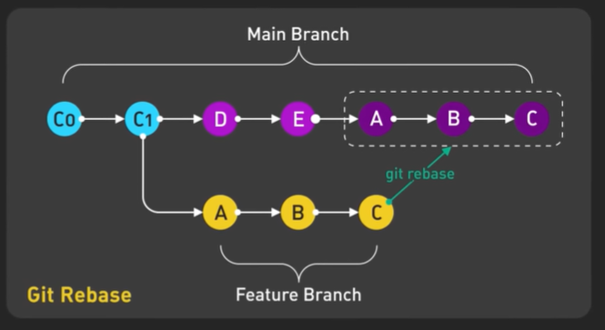

# Git Rebase - Step 13: Rewriting History for Clean Integration



## Overview

This diagram illustrates the **Git rebase operation**, one of the most powerful and sometimes misunderstood features in Git. It shows how rebase **rewrites commit history** by moving a feature branch's commits to start from a different point, creating a clean, linear history. Understanding rebase is crucial for maintaining a professional, readable Git history in collaborative projects.

## The Transformation: Before and After

### Before Rebase (Bottom - Yellow)
**Feature Branch as Originally Created**

```
Main:    C0 → C1
              ↓
Feature:      A → B → C
```

**State:**
- Feature branch created from C1
- Three commits: A, B, C
- Feature developed while main stayed at C1
- Traditional branch structure

### After Rebase (Top - Magenta, Dashed Box)
**Feature Branch Replayed onto Updated Main**

```
Main:    C0 → C1 → D → E → A' → B' → C'
```

**State:**
- Feature commits moved to start from E (latest main)
- Commits transformed: A → A', B → B', C → C'
- Linear history (no branching visible)
- Feature appears to be developed from latest main

## Understanding the Diagram Components

### Main Branch Timeline (Solid Line - Cyan and Magenta)

**Complete progression:**
```
C0 → C1 → D → E → A' → B' → C'
```

#### C0 (Cyan - Initial Commit)
- Repository starting point
- Common to all branches
- Base of all development

#### C1 (Cyan - Second Commit)
- Original branching point
- Where feature was created from
- Historical divergence point

#### D (Magenta - Main Progress)
- New commit on main after branching
- Represents main branch evolution
- Why rebase is needed

#### E (Magenta - Latest Main)
- Current tip of main branch
- Where feature will be rebased onto
- New starting point for feature

#### A', B', C' (Magenta - Rebased Commits)
- **Transformed versions** of A, B, C
- Same changes, different commit hashes
- Now appear to start from E
- Enclosed in dashed box (marked "git rebase")

### Feature Branch Timeline (Yellow - Original)

**Original progression:**
```
A → B → C
```

#### A (Yellow - First Feature Commit)
- Original feature commit
- Created from C1
- Will become A' after rebase

#### B (Yellow - Second Feature Commit)
- Original feature commit
- Follows A
- Will become B' after rebase

#### C (Yellow - Third Feature Commit)
- Original feature commit
- Last commit before rebase
- Will become C' after rebase

### The Dashed Box (Top Right)
**What it represents:**
- The rebased commits (A', B', C')
- Result of `git rebase` operation
- New commits with different hashes
- Same content, different history

### The Labels

**"Main Branch" (Top):**
- Shows scope of main branch timeline
- Encompasses all main commits including rebased ones

**"Feature Branch" (Bottom):**
- Shows scope of original feature branch
- The branch that will be rebased

**"Git Rebase" (Left, Yellow):**
- Labels the rebase operation
- Indicates transformation process

**"git rebase" (Green, pointing to dashed box):**
- Points to result of rebase command
- Shows where rebased commits end up

## The Rebase Process Step-by-Step

### Initial State: Feature Branch Created

```bash
# Starting point
git checkout main  # At C1
git checkout -b feature/my-feature

# Make commits
git commit -m "A: Add feature structure"
git commit -m "B: Implement feature logic"
git commit -m "C: Complete feature"
```

**State:**
```
Main:    C0 → C1
              ↓
Feature:      A → B → C
```

### Main Branch Advances

```bash
# Someone else pushes to main
# Or you made commits on main

git checkout main
git commit -m "D: Update main"
git commit -m "E: More main updates"
```

**State:**
```
Main:    C0 → C1 → D → E
              ↓
Feature:      A → B → C (still from C1)
```

**Problem:** Feature branch is now "behind" main

### Performing the Rebase

```bash
# Switch to feature branch
git checkout feature/my-feature

# Rebase onto main
git rebase main
```

**What Git does:**

1. **Finds common ancestor** (C1)
2. **Stores feature commits** (A, B, C) temporarily
3. **Resets feature branch** to main (E)
4. **Replays commits** one by one onto E
5. **Creates new commits** (A', B', C')

**Result:**
```
Main:    C0 → C1 → D → E → A' → B' → C'
                          ↑
                    Feature branch now here
```

### After Rebase State

```bash
# View the log
git log --oneline --graph

# Output:
* C' Complete feature
* B' Implement feature logic
* A' Add feature structure
* E More main updates
* D Update main
* C1 Second commit
* C0 Initial commit
```

**Key observation:** Linear history, no branching visible!

## Why Commits Change: A → A', B → B', C → C'

### Understanding Commit Transformation

**Original commit A:**
```
Commit: A
Parent: C1
Tree: [feature files]
Author: Developer
Date: Monday
Hash: abc123def
```

**Rebased commit A':**
```
Commit: A'
Parent: E ← Changed!
Tree: [feature files + main changes from D, E]
Author: Developer
Date: Monday
Hash: xyz789ghi ← Different!
```

### Why Hash Changes

Git commit hash is calculated from:
- **Parent commit** (changed from C1 to E)
- **Tree state** (now includes D and E changes)
- **Commit metadata** (author, message, date)

Since parent changed → **hash must change**

### What Stays the Same

- ✅ Commit message
- ✅ Author information
- ✅ Your code changes (diff)
- ✅ Relative order (A before B before C)

### What Changes

- ❌ Commit hash (abc123 → xyz789)
- ❌ Parent commit (C1 → E)
- ❌ Tree snapshot (now includes D, E changes)

## The Complete Command Sequence

### Scenario: Rebasing Feature onto Main

```bash
# Step 1: Ensure main is up to date
git checkout main
git pull origin main
# Now at commit E

# Step 2: Switch to feature branch
git checkout feature/my-feature
# Currently: A → B → C from C1

# Step 3: Rebase onto main
git rebase main

# Git output:
First, rewinding head to replay your work on top of it...
Applying: A: Add feature structure
Applying: B: Implement feature logic
Applying: C: Complete feature

# Step 4: Verify the rebase
git log --oneline
# C' Complete feature
# B' Implement feature logic
# A' Add feature structure
# E More main updates
# D Update main
# C1 Second commit
# C0 Initial commit

# Step 5: Push (requires force push)
git push --force-with-lease origin feature/my-feature
```

## Rebase vs Merge Comparison

### Same Starting Point

```
Main:    C0 → C1 → D → E
              ↓
Feature:      A → B → C
```

### Option 1: Merge

```bash
git checkout main
git merge feature/my-feature
```

**Result:**
```
Main:    C0 → C1 → D → E → M
              ↓           ↗
Feature:      A → B → C
```
- Creates merge commit M
- Preserves branch structure
- Shows parallel development

### Option 2: Rebase then Merge

```bash
git checkout feature/my-feature
git rebase main
git checkout main
git merge feature/my-feature  # Fast-forward
```

**Result:**
```
Main:    C0 → C1 → D → E → A' → B' → C'
```
- Linear history
- No merge commit
- Clean progression

### Visual Comparison

**Merge approach (branched history):**
```
*   M Merge feature
|\  
| * C Feature commit 3
| * B Feature commit 2
| * A Feature commit 1
* | E Main commit 2
* | D Main commit 1
|/  
* C1 Base commit
```

**Rebase approach (linear history):**
```
* C' Feature commit 3
* B' Feature commit 2
* A' Feature commit 1
* E Main commit 2
* D Main commit 1
* C1 Base commit
```

## When to Use Rebase

### ✅ Good Use Cases

#### 1. **Updating Feature Branches**
```bash
# Keep feature branch current with main
git checkout feature/my-feature
git rebase main
```

**Why:** Incorporates latest main changes cleanly

#### 2. **Before Creating Pull Request**
```bash
# Clean up feature branch before PR
git checkout feature/my-feature
git rebase main
git push --force-with-lease
```

**Why:** Creates clean, reviewable history

#### 3. **Cleaning Up Local Commits**
```bash
# Interactive rebase to squash commits
git rebase -i HEAD~3
```

**Why:** Combine multiple "WIP" commits into one

#### 4. **Personal Feature Branches**
```bash
# On your own unpushed branch
git rebase main
```

**Why:** Safe because no one else has these commits

### ❌ Don't Use Rebase When

#### 1. **On Public/Shared Branches**
```bash
# ❌ NEVER do this:
git checkout main
git rebase feature-branch

# Why: Rewrites public history
# Causes issues for everyone
```

#### 2. **On Pushed Feature Branches Others Use**
```bash
# ❌ Bad if others are working on this:
git checkout feature/shared-feature
git rebase main
```

**Why:** Others have old commits, will conflict

#### 3. **When You Want to Preserve History**
```bash
# Sometimes branch structure is important
# Shows when features were developed in parallel
# Merge is better here
```

#### 4. **On Main/Master Branch**
```bash
# ❌ NEVER rebase main branch
git checkout main
git rebase develop  # NO!
```

**Why:** Main should never be rewritten

## Interactive Rebase: Advanced Usage

### Cleaning Up Commit History

```bash
# Rebase last 3 commits interactively
git rebase -i HEAD~3

# Editor opens:
pick abc123 A: Add feature structure
pick def456 B: Implement feature logic
pick ghi789 C: Complete feature

# You can change to:
pick abc123 A: Add feature structure
squash def456 B: Implement feature logic
squash ghi789 C: Complete feature

# Result: All 3 commits squashed into 1
```

### Interactive Rebase Commands

```bash
# pick = keep commit as is
# reword = change commit message
# edit = stop to amend commit
# squash = combine with previous commit
# fixup = like squash but discard message
# drop = remove commit
```

### Example: Clean Up Before PR

```bash
# Original messy history:
* WIP save progress
* Fix typo
* Add feature
* Fix bug
* More work
* Initial feature

# Interactive rebase:
git rebase -i HEAD~6

# Clean it to:
* Complete user authentication feature
```

## Handling Rebase Conflicts

### When Conflicts Occur

```bash
git rebase main

# Output:
CONFLICT (content): Merge conflict in app.js
error: could not apply abc123... Feature commit
Resolve all conflicts manually, mark them as resolved with
"git add/rm <conflicted_files>", then run "git rebase --continue".
You can instead skip this commit: run "git rebase --skip".
To abort and get back to the state before "git rebase", run "git rebase --abort".
```

### Resolving Rebase Conflicts

```bash
# Step 1: Fix conflicts in files
# Edit app.js, remove conflict markers

# Step 2: Stage resolved files
git add app.js

# Step 3: Continue rebase
git rebase --continue

# Git continues applying remaining commits
# May have more conflicts in later commits

# Step 4: Repeat until done
# Or abort if needed:
git rebase --abort
```

### Conflict Resolution Per Commit

```bash
# Rebasing 3 commits: A, B, C

# Applying A:
# CONFLICT! Fix and continue
git add .
git rebase --continue

# Applying B:
# CONFLICT! Fix and continue
git add .
git rebase --continue

# Applying C:
# Success! Rebase complete
```

## Force Push After Rebase

### Why Force Push is Needed

```bash
# Before rebase:
Local:  C1 → A → B → C
Remote: C1 → A → B → C
# Histories match ✓

# After rebase:
Local:  C1 → D → E → A' → B' → C'
Remote: C1 → A → B → C
# Histories diverged ✗

# Normal push fails:
git push origin feature/my-feature
# Error: Updates were rejected

# Force push required:
git push --force-with-lease origin feature/my-feature
```

### Safe Force Push

```bash
# ❌ Dangerous:
git push --force

# ✅ Safer:
git push --force-with-lease

# Why: --force-with-lease checks if remote changed
# If someone else pushed, it fails (safety check)
# If remote unchanged, it force pushes (safe)
```

## Rebase Workflow Example

### Complete Feature Development with Rebase

```bash
# Day 1: Start feature
git checkout main
git pull origin main
git checkout -b feature/user-notifications

# Day 1: Work on feature
git commit -m "Add notification structure"
git commit -m "Add notification service"
git push -u origin feature/user-notifications

# Day 2: Main has advanced
# Teammate pushed updates

# Day 2: Update feature with latest main
git checkout feature/user-notifications
git fetch origin
git rebase origin/main

# Resolve any conflicts
# ... fix conflicts ...
git add .
git rebase --continue

# Day 2: Continue work
git commit -m "Add notification UI"

# Day 3: Ready for PR, rebase again
git fetch origin
git rebase origin/main

# Clean history, push
git push --force-with-lease origin feature/user-notifications

# Day 3: Create PR
# History is clean and linear
# Easy to review

# After PR approval, fast-forward merge
git checkout main
git merge feature/user-notifications  # Fast-forward
git push origin main
```

## The Golden Rule of Rebase

### Never Rebase Public History

```bash
# ❌ NEVER rebase commits that exist on remote AND others use

# Example of what NOT to do:
git checkout main
git pull origin main
# Others have these commits
git rebase develop
# YOU JUST BROKE EVERYONE'S REPOSITORY!

# Why it's bad:
# - Everyone has the old commits (D, E)
# - You just created new commits (D', E')
# - Their D is now orphaned
# - Pull requests will fail
# - Merges will be a nightmare
```

### Safe Rebase Checklist

Before rebasing, ask:
1. ✅ Are these commits only on my local machine?
2. ✅ If pushed, am I the only one using this branch?
3. ✅ Have I communicated with team about rebase?
4. ✅ Is this a feature branch (not main)?

All YES? → Safe to rebase
Any NO? → Use merge instead

## Best Practices

### ✅ Do's

1. **Rebase feature branches onto main regularly**
   ```bash
   # Weekly or before PR
   git checkout feature/my-feature
   git rebase main
   ```

2. **Use interactive rebase to clean history**
   ```bash
   git rebase -i HEAD~5
   # Squash "WIP" commits
   ```

3. **Rebase before creating PR**
   ```bash
   git fetch origin
   git rebase origin/main
   git push --force-with-lease
   ```

4. **Communicate before rebasing shared branches**
   ```bash
   # Tell team: "I'm rebasing feature/shared at 3pm"
   # They can merge or wait
   ```

5. **Use --force-with-lease instead of --force**
   ```bash
   git push --force-with-lease origin feature-branch
   ```

6. **Test after rebasing**
   ```bash
   git rebase main
   npm test  # Ensure nothing broke
   ```

### ❌ Don'ts

1. **Don't rebase public branches**
   ```bash
   # ❌ Never
   git checkout main
   git rebase develop
   ```

2. **Don't rebase if you don't understand it**
   ```bash
   # Learn in private repo first
   # Or use merge (always safe)
   ```

3. **Don't rebase with uncommitted changes**
   ```bash
   # ❌ Bad
   # ... modified files ...
   git rebase main  # Fails
   
   # ✅ Good
   git stash
   git rebase main
   git stash pop
   ```

4. **Don't use --force without --force-with-lease**
   ```bash
   # ❌ Dangerous
   git push --force
   
   # ✅ Safer
   git push --force-with-lease
   ```

5. **Don't forget to test after rebase**
   ```bash
   # Rebase can introduce bugs
   # Always test before pushing
   ```

## Troubleshooting Rebase Issues

### Issue 1: Rebase Conflict Hell

```bash
# Too many conflicts during rebase

# Solution 1: Abort and merge instead
git rebase --abort
git merge main

# Solution 2: Rebase in smaller chunks
git rebase C1  # Rebase to intermediate point
# Resolve conflicts
git rebase main  # Continue to main
```

### Issue 2: Lost Commits After Rebase

```bash
# "My commits disappeared!"

# Solution: Use reflog
git reflog
# Find your old commits
# abc123 HEAD@{1}: rebase finished
# def456 HEAD@{2}: commit: My commit

# Restore if needed
git reset --hard HEAD@{2}
```

### Issue 3: Force Push Rejected

```bash
# --force-with-lease rejected

# Someone pushed to your branch
# Solution: Fetch and check
git fetch origin
git log origin/feature-branch
# Review their changes
# Rebase on top of their work
git rebase origin/feature-branch
git push --force-with-lease
```

### Issue 4: Rebase Broke Tests

```bash
# Tests pass on feature branch
# Rebase onto main
# Tests now fail

# Reason: Main has incompatible changes
# Solution: Fix compatibility
git rebase main
npm test  # Fails
# Fix code to work with main changes
git add .
git rebase --continue
```

## Visualizing Rebase in Real Time

### Using Git Log

```bash
# Before rebase:
git log --oneline --graph --all
* C (feature) Complete feature
* B Implement feature
* A Add feature
| * E (main) Main update 2
| * D Main update 1
|/  
* C1 Base commit

# After rebase:
git log --oneline --graph --all
* C' (feature) Complete feature
* B' Implement feature
* A' Add feature
* E (main) Main update 2
* D Main update 1
* C1 Base commit
```

### Commits Change Identity

```bash
# Before rebase:
git rev-parse feature
# abc123def (commit C)

# After rebase:
git rev-parse feature
# xyz789ghi (commit C')
# Different hash!
```

## Key Takeaways

1. **Rebase rewrites history** by changing commit parents
2. **Creates new commits** (A → A', B → B', C → C')
3. **Results in linear history** (no merge commits)
4. **Original commits shown in yellow** (before rebase)
5. **Rebased commits shown in magenta** (after rebase)
6. **Dashed box indicates** transformed commits
7. **Use for feature branches** to stay current with main
8. **Never rebase public history** (golden rule)
9. **Requires force push** after rebasing pushed branches
10. **Alternative to merge** for clean history

## When to Choose Rebase vs Merge

### Choose Rebase When:
- ✅ Working on personal feature branch
- ✅ Want clean, linear history
- ✅ Preparing PR for review
- ✅ Feature branch needs main updates
- ✅ Team prefers linear history
- ✅ Commits haven't been shared widely

### Choose Merge When:
- ✅ Working on public/shared branch
- ✅ Want to preserve branch context
- ✅ Multiple people using the branch
- ✅ Important to show parallel development
- ✅ Unsure about rebase implications
- ✅ Working on main/master branch

## Summary

This diagram elegantly shows the **transformation** that rebase performs:

**Before (Yellow):**
- Feature branch from C1
- Contains commits A, B, C
- Parallel to main branch progress

**After (Magenta, Dashed):**
- Feature commits moved to E
- Transformed to A', B', C'
- Linear, clean history
- Ready for fast-forward merge

**The Process:**
1. Find common ancestor (C1)
2. Save feature commits (A, B, C)
3. Reset to main (E)
4. Replay commits (creating A', B', C')
5. Result: Linear history

Rebase is a **powerful tool** for maintaining clean Git history, but remember:
- ✅ Use on personal/feature branches
- ❌ Never on public/shared branches
- 🎯 Creates professional, readable history
- ⚠️ With great power comes great responsibility!

Master rebase, and your team will thank you for the clean, understandable Git history! 🚀

---

*This document explains Git rebase operation. For merge operations, see Step-11.md and Step-12.md. For branching strategies, see Step-09.md and Step-10.md.*
