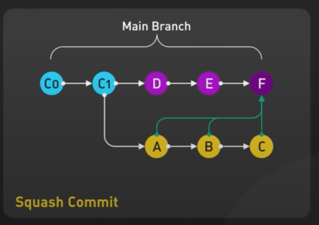

# Git Squash Commit - Step 14: Combining Multiple Commits into One



## Overview

This diagram illustrates the **Git squash commit operation**, a powerful technique for **combining multiple commits into a single commit**. It shows how three separate feature branch commits (A, B, C) are consolidated into one unified commit (F) when merging into the main branch. Squashing is essential for maintaining clean, professional Git history and is a standard practice in modern Git workflows.

## The Transformation: Multiple Commits → Single Commit

### Before Squash (Yellow Branch)
**Feature Branch with Multiple Commits**

```
Main:    C0 → C1
              ↓
Feature:      A → B → C
```

**State:**
- Three separate commits on feature branch
- Each commit represents incremental work
- Could be "WIP", "Fix typo", "Add tests", etc.
- All three commits solve one feature

### After Squash (Magenta on Main)
**Single Consolidated Commit**

```
Main:    C0 → C1 → D → E → F
```

**State:**
- Commits A, B, C combined into F
- One clean commit represents entire feature
- Linear main branch history
- No trace of intermediate commits

## Understanding the Diagram Components

### Main Branch Timeline (Cyan and Magenta)

**Complete progression:**
```
C0 → C1 → D → E → F
```

#### C0 (Cyan - Initial Commit)
- Repository starting point
- First commit in history
- Base for all development

#### C1 (Cyan - Branching Point)
- Second commit on main
- Where feature branch was created
- Common ancestor of main and feature

#### D (Magenta - Main Progress #1)
- Commit added to main after branching
- Represents parallel development
- Main branch evolution

#### E (Magenta - Main Progress #2)
- Another commit on main
- Main continues to evolve
- Current tip before merge

#### F (Magenta - Squashed Merge Commit)
- **The squash commit** 🎯
- Combines A + B + C into one
- Single commit representing entire feature
- Direct descendant of E
- Only parent is E (unlike regular merge with two parents)

### Feature Branch Timeline (Yellow)

**Original progression:**
```
C1 → A → B → C
```

#### A (Yellow - First Feature Commit)
- First commit on feature branch
- Example: "Add feature structure"
- Will be squashed into F

#### B (Yellow - Second Feature Commit)
- Second commit on feature branch
- Example: "Implement feature logic"
- Will be squashed into F

#### C (Yellow - Third Feature Commit)
- Final commit on feature branch
- Example: "Add tests and documentation"
- Will be squashed into F

### The Green Arrows (Critical!)
**Show squashing operation:**
- Arrow from A to F
- Arrow from B to F
- Arrow from C to F

**Meaning:** All three commits contribute to F, but F is **one commit**, not three!

### The Label: "Squash Commit" (Yellow, Bottom)
Indicates the operation being performed - squashing multiple commits into one.

## The Squash Process Step-by-Step

### Step 1: Feature Development (Multiple Commits)

```bash
# Create feature branch
git checkout -b feature/user-authentication
# At C1

# Work in progress, commit frequently
git commit -m "Add user model structure"          # Commit A
git commit -m "Implement login logic"             # Commit B
git commit -m "Add authentication tests"          # Commit C

# Feature branch now: C1 → A → B → C
```

**Why multiple commits?**
- Save progress frequently
- Experiment safely
- Easy to undo small changes
- Good development practice

### Step 2: Main Branch Advances

```bash
# Meanwhile, others push to main
# Main advances: C1 → D → E
```

**Current state:**
```
Main:    C0 → C1 → D → E
              ↓
Feature:      A → B → C
```

### Step 3: Squash Merge

```bash
# Method 1: Using --squash flag
git checkout main                    # Switch to main (at E)
git merge --squash feature/user-authentication

# Git stages all changes from A, B, C
# But DOES NOT commit yet

# Check status
git status
# Changes to be committed:
#   (all changes from A, B, C)

# Create the squash commit
git commit -m "Add user authentication feature

- Add user model structure
- Implement login logic
- Add authentication tests

Completes user story #123"

# This creates commit F
```

**Result:**
```
Main:    C0 → C1 → D → E → F
              ↓
Feature:      A → B → C (unchanged)
```

### Step 4: Clean Up

```bash
# Feature branch no longer needed
git branch -d feature/user-authentication

# If already pushed, delete remote
git push origin --delete feature/user-authentication

# Final history is clean
git log --oneline
# F Add user authentication feature
# E More main updates
# D Update main
# C1 Second commit
# C0 Initial commit
```

## Squash Merge Methods

### Method 1: Git Merge --squash (Command Line)

```bash
# Most common method
git checkout main
git merge --squash feature/my-feature

# Git stages changes but doesn't commit
# You write the commit message
git commit -m "Feature: Add payment integration"

# Advantages:
# ✅ Full control over commit message
# ✅ Can review staged changes before committing
# ✅ Can add detailed description
```

### Method 2: Interactive Rebase

```bash
# On feature branch
git checkout feature/my-feature

# Squash commits on the branch itself
git rebase -i HEAD~3

# Editor opens:
pick abc123 A: Add feature structure
squash def456 B: Implement feature logic
squash ghi789 C: Complete feature

# Save and close
# Git combines into 1 commit on feature branch

# Then merge normally
git checkout main
git merge feature/my-feature  # Fast-forward
```

### Method 3: GitHub Pull Request "Squash and Merge"

```bash
# On GitHub PR page:
# 1. Create pull request
# 2. Review and approve
# 3. Click "Squash and merge" button
# 4. Edit combined commit message
# 5. Confirm merge

# GitHub automatically:
# - Squashes all commits
# - Creates single commit on main
# - Closes PR
# - Optionally deletes branch
```

### Method 4: GitLab Merge Request "Squash Commits"

```bash
# On GitLab MR page:
# 1. Create merge request
# 2. Check "Squash commits" option
# 3. Review and approve
# 4. Click "Merge" button
# 5. Edit squash commit message
# 6. Confirm merge
```

## Squash vs Regular Merge Comparison

### Same Starting Point

```
Main:    C0 → C1 → D → E
              ↓
Feature:      A → B → C
```

### Option 1: Regular Merge (With Merge Commit)

```bash
git checkout main
git merge feature/my-feature
```

**Result:**
```
Main:    C0 → C1 → D → E → M
              ↓           ↗
Feature:      A → B → C
```

**Characteristics:**
- Merge commit M has two parents (E and C)
- All commits A, B, C preserved in history
- Shows branching structure
- History shows all work

**Git log output:**
```
* M Merge feature/my-feature
|\  
| * C Complete feature
| * B Implement feature
| * A Add feature
* | E Main updates
* | D Main updates
|/  
* C1 Base
```

### Option 2: Squash Merge

```bash
git checkout main
git merge --squash feature/my-feature
git commit -m "Add complete feature"
```

**Result:**
```
Main:    C0 → C1 → D → E → F
              ↓
Feature:      A → B → C (not in main history)
```

**Characteristics:**
- Commit F has one parent (E)
- Commits A, B, C NOT in main history
- Linear history
- Clean, simple log

**Git log output:**
```
* F Add complete feature
* E Main updates
* D Main updates
* C1 Base
```

### Option 3: Rebase then Fast-Forward

```bash
git checkout feature/my-feature
git rebase main
git checkout main
git merge feature/my-feature  # Fast-forward
```

**Result:**
```
Main:    C0 → C1 → D → E → A' → B' → C'
```

**Characteristics:**
- All commits A', B', C' in main history
- Linear history
- Preserves individual commits

**Git log output:**
```
* C' Complete feature
* B' Implement feature
* A' Add feature
* E Main updates
* D Main updates
* C1 Base
```

## Visual Comparison of All Three Approaches

### Regular Merge
```
*   M (main) Merge feature
|\  
| * C (feature) Commit 3
| * B Commit 2
| * A Commit 1
* | E Main commit
* | D Main commit
|/  
* C1

History: Shows branches
Commits on main: M, E, D, C1
Feature commits: A, B, C (visible but on branch)
```

### Squash Merge
```
* F (main) Complete feature (A+B+C combined)
* E Main commit
* D Main commit
* C1

History: Linear
Commits on main: F, E, D, C1
Feature commits: A, B, C (not in main history)
```

### Rebase + Fast-Forward
```
* C' (main) Commit 3
* B' Commit 2
* A' Commit 1
* E Main commit
* D Main commit
* C1

History: Linear
Commits on main: C', B', A', E, D, C1
Feature commits: All included individually
```

## When to Use Squash Merge

### ✅ Use Squash Merge When:

#### 1. **Feature Branch Has Many Small Commits**
```bash
# Messy feature branch:
* Fix typo in comment
* Remove debug logging
* WIP: trying approach
* Fix lint errors
* Add missing semicolon
* Implement feature logic
* Initial feature structure

# Better as one squashed commit:
* Add user authentication feature
```

#### 2. **You Want Clean Main Branch History**
```bash
# Team policy: main branch should only have feature-level commits
# Each commit on main = one complete feature
# Squash ensures this
```

#### 3. **Feature Commits Aren't Meaningful Individually**
```bash
# These don't need to be separate in main:
* Checkpoint
* Save progress
* More work
* Almost done
* Fix

# Better as:
* Implement shopping cart functionality
```

#### 4. **Using GitHub/GitLab PR Workflow**
```bash
# Standard practice:
# 1. Create feature branch
# 2. Commit frequently while developing
# 3. Open PR/MR
# 4. Review
# 5. Squash and merge
# → Clean main history automatically
```

#### 5. **One Feature = One Commit Philosophy**
```bash
# Team philosophy: Each feature should be one commit
# Makes:
# - Easier to revert entire feature
# - Simpler to cherry-pick features
# - Cleaner release notes
# - Better git bisect results
```

### ❌ Don't Use Squash Merge When:

#### 1. **Individual Commits Are Meaningful**
```bash
# These should be separate:
* Add database schema
* Implement API endpoints
* Add frontend components
* Add integration tests

# Each is significant milestone
# Use regular merge or rebase instead
```

#### 2. **You Need Detailed History for Debugging**
```bash
# When hunting bugs:
git bisect start

# Each commit should be testable
# Squashing loses granularity
# Harder to find which exact change broke things
```

#### 3. **Following Conventional Commits Strictly**
```bash
# If each commit has semantic meaning:
feat: add user login
fix: correct password validation
test: add login tests
docs: update authentication docs

# Squashing loses semantic history
```

#### 4. **Co-authored Commits**
```bash
# Multiple developers worked on feature
# Squashing might lose attribution
# Regular merge preserves all authors
```

#### 5. **Commits Already Reviewed Individually**
```bash
# If team reviewed each commit separately
# And each commit has value
# Don't squash - preserve reviewed state
```

## Crafting the Perfect Squash Commit Message

### Bad Squash Commit Message
```bash
git commit -m "Merge feature branch"
```
❌ Problems:
- Doesn't say what feature
- No details about changes
- Not helpful for future readers

### Good Squash Commit Message
```bash
git commit -m "Add user authentication with JWT tokens"
```
✅ Better:
- Describes the feature
- Clear and concise
- Searchable

### Excellent Squash Commit Message
```bash
git commit -m "Add user authentication with JWT tokens

Implements secure user authentication system using JSON Web Tokens.

Key changes:
- Add User model with password hashing (bcrypt)
- Implement login/logout API endpoints
- Add JWT token generation and validation
- Include middleware for protected routes
- Add authentication tests (95% coverage)

Security features:
- Password hashing with salt
- Token expiration (24 hours)
- Refresh token support
- Rate limiting on login attempts

Completes user story #123
Closes #45, #67, #89"
```
✅ Excellent because:
- Clear title (50 chars)
- Blank line separator
- Detailed body explaining what and why
- Lists key changes
- Notes important details (security)
- References issues/stories
- Helpful for code archaeology

### Commit Message Template for Squash
```bash
# Title: What (imperative mood, 50 chars)
Add user authentication with JWT tokens

# Blank line

# Body: Why and how (72 char line width)
This implements the authentication system needed for the user
management feature. Uses industry-standard JWT tokens for
stateless authentication.

# Key changes (bullet points)
Key changes:
- Component A: What it does
- Component B: What it does
- Component C: What it does

# Additional context
Technical decisions:
- Chose JWT over sessions for scalability
- Used bcrypt for password hashing (cost factor 10)

# References
Completes: #123
Related: #45, #67
```

## Squash Workflow Examples

### Example 1: Simple Feature Development

```bash
# Day 1: Start feature
git checkout -b feature/add-search
git commit -m "Add search UI"
git commit -m "WIP: search logic"
git commit -m "Fix search bug"

# Day 2: Continue work
git commit -m "Add search tests"
git commit -m "Fix typo"
git commit -m "Update documentation"

# Day 3: Ready to merge
git checkout main
git pull origin main
git merge --squash feature/add-search

git commit -m "Add search functionality

Implements full-text search across products.

Features:
- Real-time search suggestions
- Filter by category
- Sort by relevance
- Search highlighting

Includes comprehensive test coverage.

Closes #234"

git push origin main
git branch -d feature/add-search
```

### Example 2: GitHub PR Workflow

```bash
# Local development
git checkout -b feature/payment-integration
# ... make commits ...
git push -u origin feature/payment-integration

# On GitHub:
# 1. Create Pull Request
# 2. Team reviews code
# 3. Make requested changes:
git commit -m "Address review comments"
git push origin feature/payment-integration

# 4. More reviews and fixes...
git commit -m "Fix edge case"
git commit -m "Add error handling"
git push origin feature/payment-integration

# 5. Approved! On GitHub PR page:
# Click "Squash and merge"
# Edit commit message:
"""
Add Stripe payment integration

Integrates Stripe payment processing for checkout flow.

Features:
- Credit card processing
- Payment validation
- Error handling and retries
- Transaction logging
- Refund support

Testing:
- Unit tests for all payment scenarios
- Integration tests with Stripe test API
- Manual testing completed

Security:
- No credit card data stored locally
- PCI compliance maintained
- Secure token handling

Co-authored-by: Reviewer Name <reviewer@email.com>

Closes #567
"""

# Click "Confirm squash and merge"
# GitHub creates single commit on main
# PR closed automatically
# Branch can be deleted
```

### Example 3: Interactive Rebase + Squash

```bash
# Feature branch with messy history
git checkout feature/refactor-api

git log --oneline
# abc123 Fix typo
# def456 Remove console.log
# ghi789 Add API method
# jkl012 Fix lint
# mno345 Refactor API structure

# Squash locally with interactive rebase
git rebase -i HEAD~5

# Editor opens:
pick mno345 Refactor API structure
squash jkl012 Fix lint
squash ghi789 Add API method
squash def456 Remove console.log
squash abc123 Fix typo

# Save and close
# New editor for combined message:
"""
Refactor API for better maintainability

Restructures API modules for clarity and performance.

Changes:
- Split monolithic API file into modules
- Improve error handling
- Add request validation
- Update API documentation

Performance: 30% faster response times
Code quality: Improved lint score from B to A
"""

# Now feature branch has 1 commit
git log --oneline
# xyz999 Refactor API for better maintainability

# Merge to main (fast-forward)
git checkout main
git merge feature/refactor-api
git push origin main
```

## Squash Merge in Different Git Platforms

### GitHub - "Squash and Merge" Button

**Configuration:**
```yaml
# .github/settings.yml (if using settings app)
branches:
  - name: main
    protection:
      required_pull_request_reviews:
        required_approving_review_count: 1
      
# Repository Settings > General > Pull Requests
☑ Allow squash merging
  ☑ Default to pull request title
  ☐ Default to pull request title and commit details
  ☐ Default to pull request title and description
```

**Usage:**
1. Create PR
2. Review and approve
3. Click dropdown next to "Merge"
4. Select "Squash and merge"
5. Edit commit message (defaults to PR title)
6. Click "Confirm squash and merge"

### GitLab - "Squash Commits" Option

**Configuration:**
```yaml
# .gitlab-ci.yml or project settings
# Settings > Merge requests
Squash commits when merging: [Encourage/Require/Allow/Do not allow]
```

**Usage:**
1. Create Merge Request
2. Check "Squash commits" checkbox
3. Review and approve
4. Click "Merge"
5. Edit squash commit message
6. Confirm merge

### Bitbucket - "Squash" Merge Strategy

**Configuration:**
```
# Repository settings > Merge strategies
☑ Squash
```

**Usage:**
1. Create Pull Request
2. Review and approve
3. Select "Squash" from merge strategy dropdown
4. Click "Merge"
5. Edit commit message
6. Confirm merge

## Advanced: Partial Squashing

### Squash Some, Keep Others

```bash
# Feature branch has 5 commits
git log --oneline
# E Final polish
# D Add tests
# C Implement feature
# B Add structure
# A Initial setup

# Want to squash A+B, keep C, squash D+E
git rebase -i HEAD~5

# Editor:
pick A Initial setup
squash B Add structure
pick C Implement feature
pick D Add tests
squash E Final polish

# Result: 3 commits
# AB (Initial setup + structure)
# C (Implement feature)
# DE (Add tests + polish)
```

## Troubleshooting Squash Merge

### Issue 1: Merge Conflicts During Squash

```bash
git merge --squash feature-branch

# CONFLICT in file.js
# Fix conflicts
vim file.js
# Resolve conflicts

# Stage resolved files
git add file.js

# Complete the squash (note: NOT git merge --continue)
git commit -m "Add feature with conflict resolution"
```

### Issue 2: Forgot to Commit After --squash

```bash
git merge --squash feature-branch
# Changes staged but not committed

# Oops, switched branches
git checkout other-branch

# How to get back:
git checkout main
git status  # Changes still staged!
git commit -m "Add feature"  # Commit them
```

### Issue 3: Want to Undo Squash Merge

```bash
# Just squashed and committed
git log
# F (HEAD -> main) Add feature (just created)
# E Previous commit

# Undo it:
git reset --hard HEAD~1
# Back to commit E
# F is gone
```

### Issue 4: Lost Individual Commit Messages

```bash
# After squash, want to see original commits
# They're on the feature branch!

git log feature/my-feature
# C Third commit
# B Second commit
# A First commit

# Or use reflog if branch was deleted
git reflog
# Find the branch tip before deletion
# abc123 feature/my-feature@{0}: commit: C
```

## Best Practices for Squash Merging

### ✅ Do's

1. **Squash messy feature branches before merging**
   ```bash
   # Feature has 15 commits
   # Many are "WIP", "fix", "oops"
   git merge --squash feature-branch
   ```

2. **Write detailed squash commit messages**
   ```bash
   # Include: what, why, key changes, references
   git commit -m "Add feature X

   Why: User story #123 requires...
   
   Key changes:
   - Component A
   - Component B
   
   Closes #123"
   ```

3. **Use squash for PR workflow**
   ```bash
   # Standard modern Git workflow
   # Especially for open source projects
   ```

4. **Keep feature branches short-lived**
   ```bash
   # Easier to squash 1-2 days of work
   # Than 2 weeks of diverged history
   ```

5. **Document squash policy in CONTRIBUTING.md**
   ```markdown
   ## Merge Policy
   We use squash merges for all PRs.
   Each commit on main represents one feature.
   ```

6. **Test before squashing**
   ```bash
   # Ensure feature branch works
   git checkout feature-branch
   npm test
   # Then squash
   ```

### ❌ Don'ts

1. **Don't squash already-public main branch**
   ```bash
   # ❌ Never squash commits on main
   git checkout main
   git rebase -i HEAD~5  # NO!
   ```

2. **Don't lose important context**
   ```bash
   # ❌ Bad squash message
   git commit -m "Updates"
   
   # ✅ Good squash message
   git commit -m "Add OAuth authentication
   
   Implemented Google and GitHub OAuth.
   Includes security audit and tests."
   ```

3. **Don't squash co-authored work without attribution**
   ```bash
   # Include co-authors in squash message
   git commit -m "Add feature
   
   Co-authored-by: Alice <alice@example.com>
   Co-authored-by: Bob <bob@example.com>"
   ```

4. **Don't squash if team needs detailed history**
   ```bash
   # Some teams need granular history
   # For auditing, compliance, or debugging
   # Use regular merge instead
   ```

5. **Don't forget to delete feature branch**
   ```bash
   # After squash merge:
   git branch -d feature-branch
   git push origin --delete feature-branch
   ```

## Squash Merge vs Other Strategies: Decision Matrix

| Scenario | Use Squash Merge? | Alternative |
|----------|-------------------|-------------|
| Feature branch with many small commits | ✅ Yes | N/A |
| PR workflow (GitHub/GitLab) | ✅ Yes | N/A |
| Want clean main branch history | ✅ Yes | N/A |
| Open source contributions | ✅ Yes | N/A |
| Each commit is meaningful | ❌ No | Regular merge |
| Need detailed history for debugging | ❌ No | Regular merge or rebase |
| Co-authored work (attribution important) | ⚠️ Maybe | Regular merge + co-author tags |
| Following Conventional Commits | ❌ No | Rebase + fast-forward |
| Long-lived feature branch | ⚠️ Maybe | Rebase then merge |
| Compliance/audit requirements | ❌ No | Regular merge (preserve all) |
| Hotfix (single commit) | ❌ No | Fast-forward merge |
| Experiment branches | ✅ Yes | N/A |

## Key Takeaways

1. **Squash combines multiple commits into one** (A + B + C → F)
2. **Creates clean, linear history** on main branch
3. **Feature branch commits not in main history** (only the squashed commit)
4. **Squashed commit has one parent** (E), not two like merge commit
5. **Green arrows show** A, B, C contribute to F
6. **Perfect for PR workflows** (GitHub, GitLab, Bitbucket)
7. **Use for messy feature branches** with many small commits
8. **Write detailed commit messages** when squashing
9. **Standard practice** in modern Git workflows
10. **Test before squashing** to ensure everything works

## When to Choose: Quick Reference

### Choose Squash Merge ✅
- ✅ Feature branch has >5 commits
- ✅ Many "WIP" or "fix" commits
- ✅ Using GitHub/GitLab PR workflow
- ✅ Want clean main history (one commit per feature)
- ✅ Commits aren't individually meaningful
- ✅ Open source contribution
- ✅ Team policy: squash by default

### Choose Regular Merge 🔀
- ✅ Each commit is meaningful milestone
- ✅ Need detailed history for debugging
- ✅ Multiple authors need attribution
- ✅ Compliance requires full history
- ✅ Want to preserve branch structure
- ✅ Following Conventional Commits strictly

### Choose Rebase + Fast-Forward ⏩
- ✅ Want linear history with all commits
- ✅ Each commit is well-crafted
- ✅ Following Conventional Commits
- ✅ Each commit is atomic and testable
- ✅ Feature commits are high quality
- ✅ Want to preserve commit granularity

## Summary

This diagram elegantly demonstrates **squash merging**:

**The Setup:**
- Main branch: C0 → C1 → D → E
- Feature branch: C1 → A → B → C
- Three separate feature commits

**The Squash:**
- `git merge --squash feature-branch`
- Combines A + B + C
- Creates single commit F
- Green arrows show contribution

**The Result:**
- Main: C0 → C1 → D → E → **F**
- F contains all changes from A, B, C
- Clean, linear history
- Feature branch can be deleted

**The Benefit:**
- 🎯 One commit per feature on main
- 📖 Readable history
- 🧹 Clean and professional
- ⚡ Easy to revert entire feature
- 🚀 Modern Git best practice

Squash merging is the secret to maintaining a **professional, clean Git history** that your team will love! 🌟

---

*This document explains Git squash merge operation. For regular merging, see Step-12.md. For rebase operations, see Step-13.md. For branching strategies, see Step-09.md and Step-10.md.*
